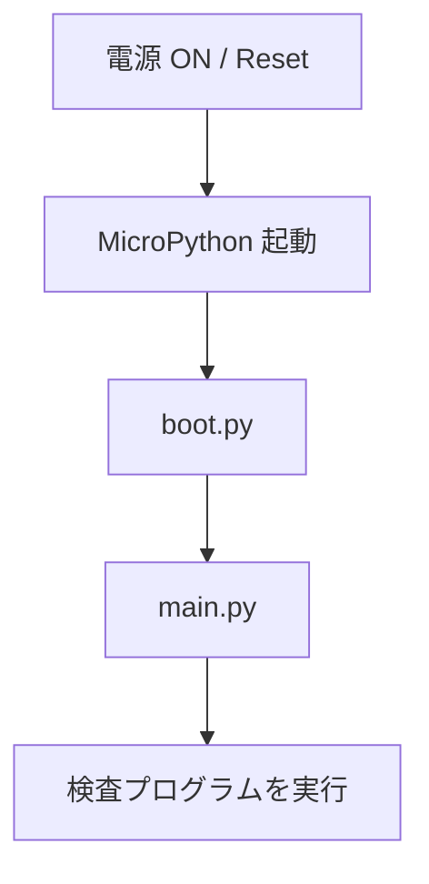
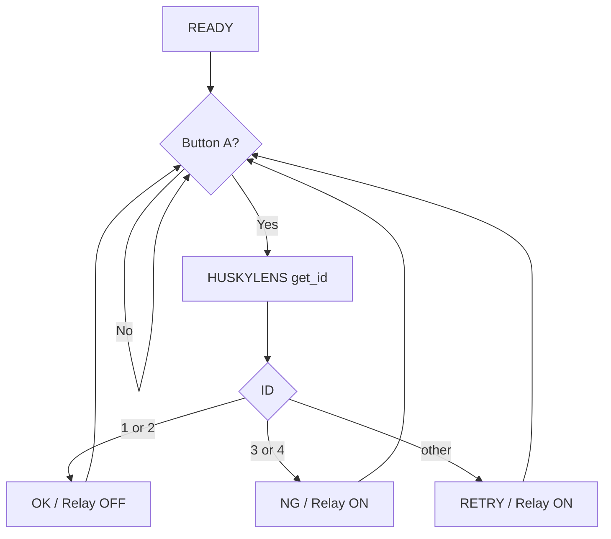

# メカトロニクス授業プロジェクト 引継ぎコンテキスト

用途: ChatGPT Project（Project-only memory）用の基礎コンテキスト  
正本管理: GitHub リポジトリ `https://github.com/t-kubota72459/E03`

---

## 0. この文書の扱い

この文書は、広島県立技術短大のメカトロニクス授業について、これまでの設計・試行錯誤・決定事項を新しい ChatGPT Project へ引き継ぐための基礎資料である。

この Project では、以下を継続的に管理・検討する。

- 各回の授業設計
- 学生向け指示書・技術補足資料
- MicroPython サンプル／テンプレート
- HUSKYLENS / M5StickC PLUS2 / センサ / リレー等の機材構成
- 実施結果と学生の進捗
- トラブルと改善案
- 次回授業への引継ぎ
- 最終的な FA 外観検査システムへの発展

**GitHub を教材・コードの正本とし、ChatGPT Project は授業設計・相談・振り返りの作業場として使う。**

## 情報源・関連サービス

- GitHub
  - URL: https://github.com/t-kubota72459/E03
  - 教材・コードの正本
  - この `000_project_context_mechatronics.md` も最新を管理する
  - 最新仕様は原則として GitHub を優先する

- ChatGPT Project
  - 授業設計、教材作成、実施記録、振り返り、改善検討の作業場
  - `000_project_context_mechatronics.md` を基準コンテキストとして使用する

- Google Education
  - 学生への教材・レポートテンプレート等の配布に使用する
  - 学生には GitHub の使用方法を教えていないため、授業で GitHub を配布経路として使用しない
  - 教材・レポートテンプレートの正本は GitHub に保管し、学生向けには Google Education の課題として配布する

- PLC I/O 基準資料
  - `第1~6ステーション入出力表.pdf`
  - メカトロ担当教員から提供された各ステーション担当 PLC の I/O 表
  - 第7回以降の PLC 接続・ラダー課題では、この PDF を I/O 割付の基準資料として参照する
  - PDF に記載のない I/O を「空き」と推測して確定せず、必要に応じて GX Works の既存ラダーと実機端子を確認する

- NotebookLM
  - URL: （NotebookLM のリンク）
  - 過去資料の参照・整理用
  - 現在は継続的に更新していないため、最新仕様の正本としては扱わない
  - GitHub や `000_project_context_mechatronics.md` と内容が異なる場合は、
    GitHub / 最新コンテキストを優先する

---

# 1. 授業全体

## 1.1 授業の位置づけ

メカトロニクス系の実習授業。

- 全8回 (確定)
- 1回 200分
- 対象学生: 9名
- 4グループ
  - 2名グループ × 3
    - A グループ：清水・松岡
    - B グループ：長嶺・森島
    - C グループ：伏谷・溝畑
    - D グループ：酒井・山口・山田
  - 3名グループ × 1
- 授業運用上、2グループずつ進める。


テーマは、

> **AIカメラによるワーク外観検査 → マイコンで判定 → リレー出力 → FA機器へ接続**

という一連の検査システムを、実際に動かしながら理解させること。

最終的には、単に AI カメラ単体で分類するのではなく、

> センサ入力  
> → AI認識  
> → マイコンによる判定  
> → 表示  
> → リレー出力  
> → FA機器

という「システム全体」を構成することが授業の主眼。

## 1.2 授業実施体制

同じ授業内容を、学生を2組に分けて2回実施する。

- 1st turn
  - 月曜日午前
  - 200分
  - 2グループ
  - A, B グループ (計4名)

- 2nd turn
  - 木曜日午後
  - 200分
  - 残りの2グループ
  - C, D グループ (計5名)


教員は、各授業回について同じ内容を原則2回実施する。

そのため、学生側では全8回の授業であり、
教員側では合計16回の授業実施となる。

この Project では、

- 月曜日午前の組を `1st turn`
- 木曜日午後の組を `2nd turn`

と呼ぶ。

1st turn の実施結果を確認し、必要であれば教材・説明・時間配分を修正して
同じ週の 2nd turn に反映する。

授業案を検討するときの基本単位は、

> **200分・2グループ・学生4～5名・教員1名**

とする。

4グループ9名が同時に授業を受ける前提では考えない。

# 1.3 教材ファイルの命名規則

<XX><Y>_タイトル.<ext>

XX = 授業回
Y  = その授業回内での参照順
ext = 適切な拡張子


---

# 2. 教員側の授業方針

学生は Python の専門家ではない。

そのため、授業では Python 文法そのものを難しくするより、

> **入力 → 判定 → 出力**

という処理の流れを理解させる。

具体的には、

- Button A またはセンサ = 入力
- HUSKYLENS の Class ID = 認識結果
- M5StickC PLUS2 = 判定ロジック
- LCD = 状態表示
- Relay Unit = FA側への出力

という構造を意識させる。

学生には、最初から全体コードを書かせるのではなく、

1. M5 と Thonny の接続
2. LCD
3. Relay
4. HUSKYLENS 配線
5. I2C 通信
6. ID取得
7. Button A
8. 全体統合

の順で、**1要素ずつ動作確認してから統合する**。

また、授業では「何となく試す」状態を避けるため、各作業に明確な到達基準を与える。

例:

> ワークを置き直しながら10回判定し、最低8/10、目標9/10以上正しく判定できること。

---

# 3. 使用機材

## 3.1 AIカメラ

### HUSKYLENS PRO Ver1

現在の主カメラ。

- Object Classification を使用
- HUSKYLENS PRO Ver1 × 5台
- Ver2 の導入案も検討したが、現時点では Ver1 を中心に授業構成
- OAK-D-Lite も試したが、対象ワークへ十分寄れないため授業では HUSKYLENS へ変更

HUSKYLENS の Object Classification では、実際の授業運用上、

> 1つの ID に対して、ボタンを押しながら学習した一連の画像を登録する

という使い方になる。

そのため、学習後に別の形状・配色を同一 ID に追加する使い方は扱いづらい。

## 3.2 マイコン

### M5StickC PLUS2

4グループ分を用意済み。

各 M5StickC PLUS2 には教員側であらかじめ、

- MicroPython firmware
- `boot.py`
- `display.py`
- `huskylens.py`

を導入済み。

学生は、

- Firmware 書込み
- LCD ドライバ実装
- HUSKYLENS 通信プロトコル実装

を行わない。

学生は主に `main.py` を編集する。

## 3.3 リレー

M5StickC PLUS2 から Relay Unit を制御する。

現時点の構成では、

- Relay GPIO: GPIO32
- `1` = Relay ON
- `0` = Relay OFF

として扱う。

Relay ON は、警告灯の表示 (NG / RETRY) など アラーム機能して使用する。

## 3.4 カメラ固定用ジグ

使用機材:

- タミヤ ユニバーサルプレート
- タミヤ アーム／レール類
- Ulanzi MT-08 三脚
- スマートフォンホルダー等

HUSKYLENS の撮像位置は非常に重要。

学生には、

- カメラ位置
- ワーク位置
- 背景
- 撮像距離

を固定するジグを自分たちで構成させる。

HUSKYLENS は、対象ワークにかなり近づけて撮像する。

実験では約3 cm程度の距離で、今回の色構成なら十分な識別が可能だった。

---

# 4. ワーク仕様

ワークは下から、

- A
- B
- C

の3部品で構成される。

実際の生産ラインでは赤・青・黄の部品が供給順によって組み合わされる想定だが、授業では複雑化しすぎないよう製品仕様を単純化する。

## 4.1 今回の OK

- 青・青・青
- 黄・黄・黄

## 4.2 製品仕様上の NG

上記以外は基本的に NG。

ただし、今回の HUSKYLENS 学習では全組合せを網羅しない。

第4回では代表例として、

- 青・青・赤
- 黄・黄・赤

を NG として学習する。

他の混色パターンは製品仕様上 NG だが、今回の授業では必ずしも正しく分類できなくてよい。

これは、

> **製品仕様上の OK / NG と、AI が学習した Class は同一ではない**

ことを理解させる題材にもできる。

---

# 5. HUSKYLENS 学習仕様

第4回の基本クラス:

| HUSKYLENS ID | ワーク | M5側判定 |
|---|---|---|
| ID1 | 青・青・青 | OK |
| ID2 | 黄・黄・黄 | OK |
| ID3 | 青・青・赤 | NG |
| ID4 | 黄・黄・赤 | NG |

重要:

> **HUSKYLENS の Class ID は、そのまま設備上の OK / NG ではない。**

M5StickC PLUS2 側で、

- ID1 / ID2 → OK
- ID3 / ID4 → NG
- その他 / 未認識 → RETRY

とマッピングする。

---

# 6. HUSKYLENS 初期設定

基本設定:

- Algorithm: `Object Classification`
- Learn Multiple: ON
- Threshold: 70 を初期値

Threshold 70 で不安定な場合は、いきなり大幅変更せず、

1. カメラ位置
2. 撮像距離
3. 背景
4. 照明
5. 再学習

を先に確認する。

その後、65 / 70 / 75 など、±5程度で調整する。

概念:

- Threshold を上げる → 誤認識は減りやすいが、未認識が増える
- Threshold を下げる → 認識しやすくなるが、誤分類の可能性が増える

---

# 7. HUSKYLENS と M5StickC PLUS2 の接続

現時点の使用ピン:

| 用途 | GPIO |
|---|---:|
| HUSKYLENS SDA | GPIO25 |
| HUSKYLENS SCL | GPIO26 |
| Button A | GPIO37 |
| Relay Unit | GPIO32 |
| 電源保持関連 | GPIO4 |
| IRセンサ Signal | GPIO33 |

HUSKYLENS:

- VCC → 5V / 指定電源
- GND → GND
- SDA → GPIO25
- SCL → GPIO26

I2C:

```python
from machine import Pin, I2C

i2c = I2C(
    0,
    sda=Pin(25),
    scl=Pin(26),
    freq=100000
)
```

HUSKYLENS の I2C Address:

- `0x32`
- 10進では `50`

そのため、

```python
print(i2c.scan())
```

で、

```text
[50]
```

と表示されれば、I2C 接続確認は成功。

---

# 8. 配線時の授業運用

学生自身に HUSKYLENS を配線させる。

これは時間がかかるが、実習として重要なので省略しない。

推奨手順:

1. 学生が配線
2. ペア学生が配線表と照合
3. 教員が通電前チェック
4. USB / 電源投入
5. `i2c.scan()`
6. `[50]` を確認
7. HUSKYLENS ID取得へ進む

2グループずつの授業運用であれば、教員による通電前確認は十分可能。

---

# 9. M5StickC PLUS2 / MicroPython の基礎

学生は別授業で Raspberry Pi Pico / MicroPython を使用した経験がある。

ただし、

> MicroPython では `main.py` が電源 ON / Reset 後に自動実行される

という点は忘れている可能性が高いので、補足資料で明示的に復習する。

基本フロー:



M5StickC PLUS2 側には教員準備済みの `boot.py` が存在するため、学生には主として `main.py` を編集させる。

---

# 10. Thonny

学生は Thonny を使用可能。

基本確認:

- Interpreter: MicroPython (ESP32)
- M5StickC PLUS2 のシリアルポートを選択
- REPL が使用できることを確認

授業では、最初から `main.py` にすべてを書かせず、REPL や短いテストコードで各部品を確認する。

## 10.1 FA実習室で使用する学生ノートPC

第6回2nd turn以降、FA実習室では学生が各自の **GX Works インストール済みノートPC** を使用する。

- このノートPCには当初 Thonny が入っていなかった
- Thonny は管理者権限なしでインストール可能
- 第6回2nd turnで Thonny を導入済み
- 低速なノートPCのため、FA室でのPC・電源設置とThonny導入を合わせて約30分を要した
- 第7回以降は原則として再インストール不要だが、起動・M5接続・シリアルポート確認の時間は見込む
- 導入後は `MicroPython (ESP32)` と M5StickC PLUS2 のシリアルポートを選択し、REPL の `>>>` が使用できることを確認する
- 同一PCで、M5StickC PLUS2 のデバッグ（Thonny）と PLC プログラムの確認（GX Works）を行える環境を狙う

FA実習室では、PCの置き場、100V電源、USBケーブル・配線の取り回しを事前に確認する。

---

# 11. `display.py`

教員準備済み API。

例:

```python
from display import Display

lcd = Display()

lcd.clear()
lcd.text2x("HELLO", 10, 20)
lcd.show()
```

基本的な画面表示には `text2x()` を使用する。

---

# 12. `huskylens.py`

教員準備済み API。

例:

```python
from machine import Pin, I2C
from huskylens import HuskyLens

i2c = I2C(
    0,
    sda=Pin(25),
    scl=Pin(26),
    freq=100000
)

husky = HuskyLens(i2c)

object_id = husky.get_id()

print(object_id)
```

学生は HUSKYLENS の低レベル通信処理を実装しない。

---

# 13. Button A

第4回では、ワーク到着センサの代わりに M5StickC PLUS2 の Button A を使用する。

Button A:

- GPIO37
- Active Low
- 押していない: `1`
- 押している: `0`

考え方:

> ワークをセット  
> → Button A を押す  
> → HUSKYLENS の ID を取得  
> → OK / NG 判定  
> → LCD / Relay 出力

将来的には Button A 部分を IR センサ等へ置換する。

---

# 14. 検査ロジック

基本構造:



- OK が明確に確認できた場合は Relay OFF
- NG は Relay ON
- 未認識・不明 ID も RETRY とし Relay ON

とする。

---

# 15. `main.py` テンプレートの考え方

学生には完成コードをそのまま渡すのではなく、主要判定部分を TODO としたテンプレートを配布する。

基本構成:

```python
from machine import Pin, I2C
import time

from display import Display
from huskylens import HuskyLens

BUTTON_PIN = 37
RELAY_PIN = 32
HUSKY_SDA = 25
HUSKY_SCL = 26

button = Pin(BUTTON_PIN, Pin.IN)
relay = Pin(RELAY_PIN, Pin.OUT)
relay.value(0)

lcd = Display()

i2c = I2C(
    0,
    sda=Pin(HUSKY_SDA),
    scl=Pin(HUSKY_SCL),
    freq=100000
)

husky = HuskyLens(i2c)


def show_message(message):
    lcd.clear()
    lcd.text2x(message, 10, 20)
    lcd.show()


def inspect_work():
    object_id = husky.get_id()
    print("ID =", object_id)

    if object_id in (1, 2):
        # TODO: OK を表示 / Relay OFF
        pass
    elif object_id in (3, 4):
        # TODO: NG を表示 / Relay ON
        pass
    else:
        # TODO: RETRY を表示 / 警告として Relay ON
        pass


show_message("READY")

try:
    while True:
        if button.value() == 0:
            inspect_work()

            while button.value() == 0:
                time.sleep_ms(10)

        time.sleep_ms(10)
finally:
    relay.value(0)
```

※ GPIO4 の power hold 処理は `boot.py` 側との役割分担を確認し、不要であれば `main.py` へ重複して書かない。

---

# 16. 第4回授業

## 16.1 第4回の目的

第4回では、

> **HUSKYLENS による学習結果を M5StickC PLUS2 が受け取り、OK / NG を判断して Relay Unit を動作させる**

ところまで到達する。

AIの分類精度だけを追求する授業ではない。

重要なのは、

> AIカメラ → マイコン → 判定ロジック → リレー

というシステム統合。

## 16.2 第4回の作業内容

大きな流れ:

1. 作業目標確認
2. HUSKYLENS 設定
3. カメラ固定ジグの作成
4. 背景の決定
5. HUSKYLENS と M5 の配線
6. I2C 接続確認
7. 4クラス学習
8. 判定精度確認
9. M5 各要素の個別動作確認
10. `main.py` 統合
11. Button A を使った検査
12. Relay Unit 連携確認

## 16.3 200分の目安

| 時間 | 内容 |
|---|---|
| 0–15分 | 今日の目標・製品仕様・HUSKYLENS設定 |
| 15–40分 | カメラ固定ジグ |
| 40–55分 | 背景色の確認・決定 |
| 55–75分 | HUSKYLENS ↔ M5 配線、教員確認、I2C scan |
| 75–105分 | 4クラス学習と判定確認 |
| 105–115分 | 休憩 |
| 115–135分 | LCD / Relay / ID / Button A 個別確認 |
| 135–175分 | `main.py` 作成・統合 |
| 175–195分 | 一連動作確認 |
| 195–200分 | 片付け |

背景色の比較は、第3回ですでに一度扱っているため、第4回では長く時間を取らない。

---

# 17. 第3回以前の状況

夏休み前の第3回では、学生に、

> ワーク認識に適した背景色を色画用紙等で試す

作業をさせた。

ただし、作業目標・終了条件が曖昧だったため、十分に進まなかった。

この反省から、第4回以降は、

- 時間制限
- 評価回数
- 合格基準

を明示する。

---

# 18. 認識精度の到達目標

HUSKYLENS の学習後、

> ワークを一度取り外し、毎回置き直して10回判定する。

基準:

- 最低: 8 / 10
- 目標: 9 / 10

単に固定状態で連続認識できるだけでは合格としない。

位置ズレや再設置を含めて評価する。

---

# 19. 背景

背景候補として色画用紙を使用。

背景の「正解」を教員が一方的に決めるのではなく、学生が簡単に比較して決定する。

ただし背景選定自体を主課題にはしない。

優先順位は、

1. 安定した撮像
2. HUSKYLENS 学習
3. M5との接続
4. 判定
5. リレー出力

である。

---

# 20. 今後のワーク検出

HUSKYLENS 単体で、

> 「ワークが置かれた」

ことまで安定して検出させるのは難しい。

そのため、第4回では Button A を代用する。

将来的に、

> Button A → ワーク検出センサ

へ置換する。

検討済みセンサ:

- Sharp GP2Y0A21 赤外距離センサ
- HC-SR04 超音波距離センサ
- Keyestudio KS0487 37-in-1 Sensor Kit 内センサ

---

# 21. Sharp GP2Y0A21 の試行

手元の Sharp GP2Y0A21 を試した。

確認事項:

- 5V供給
- 実ワークでは数 cm 近距離で使用
- 約6 cm付近が実用上の限界に近い
- 缶底等には反応

M5への接続を検討したが、

- HUSKYLENS ですでに GPIO25 / GPIO26 使用
- GND の取り回し
- メスピン側ケーブル加工
- はんだ作業

などが必要になり、授業直前には間に合わないため第4回での導入を見送った。

---

# 22. センサ導入時の設計思想

将来的には、

```text
ワーク到着
    ↓
距離 / 近接センサ
    ↓
M5StickC PLUS2
    ↓
HUSKYLENS 判定要求
    ↓
ID取得
    ↓
OK / NG
    ↓
Relay
```

とする。

ソフトウェア構造は Button A 使用時とほぼ同じにし、

```python
if button.value() == 0:
```

の部分を、

```python
if work_sensor_detected():
```

のように置換できる形を狙う。

学生には、

> **入力デバイスが変わっても、システム全体の構造は変わらない**

ということを理解させたい。

---

# 23. FAシステムとしての考え方

授業の目的は、AIの分類デモではない。

FA的には、

```text
入力
 ↓
状態取得
 ↓
判断
 ↓
出力
```

という基本構造を体験させる。

HUSKYLENS は「判断装置」そのものではなく、

> **センサの一種として Class ID を返す装置**

として扱う。

最終的な OK / NG の意味づけは M5 側が行う。

---

# 24. Fail-safe

設備側では、

> 「よく分からないものを OK にしない」

ことを優先する。そのため、

- ID1 / ID2 → OK → Relay OFF
- ID3 / ID4 → NG → Relay ON (警告)
- 未認識 / その他 → RETRY → Relay ON　(警告)

とする。
授業上は「AIが分からない」と「NG」を区別して表示してよい。未認識・不明IDも安易にOKとせず、警告として Relay ON とする。なお、電源喪失まで含む真のFail-safe設計は別の発展課題として扱う。

---

# 25. 現在の教材ファイル命名規則

**授業回数の訂正に関する注意：** 2026-09-07 に出席簿と照合した結果、ChatGPTへ相談を開始した時点以降の作業用カウントが正式な授業回より1回先行していたことが判明した。既存GitHub教材の `050_...`、`060_...` 等のファイル名は履歴としてそのまま扱い、このコンテキスト内では正式な授業回を出席簿基準で記載する。教材ファイルのリネームは別途決定するまで行わない。

教材ファイルは3桁の数字を接頭辞にする。

形式:

```text
05X_<title>.md
```

`X` は第4回内での参照順。

現在:

```text
050_huskylens_m5_inspection.md
051_ai_learning_m5_connection.md
052_...
```

役割:

- `050_huskylens_m5_inspection.md`
  - 第4回メイン指示書
  - 学生が「何をするか」を確認する資料
- `051_ai_learning_m5_connection.md`
  - M5StickC PLUS2 / HUSKYLENS 技術補足
  - 配線 / MicroPython / `main.py` / `i2c.scan()` / LCD / Relay / Button A / Mermaid フローチャート
- `052_...`
  - 学生用 `main.py` テンプレート

PDFも同名で生成する。

---

# 26. Markdown / PDF 運用

学生向け資料は Markdown で作成し、PDFへ変換して印刷・配布する。

VS Code の `Markdown PDF` を使用。

Mermaid は、

````markdown

````

の形式で記述する。

VS Code 標準プレビューでは Mermaid が表示されない場合があったが、`Markdown PDF` の PDF生成時には Mermaid が正しくレンダリングされることを確認済み。

授業資料では最終成果物の PDF が正常なら運用上問題ない。

---

# 27. 既存技術資料の注意

以前の `05_ai_learning_m5_connection.md` には、

- ID1 = OK
- ID2 = パーツ欠品
- ID3 = 赤色混入

という旧3クラス構成が記載されていた。

これは現在の仕様では廃止。

現在は必ず、

- ID1 = 青・青・青
- ID2 = 黄・黄・黄
- ID3 = 青・青・赤
- ID4 = 黄・黄・赤

を使用する。

旧仕様を新しい資料へ混在させないこと。

---

# 28. HUSKYLENS の学習上の注意

Object Classification では、

> 同じ ID に後から別パターンを簡単に追加学習する

という運用が難しい。

そのため、

- 青・青・赤
- 黄・黄・赤

を同じ NG ID にまとめず、ID3 / ID4 に分ける。

M5側で、

```python
object_id in (3, 4)
```

とまとめて NG 判定する。

これにより、

> AIのクラス分類  
> と  
> 設備上の意味

を分離する。

---

# 29. デバッグの基本順序

統合時に問題が出た場合、全体を一度に疑わない。

1. M5StickC PLUS2 が Thonny から見えるか
2. LCD 表示できるか
3. Relay ON / OFF できるか
4. HUSKYLENS の配線は正しいか
5. `i2c.scan()` で `[50]` が出るか
6. `husky.get_id()` で ID が取れるか
7. Button A の値を読めるか
8. `main.py` で統合する

---

# 30. 学生への説明で重視すること

## 30.1 AIを魔法として扱わない

AIが直接「良品」「不良品」を理解しているわけではない。

実際には、

```text
画像
 ↓
Class ID
 ↓
プログラム
 ↓
OK / NG
```

である。

## 30.2 製品仕様と学習クラスを分ける

製品仕様:

> 青・青・青 / 黄・黄・黄 以外は NG

AI学習:

> 今回学習したのは4クラスだけ

この違いを理解させる。

## 30.3 物理条件が重要

AI分類精度だけでなく、

- カメラ固定
- 距離
- 背景
- 光
- ワーク位置

が結果へ大きく影響する。

FAでは「モデル」だけでなく「設備条件」が重要。

---

# 31. 今後の授業で検討する事項

第4回以降、必要に応じて以下を進める。

- Button A → IR / 近接センサ
- Grove 接続方法
- GND / 電源分岐
- GPIO33 等の利用可否確認
- ケーブル加工方法
- リレー → 実際のFA警告灯
- NG保持時間
- ワーク通過後のリセット
- チャタリング / 二重判定防止
- 判定履歴
- 状態遷移化
- 異常時のFail-safe
- 検査設備としての再現性

---

# 32. 授業設計上の優先順位

新しいアイデアを追加しすぎない。

優先順位:

1. 学生が作業の目的を理解する
2. 物理的に安定した撮像ができる
3. HUSKYLENS から ID が取れる
4. M5 が判定できる
5. Relay を動かせる
6. 一連の検査として動く
7. 余裕があれば発展課題

色分類の複雑化そのものは主目的ではない。

---

# 33. 教員側の教材設計スタイル

この Project で ChatGPT が資料を提案する際は、以下を重視する。

- 学生が「次に何をするか」で迷わない
- 到達基準を明確にする
- 実習時間200分を意識する
- 配線・デバッグ時間を過小評価しない
- コードを長くしすぎない
- Python構文よりシステム構造を優先する
- できる学生だけが先に進みすぎない
- 教員確認ポイントを明記する
- 片付け時間を最後に確保する
- 教材は Markdown で作りやすい形にする
- Git で差分管理しやすい構成にする

---

# 34. この Project での ChatGPT への依頼方針

ChatGPT は、今後この文書を前提に、

- 次回授業案
- 学生指示書
- 技術補足資料
- MicroPython コード
- 配線表
- 動作確認チェックリスト
- トラブルシュート表
- 授業後の振り返り
- 次回への改善案

を提案する。

過去の決定事項を勝手に変更しない。

特に変更提案をする場合は、

> 現在の仕様  
> → 問題  
> → 変更案  
> → 授業への影響

を明示する。

---

# 35. 現在地点

2026-09-10 第6回2nd turn終了時点。

正式な授業回数は出席簿の「授業回数」行を基準とする。全8回で変更はない。
休日等の関係で、同一授業回でも 1st turn / 2nd turn の実施日順が前後する場合がある。

現在の進捗：

- 1st turn（A・B）：2026-09-07 に第6回を実施済み。残りは第7回・第8回の2回。
- 2nd turn（C・D）：2026-09-10 に第6回を実施済み。残りは第7回・第8回の2回。

正式な授業日程：

| 授業回 | 1st turn | 2nd turn |
|---|---|---|
| 第1回 | 7/6 | 7/9 |
| 第2回 | 7/13 | 7/16 |
| 第3回 | 7/27 | 7/23 |
| 第4回 | 8/24 | 8/27 |
| 第5回 | 8/31 | 9/3 |
| 第6回 | 9/7 | 9/10 |
| 第7回 | 9/14 | 9/17 |
| 第8回 | 9/28 | 9/24 |

第6回1st turn終了時点で、実FAライン上に

> IRセンサ  
> → M5StickC PLUS2  
> → HUSKYLENS Class ID  
> → OK / NG / RETRY 判定  
> → Relay Unit  
> → 24V警告灯

を実装し、コンベア稼働状態で一連動作を確認できた。
Relay出力をPLC入力へ渡す作業は未実施。

第6回1st turnの評価では、A・B両グループとも正答率70%だった。特に ID4（黄・黄・赤）の認識成績が低かった。原因は現時点では確定していない。

今後の大きなタスクは、

1. 第7回冒頭で、第6回2nd turnで完了できなかった10回試験を再開する
2. 第7回で測定結果をもとに原因切り分け・改善を行い、可能ならPLC連携まで進める
3. 第8回で最終検収・As-built仕様書・発表・納品を行う

である。

# 36. 最重要ポイント

この授業の中心は、

> **「AIで画像分類すること」ではなく、AIカメラをひとつのセンサとして使い、マイコン・リレー・FA機器まで含めた検査システムを構成すること**

である。

今後の教材・授業設計でも、この軸を外さないこと。

# 37. 第4回1st turn 振り返り

- 第4回1ターンめでは、両グループともカメラ固定ジグを作成できた。
- 2人で「ジグ作成」と「背景準備」を並行すると、待ち時間を減らせた。
- 背景候補を2色準備したが、実際の認識確認では1色のみでも今回の限定された4クラスは高確率で認識できた。
- HUSKYLENS Object Classification の複数学習操作は学生にとって直感的ではなく、特に「次IDの学習へ移る操作」がつまずきになった。
- M5StickC PLUS2側の動作確認は比較的スムーズだった。
- 一方、学生はGitHub上のコードをコピーして動かす傾向があり、動作成功だけでは処理内容を理解したとは判断できなかった。
- 第4回2ターンめでは、HUSKYLENS学習操作の手順明確化と、main.py の「入力→ID→判定→出力」の理解確認を強化する。

# 38. 第4回2nd turn 振り返り

- 第4回2nd turnでは、24V表示灯用ケーブルを1グループ1セット学生が製作した。
- ケーブル加工開始から、24V回路構築・REPLによるRelay ON/OFF・表示灯点灯確認まで約25分だった。
- 参加学生全員が当初、Relay Unitが外部電源なしでも負荷を駆動できるように理解していた。
- 24V電源を接続しない状態／接続した状態でRelayをON/OFFする実演により、「Relayは電圧を作る装置ではなく、別回路の接点を開閉する装置」であることを確認した。
- Relay理解では「M5側回路と24V側回路は電気的に接続されていない」ことを特に明示する必要がある。
- 第4回2nd turnでは24V表示灯まで動作確認できた。
- 最終統合は時間の都合でFA室へ戻らず、PC室でスマートフォンと背景をID1/ID2として2クラス学習し、Button A→HUSKYLENS→M5判定→Relayのプログラム動作を確認した。
- 第5回1st turnでは、第4回1st turn組に対して24V表示灯回路の補完を行った後、IRセンサ導入を検討する。

---

# 39. 第5回1st turn 振り返り

- 第5回1st turnは A・Bグループ（計4名）で実施した。
- 9:35時点で、24V警告灯用ケーブル製作と、警告灯点灯回路を学生がホワイトボードへ描くところまで進んだ。
- 休憩後、実際に24V警告灯を点灯させ、RelayのCOM-NO接点と24V側電流経路を確認した。
- 12:00時点で両グループとも検査回路を構築し、手近な物体をID1 / ID2として学習させ、OK / NG判定まで確認した。
- ワークが検出位置に存在している間は入力が継続するため、同じワークを再判定しないよう `while` で通過を待つ考え方を理解できた。
- 配布資料 `060_relay_ir_sensor_integration.md` のうち、実FA設備で行うIRセンサ固定・通過試験は、FA実習室への移動が必要なため次回以降へ繰り越した。

# 40. 第5回2nd turn 振り返り

- 第5回2nd turnは C・Dグループ（計5名）で実施した。
- 13:00開始、14:25頃までに Button A を IRセンサへ置き換え、GPIO33入力を使って検査開始条件へ組み込むところまで進んだ。
- IRセンサは負論理で、真鍮ベースなし=`1`、検出=`0` として扱う。
- 判定処理後に同じワークを再検出しないための `while` 待機処理を説明した。
- 実FAラインでは、想定よりIRセンサを直接取り付けられる空間が少なく、固定ジグの設計が大きな課題になった。
- 第5回内では、実コンベア上での安定通過試験・一連検査まで完了していない。
- この結果から、「プログラムが動いても、センサを適切な位置へ固定できなければ設備として成立しない」ことが明確になった。

# 41. IRセンサの現在仕様・実機知見

## 41.1 電気接続

使用するIRセンサは Keyestudio 37-in-1 Sensor Kit の Infrared Obstacle Avoidance Sensor。

現在の接続は、

- IRセンサ `S` → M5StickC PLUS2 GPIO33
- IRセンサ `+` → M5StickC PLUS2 3.3V
- IRセンサ `-` → M5側 GND
- Relay Unit Signal → GPIO32
- IRセンサと Relay Unit は M5側 GND を共有
- 24V警告灯側の0Vとは接続しない

とする。

自作ケーブルだけでは実設備の設置位置まで届かないため、第6回では約20 cmの3線一体ジャンパワイヤーで延長する。

延長線の色は G / V / S を表していないため、色では判断しない。

- `G` → IRセンサ `-`
- `V` → IRセンサ `+`
- `S` → IRセンサ `S`

として両端を確認し、必要に応じて G / V / S の目印を付ける。

## 41.2 可変抵抗と検出

- 可変抵抗は2個ある。
- この授業では内部回路上の詳細な調整理論を学生課題にしない。
- 教員確認では、2個とも反時計回り端を基準位置にすると約3 cm先の対象を検出できた。
- ただし、同じ設定でも対象物の材質・表面・向きによって検出状態が大きく変化する。
- 今回の検出対象は、赤・青・黄の各パーツではなく、各ワークに共通する真鍮ベースとする。

## 41.3 取付方向

実機では、IRセンサを真鍮ベース側面へ斜めに向けると、ワーク移動に伴って反射条件が変化し、検出境界の明滅・揺らぎが大きかった。

IRセンサの光軸を真鍮ベース側面へほぼ垂直にすると、検出の揺らぎが大きく減った。

したがって現在の標準配置は、

- IRセンサ：真鍮ベース側面へほぼ垂直に正対
- HUSKYLENS：IRセンサとの干渉を避け、斜め上方からワークを撮像

とする。

センサ信号に小さな揺らぎが残る場合も、まずソフトウェア補正より、

1. 位置
2. 距離
3. 角度
4. 可変抵抗

を調整する。

高度な揺らぎ除去処理は学生の必須課題にせず、必要であれば教員側コードで補完する。

## 41.4 IRセンサ固定ジグ

第6回で使用する基本構成：

> IRセンサ基板  
> → 約5 mmスペーサ  
> → タミヤの長いアームパーツ（約20 cm）  
> → マグネットスタンド横アーム先端へねじ止め

スペーサは、基板裏面のはんだ部・リード部をアームへ押し付けないために使用する。

既存FA設備へ穴あけ等の加工は行わず、位置調整・撤去可能な構成とする。

## 41.5 HUSKYLENS最終配置

- IRセンサを正対させるため、HUSKYLENSは斜めから撮像する。
- 今回のワークは円形であり、斜め撮像による形状差の影響は比較的小さい。
- 教員の静止確認では、現在の斜め配置・近接撮像で Class ID を取得できた。
- 背景は現時点では白を使用する。
- 第6回1st turnで、実コンベアの稼働速度でも現在の構成・プログラムでワーク判定まで追従できることを確認した。ただし判定正答率は70%で、認識精度の改善余地がある。

# 42. 判定安定化の方針

IRセンサ信号の揺らぎと、HUSKYLENSのClass ID判定の揺らぎは別問題として扱う。

- IRセンサ信号の揺らぎ  
  → まず取付角度・距離・感度を物理的に改善する。高度なソフトウェアフィルタは学生の必須課題にせず、必要であれば教員側で補完する。
- HUSKYLENSのClass ID判定  
  → 第6回1st turnでは、実コンベア速度でも現在の比較的単純なプログラムで判定処理そのものは追従できた。したがって、現時点では多数決などの複雑な処理を必須仕様にはしない。

今後は、まず10回の繰り返し試験を基本として、総正答率だけでなく可能な範囲でClass ID別の成績を記録する。

第6回1st turnでは両グループとも正答率70%で、特にID4（黄・黄・赤）の成績が低かった。ただし、原因が学習状態、カメラ条件、撮像タイミング等のどこにあるかは未確定である。

また、IRセンサの検出タイミングとHUSKYLENSの撮像・判定タイミングが適切に一致しているかは十分に確認できていない。これは今後の評価・改善項目とする。

10回試験等でClass IDの揺らぎが主要因と確認された場合に限り、真鍮ベースをIRセンサが検出している間に複数回IDを取得し、多数決で代表IDを決める方式を改善候補とする。多数決処理を導入する場合も、学生にゼロから実装させず、教員提供コードとして処理の流れを読ませることを優先する。

未認識が多い場合や判定が不明確な場合は安易にOKとせず、RETRY / 警告側に倒す。

# 43. 第6回1st turn 振り返り（2026-09-07）

## 43.1 実施できたこと

- A・Bグループ（計4名）で実施した。
- FA実習室で HUSKYLENS、M5StickC PLUS2、IRセンサ、Relay Unit、24V警告灯を実FAラインへ設置した。
- コンベアを稼働させた状態で、ワーク検出 → Class ID取得 → OK / NG判定 → 警告灯点灯まで一連の動作を確認した。
- 両グループとも判定正答率は70%だった。
- 授業最後の約20分をレポート課題に充てた。4名中2名は提出、2名は未提出だった。
- Relay出力をPLC入力へ渡す作業は行っていない。

## 43.2 想定と異なったこと・実機知見

- 実コンベアの稼働速度でも、現在の比較的単純なMicroPythonプログラムで十分に判定可能だった。
- 大幅なプログラム変更をしなくても、学生が処理の流れを読める程度のコード長・構造で実用的な動作速度が得られる見込みがある。
- ID4（黄・黄・赤）の認識成績はA・B両グループとも低かった。HUSKYLENSの学習状態・認識精度が関係している可能性はあるが、原因は未確定。
- IRセンサの検出タイミングとHUSKYLENSの撮像・判定タイミングが適切に一致しているかは十分に検証できていない。第6回ではまず一連動作を成立させることを優先し、詳細検証は行っていない。

## 43.3 学生の進捗

- 両グループとも同じ一連動作まで到達した。
- 大きなつまずきは見られなかった。
- プログラミングスキルの差によりBグループがやや早く進んだが、最終到達点に大きな差はなかった。

## 43.4 授業運営上の問題

- FA実習室では100V電源の利用可能箇所が想定より少なく、デバッグ用PCの電源確保に時間を要した。
- PCの設置場所、ホワイトボード等も現場で探したため、FA実習室でのセットアップ時間が増えた。
- 作成事例をPC室に置くとFA実習室で提示できず、FA実習室に置くとPC室で提示できないという運用上の問題がある。備品数に限りがあるため、単純な複製は難しい。

## 43.5 次回以降へ反映する事項

- FA実習室で使用する100V電源、デバッグ用PCの置き場、説明場所・ホワイトボードを事前に確認する。
- 判定性能の評価では、少数回の成功だけで「動いた」と判断せず、**10回の繰り返し試験を基本とする**。
- 総正答率だけでなく、可能ならClass ID別に成績を記録し、特定クラスだけ成績が低い場合を見分けられるようにする。
- IRセンサとHUSKYLENSのタイミング整合は、今後の改善・評価項目とする。
- 未認識・不明IDは引き続きOKとせず、RETRY / 警告側に倒す。

# 44. 第7回・第8回の授業設計状況

2026-09-07時点では、第7回・第8回の正式な授業設計は未確定。

これまで「第7回」「第8回」として検討していた案は、授業回数を1回先に数えていた時点の案を含むため、そのまま正式案として扱わない。

現時点で確定している残課題・検討材料は、

- Relay出力をPLC入力へ接続する
- 70%だった判定性能を10回試験等で定量評価する
- ID4の低認識率の原因を切り分ける
- IRセンサ検出タイミングとHUSKYLENS撮像・判定タイミングの関係を確認する
- 実FAライン上での機械的配置、電源、PC配置を含め設備として安定させる
- 最終的な検収試験、As-built仕様書、変更履歴・残課題、説明・納品を行う

である。

第7回・第8回への具体的な配分は別途授業設計で決定する。

## 44.1 第8回の現時点の骨子（2026-09-09確認）

第8回は、新しい技術要素を追加する回ではなく、

> **最終調整 → 検収試験 → As-built仕様書 → 顧客向け説明 → 納品**

を中心とする方針で進める。

学生はグループごとに短い発表を行う。現時点の案は、

- 3～4枚程度のスライド
- 1グループ5分程度
- 完成したシステム構成
- 最終試験結果
- 工夫・仕様変更
- 残課題と納品判断

を説明する構成。

スライド作成自体を大きな新課題にせず、教員提供テンプレートへ結果・写真・説明を入れる方式を基本とする。
時間配分や検収回数の比率は、第7回の正式設計・実施状況を見て最終調整する。

# 45. FAライン・PLC連携に関する確定情報（2026-09-10追記）

## 45.1 ワーク完成位置

FAラインでは、第3ステーションを通過した時点で、

> **A・B・C の3パーツが土台へ取り付けられ、今回の外観検査対象ワークが完成する。**

したがって、第7回以降の外観検査と PLC 連携を検討するときは、第3ステーション以降の完成ワークを検査対象として考える。

## 45.2 PLC I/Oの扱い

各ステーション担当 PLC の I/O 割付は、`第1~6ステーション入出力表.pdf` を基準資料とする。

第7回の PLC 連携では、

> HUSKYLENS → M5StickC PLUS2 → OK / NG / RETRY → Relay接点 → PLC入力 → FA設備側出力

という接続を候補とする。

ただし、具体的なPLC入力番号、COM配線、使用可能な出力、既存ラダーへの追加箇所は、資料だけから推測で確定しない。

確認順序は原則として、

1. `第1~6ステーション入出力表.pdf`
2. GX Works の既存ラダー・I/O使用状況
3. 実機のPLC端子・配線

とする。

既存の安全回路・非常停止回路は、内容を十分理解できないまま変更しない。


# 46. 第6回2nd turn 振り返り（2026-09-10）

## 46.1 実施できたこと

- C・Dグループ（計5名）で実施した。
- 授業開始45分程度で、IRセンサ固定ジグの作成まで完了した。
- 5分休憩後にFA実習室へ移動し、学生のGX Works導入済みノートPCを設置した。
- FA実習室で学生ノートPCへ Thonny を導入し、M5StickC PLUS2 のデバッグ環境を整えた。
- IRセンサを実FAラインへ設置し、GPIO33入力で検出動作を確認した。
- HUSKYLENS を設置し、4パターン（ID1～ID4）の学習を行った。
- 実コンベアで検査を流すところまで到達した。
- 10回試験を開始したが、約2回の通過試験を行ったところで時間切れとなった。

## 46.2 想定と異なったこと・時間を要した事項

- FA実習室でのPC・電源設置と Thonny インストールに合計約30分を要した。主因は学生ノートPCの処理速度が遅かったことである。
- IRセンサは別場所で動作確認できていても、FAラインへ移動・再設置した後に反応しないケースがあった。
- IRセンサの位置・距離・角度・感度を再調整する必要があり、想定以上に時間を要した。
- 15:30頃に、ジグ設置と HUSKYLENS への4パターン学習が完了した。
- 10回試験直前に、M5StickC PLUS2 に書き込まれていたプログラムが古いことが判明し、プログラム確認・書き直しでさらに時間を要した。

## 46.3 学生が詰まったところ

- 大きなボトルネックはPythonコードそのものではなく、FA実習室での環境復元と実機調整だった。
- 特にIRセンサは、物理配置が変わると検出条件も変わるため、実機設置後の再調整が必要だった。

## 46.4 機材・コード上の問題

- M5StickC PLUS2 内の `main.py` が、授業で使用する最新プログラムと一致しているとは限らないことが分かった。
- 今後は本試験前に、PC上の正本コードとM5内の `main.py` が一致していることを確認し、必要なら再保存してから試験する。
- IRセンサは「一度調整すれば固定」ではなく、移動・再設置後に再確認が必要な機材として扱う。

## 46.5 次回へ反映する事項

第7回は、第6回2nd turnで完了できなかった **10回試験の再開** を最初の主要課題とする。

第7回冒頭の標準手順は、原則として次の順とする。

1. FA実習室でPC・M5・センサ・カメラを復元する
2. PC上の正本コードと M5 内の `main.py` を確認する
3. IRセンサ単体で `1 → 0 → 1` を確認する
4. HUSKYLENS の Class ID 取得を確認する
5. 一連動作を確認する
6. 改善前の10回試験を完了する
7. 結果を Class ID 正答と設備判断（OK / NG / RETRY）に分けて整理する
8. その結果をもとに原因切り分け・改善へ進む
9. 時間が確保できれば Relay接点 → PLC入力の連携へ進む

改善前の10回試験を飛ばして先に変更を加えない。比較基準がなくなるためである。

## 46.6 project contextへ反映する確定事項

- 第6回2nd turnは2026-09-10に実施済み。
- C・Dグループは実FAラインへのジグ・IRセンサ・HUSKYLENS設置と4パターン学習まで完了した。
- 10回試験は完了できず、約2回の通過試験で時間切れとなった。
- FA室でのPC・電源設置とThonny初回導入には約30分を要した。
- IRセンサは移動・再設置後に検出条件が変わることがあり、実機設置後の再調整時間を正式に見込む必要がある。
- M5内のプログラムが古いことによる時間ロスが発生したため、本試験前に正本コードとの一致確認を行う。
- 第7回は、10回試験の再開から開始する。
