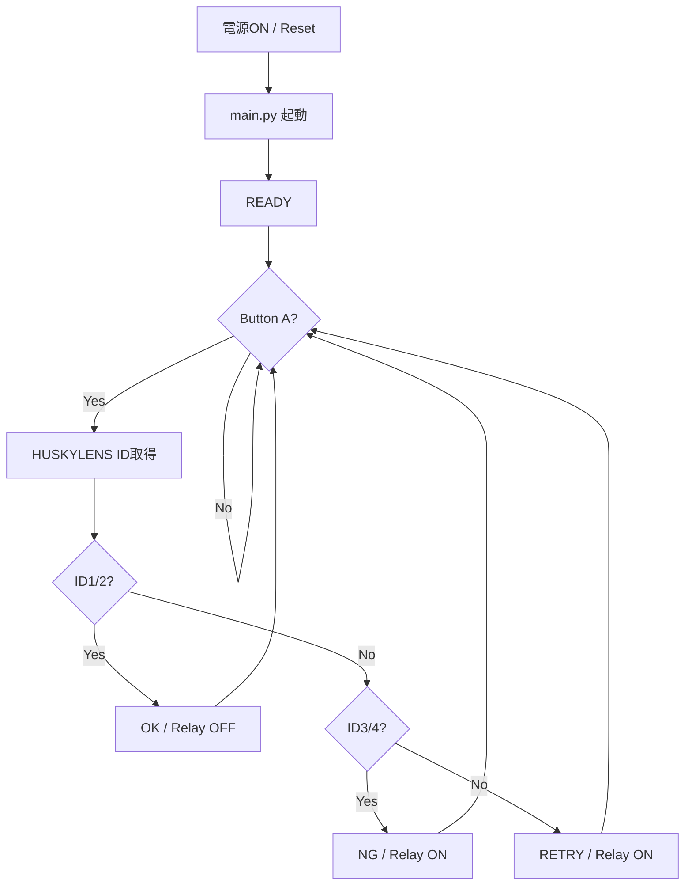

# 第5回 メカトロニクス実習
## HUSKYLENS + M5StickC PLUS2 による外観検査

### 今日のテーマ

HUSKYLENS でワークを分類し、M5StickC PLUS2 でその結果を **OK / NG に変換**して、表示とリレー動作までつなげる。

今日の授業では、ワークの有無を検出する IR センサーはまだ使わない。  
**Button A を「ワークが来た」という合図の代わり**にする。

> 今日のゴールは、色の組合せをすべて判定できるAIを作ることではない。  
> **カメラ → 分類 → M5 → OK / NG判定 → Relay Unit**  
> の検査工程を一通り動かすこと。

M5StickC PLUS2 の配線・プログラミング方法は、別紙
`05_ai_learning_m5_connection.md` を参照する。

---

# 1. 製品仕様

この実習では、3つのパーツを下から **A、B、C** とする。

通常の製造では、赤・青・黄のパーツが供給された順番で組み立てられるため、さまざまな色の組合せのワークができる。

今回は、次の製品仕様とする。

## 正常品（OK）

3つのパーツがすべて同じ色で、かつ **青または黄** であるもの。

- `青・青・青`
- `黄・黄・黄`

## 不良品（NG）

上記の正常品以外。

例：

- 赤色パーツが混入している
- 青と黄が混在している
- その他、正常品の仕様を満たさない

---

# 2. 今日の検査対象

製品仕様上はさまざまな不良品があるが、  
**今日の実習では次の4種類だけを HUSKYLENS に学習させる。**

| HUSKYLENS ID | パーツ構成 | M5での判定 |
|---|---|---|
| ID 1 | 青・青・青 | OK |
| ID 2 | 黄・黄・黄 | OK |
| ID 3 | 青・青・赤 | NG |
| ID 4 | 黄・黄・赤 | NG |

今回の代表的な不良は、

> **パーツ C に赤色パーツが混入したワーク**

とする。

ただし、HUSKYLENS では `青・青・赤` と `黄・黄・赤` を  
**別々のクラスとして学習**させる。

> 青黄青、黄青赤、赤赤赤など、その他の組合せを正しく判定できることは  
> **今日の合格条件ではない。**

---

# 3. HUSKYLENS の初期設定

作業を始める前に、全グループで設定をそろえる。

```text
Algorithm       : Object Classification
Learn Multiple  : ON
Threshold       : 70
```

## 学習する順番

```text
ID 1 : 青・青・青
ID 2 : 黄・黄・黄
ID 3 : 青・青・赤
ID 4 : 黄・黄・赤
```

### Threshold について

Threshold は判定の厳しさを決める値である。

- 高くする → 誤判定は減りやすいが、判定できない場合が増える
- 低くする → 判定しやすくなるが、誤判定が増える場合がある

**まずは全グループ `70` で実験する。**

判定が安定しない場合は、ジグ・距離・背景・照明を確認したあと、必要に応じて **5ずつ**変更して試す。

```text
65 → 70 → 75
```

---

# 4. HUSKYLENS の分類と設備の良否判定

HUSKYLENS が行うのは **画像の分類**である。

M5StickC PLUS2 は、その分類結果を製品仕様上の **OK / NG** に変換する。

```text
HUSKYLENS

ID 1 : 青・青・青 ─┐
                    ├──→ M5 : OK
ID 2 : 黄・黄・黄 ─┘

ID 3 : 青・青・赤 ─┐
                    ├──→ M5 : NG
ID 4 : 黄・黄・赤 ─┘
```

> **AIカメラの「クラス」と、製造設備の「良品／不良品」は同じものとは限らない。**

---

# 5. 今日の到達ゴール

授業終了時に、次の5項目を満たせば **OK** とする。

## ① ジグ・撮像環境

- [ ] HUSKYLENS が固定されている
- [ ] ワークを同じ位置に置き直せる
- [ ] 背景が固定されている
- [ ] カメラとワークの距離がおよそ **3 cm** になっている

## ② HUSKYLENS

- [ ] `青青青` → ID 1
- [ ] `黄黄黄` → ID 2
- [ ] `青青赤` → ID 3
- [ ] `黄黄赤` → ID 4
- [ ] ワークを置き直しながら10回試験し、**8回以上正しく分類**できる
- [ ] 目標は **9回以上**

## ③ HUSKYLENS と M5 の結線

- [ ] USBを外した状態で配線した
- [ ] VCC / GND / SDA / SCL を確認した
- [ ] 通電前に教員チェックを受けた
- [ ] `i2c.scan()` で `[50]` が表示された

## ④ M5StickC PLUS2

- [ ] Button A を読み取れる
- [ ] HUSKYLENS の ID を取得できる
- [ ] ID 1 / ID 2 を `OK` と表示できる
- [ ] ID 3 / ID 4 を `NG` と表示できる

## ⑤ Relay Unit

- [ ] OK のとき Relay OFF
- [ ] NG のとき Relay ON
- [ ] 判定不能時は安全側として Relay ON

---

# 6. 今日やらないこと

今日は次の内容は完成させなくてよい。

- IR センサーによるワーク有無の検出
- 完全自動運転
- すべての色の組合せの学習
- すべての不良パターンの判定
- 高度なPythonプログラミング

まずは、

```text
ワークを置く
  ↓
Button A
  ↓
HUSKYLENS
  ↓
ID 1 ～ ID 4
  ↓
M5 が OK / NG に変換
  ↓
LCD表示
  ↓
Relay Unit
```

が動けばよい。

---

# 7. 役割分担

各グループ2名で作業する。

## 前半

**担当A**

- ジグ
- カメラ位置
- 背景
- HUSKYLENS の学習

**担当B**

- 実験結果の記録
- M5StickC PLUS2
- 配線確認
- Thonny

## 後半

途中で担当を交代する。

> 片方の人だけが操作して終わらないこと。  
> 2人とも HUSKYLENS と M5StickC PLUS2 の両方を操作する。

---

# 8. 作業1：ジグを作る

## 条件

- HUSKYLENS を動かないように固定する
- ワークの位置を決める
- ワークを一度外しても、同じ位置に戻せるようにする
- 背景の画用紙も固定する
- レンズとワークの距離は **約3 cm** を目安にする

## 注意

判定が安定しないとき、最初に疑うのはプログラムではなく、

1. カメラの位置
2. ワークの位置
3. 距離
4. 背景
5. 照明

である。

---

# 9. 作業2：背景を決める

前回検討した内容を使い、今回は短時間で決定する。

## 手順

1. 用意されている画用紙から候補を **2色だけ**選ぶ
2. カメラ位置とワーク位置を固定する
3. 見え方・反射・輪郭を比較する
4. 必要なら簡単な分類試験を行う
5. **15分を目安に使用する背景を決定する**

## 記録

| 背景色 | 見やすさ | 判定の様子 | 備考 |
|---|---|---|---|
|  |  |  |  |
|  |  |  |  |

### 採用した背景

**色：**

理由：

---

# 10. 作業3：HUSKYLENS と M5 を結線する

詳細は `05_ai_learning_m5_connection.md` を参照する。

## 基本配線

| HUSKYLENS | M5StickC PLUS2 |
|---|---|
| VCC | 5V |
| GND | GND |
| SDA | GPIO25 |
| SCL | GPIO26 |

## 作業手順

```text
USBを外す
  ↓
4本を配線
  ↓
2人で相互確認
  ↓
教員チェック
  ↓
USB接続
  ↓
i2c.scan()
  ↓
[50] が出れば結線OK
```

> **教員チェック前に通電しないこと。**

Relay Unit は Grove端子へ接続する。制御は GPIO32 を使用する。

---

# 11. 作業4：HUSKYLENS の学習

次の順番で学習する。

```text
ID 1 : 青・青・青
ID 2 : 黄・黄・黄
ID 3 : 青・青・赤
ID 4 : 黄・黄・赤
```

## 学習時の注意

- カメラとワークの位置を大きく動かさない
- 背景を動かさない
- できるだけ同じ照明条件にする
- 指や手を画面に入れた状態で学習しない
- 1つのIDの学習中に、実際に起こる程度の小さな位置変化を与える
- 学習後は、一度ワークを外して置き直してから判定する

---

# 12. 作業5：HUSKYLENS 単体の判定試験

採用した背景で判定試験を行う。

## 試験方法

1. 4種類からワークを選ぶ
2. 一度ワークを外す
3. ジグに置き直す
4. HUSKYLENS のIDを確認する
5. 結果を記録する
6. ランダムに入れ替えて繰り返す

## 判定記録

| 回 | 実際のワーク | 正しいID | 判定ID | 正解 / 不正解 |
|---:|---|---:|---:|---|
| 1 |  |  |  |  |
| 2 |  |  |  |  |
| 3 |  |  |  |  |
| 4 |  |  |  |  |
| 5 |  |  |  |  |
| 6 |  |  |  |  |
| 7 |  |  |  |  |
| 8 |  |  |  |  |
| 9 |  |  |  |  |
| 10 |  |  |  |  |

```text
正解数：      / 10
```

- 8 / 10 以上：最低目標達成
- 9 / 10 以上：良好
- 10 / 10：非常に良好

---

# 13. 判定が安定しないとき

いきなり Threshold を変更しない。

```text
1. ワーク位置
      ↓
2. カメラとの距離
      ↓
3. HUSKYLENS の固定
      ↓
4. 背景
      ↓
5. 照明
      ↓
6. 学習方法を見直す
      ↓
7. Threshold を調整
```

Threshold を変更した場合は、**変更した値を必ず記録する。**

---

# 14. 作業6：M5StickC PLUS2 の基本動作確認

詳細は `05_ai_learning_m5_connection.md` を参照する。

次の順番で、一つずつ確認する。

```text
LCD表示
  ↓
Relay Unit 単独ON/OFF
  ↓
HUSKYLENS ID取得
  ↓
Button A
```

> いきなり完成した `main.py` を実行しない。  
> 一つずつ動作を確認する。

---

# 15. 作業7：`main.py` を完成させる

MicroPythonでは、M5StickC PLUS2 本体に保存された `main.py` が、電源ON / リセット後に自動実行される。

テンプレートの `TODO` 部分を完成させる。

```text
ID1 / ID2 → OK → Relay OFF
ID3 / ID4 → NG → Relay ON
その他    → RETRY → Relay ON
```

## 最終的な処理



---

# 16. 一連動作の最終確認

## ID1：青・青・青

- [ ] Button A
- [ ] `OK` 表示
- [ ] Relay OFF

## ID2：黄・黄・黄

- [ ] Button A
- [ ] `OK` 表示
- [ ] Relay OFF

## ID3：青・青・赤

- [ ] Button A
- [ ] `NG` 表示
- [ ] Relay ON

## ID4：黄・黄・赤

- [ ] Button A
- [ ] `NG` 表示
- [ ] Relay ON

## 自動起動

- [ ] 完成プログラムをM5StickC PLUS2本体へ `main.py` として保存した
- [ ] リセット後、Thonny の ▶ を押さなくても `READY` が表示された

---

# 17. 今日の記録

カメラとワークの距離：

```text
約          cm
```

使用した背景：

```text

```

使用した Threshold：

```text

```

ジグで工夫した点：

```text


```

判定が失敗したときの原因・対策：

```text


```

## 今日できたこと

- [ ] ジグを作った
- [ ] 背景を決めた
- [ ] HUSKYLENS と M5 を自分たちで結線した
- [ ] `i2c.scan()` で `[50]` を確認した
- [ ] ID1 ～ ID4 を学習した
- [ ] 判定試験を行った
- [ ] M5 から判定IDを取得した
- [ ] Button A を読み取った
- [ ] LCDへ OK / NG を表示した
- [ ] Relay Unit と連携した
- [ ] `main.py` として本体へ保存した

---

# 18. 200分の時間配分

| 時間 | 内容 |
|---|---|
| 0 ～ 15分 | 今日のゴール・製品仕様・HUSKYLENS設定確認 |
| 15 ～ 40分 | ジグ作成 |
| 40 ～ 55分 | 背景2色を比較して決定 |
| 55 ～ 75分 | HUSKYLENS ↔ M5結線・教員チェック・I2C Scan |
| 75 ～ 105分 | ID1～ID4 学習・HUSKYLENS単体判定試験 |
| 105 ～ 115分 | 休憩 |
| 115 ～ 135分 | LCD・Relay・ID取得・Button A の個別確認 |
| 135 ～ 175分 | `main.py` 作成・統合 |
| 175 ～ 195分 | 一連動作の最終確認・記録 |
| 195 ～ 200分 | 片付け |

> 時間が遅れている場合は、背景実験や発展課題よりも  
> **HUSKYLENS → M5 → Relay の一連動作を完成させることを優先する。**

---

# 19. 余裕があれば

## 未学習ワークを試す

例：

```text
青・黄・青
黄・青・赤
赤・赤・赤
```

これらは製品仕様上はNGだが、今回HUSKYLENSに学習させていない。

考えること：

- HUSKYLENS はどのIDと判定したか
- 設備として正しくNGにできたか
- なぜその結果になったと思うか
- 「製品仕様」と「AIが学習したクラス」の違いは何か

## その他

- ワーク位置を数mmずらすとどうなるか
- カメラ距離を変えるとどうなるか
- Threshold 65 / 70 / 75 を比較する
- Button A を IR センサーへ置き換えるには、どこを変更すればよいか

> 発展課題でうまくいかなくても、基本課題が完成していればよい。

---

# 今日の最終ゴール

```text
電源 ON
   ↓
main.py
   ↓
READY
   ↓
ワークを置く
   ↓
Button A
   ↓
HUSKYLENS
   ↓
ID1 ～ ID4
   ↓
M5StickC PLUS2
   ↓
OK / NG
   ↓
LCD + Relay Unit
```

ここまで動けば、第5回は **完成**。
