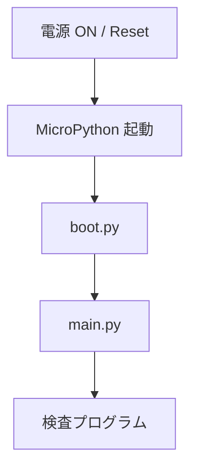
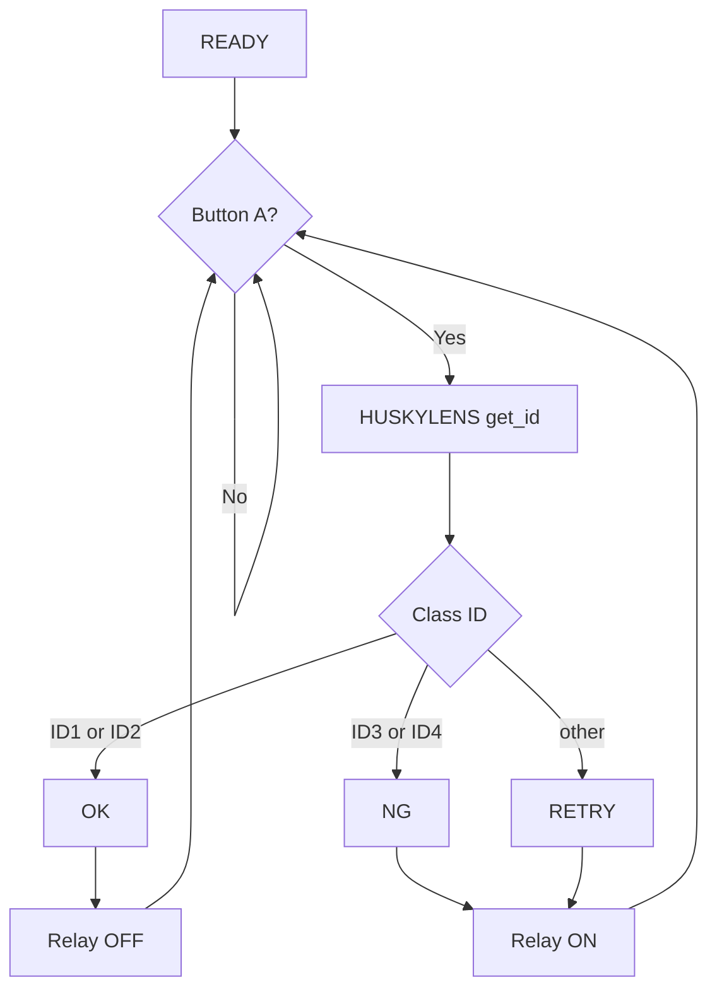

# HUSKYLENS 学習と M5StickC PLUS2 接続 補足資料

作業の順序は 050_huskylens_m5_inspection.md に従ってください。
この資料は、第5回の作業で必要になる技術事項を確認するための補足資料です。

目的は長いプログラムを書くことではなく、次の流れを理解することです。

```text
入力
 ↓
HUSKYLENS から Class ID を取得
 ↓
M5StickC PLUS2 が判断
 ↓
LCD / Relay Unit へ出力
```

---

## 1. HUSKYLENS の役割

HUSKYLENS は今回、設備全体の OK / NG を決定する装置として扱いません。

HUSKYLENS の役割は、画像を分類して **Class ID を返すこと** です。

今回の対応は次の通りです。

| ID | 学習するワーク | M5側の意味 |
|---|---|---|
| 1 | 青・青・青 | OK |
| 2 | 黄・黄・黄 | OK |
| 3 | 青・青・赤 | NG |
| 4 | 黄・黄・赤 | NG |

M5StickC PLUS2 がこの ID を読み、設備上の OK / NG / RETRY に変換します。

---

## 2. HUSKYLENS の初期設定

- Algorithm：`Object Classification`
- Learn Multiple：ON
- Threshold：70

認識が不安定なときは Threshold をすぐ変更せず、次を先に確認します。

1. カメラ位置
2. 撮像距離
3. 背景
4. 照明
5. 再学習

その後、必要なら 65 / 70 / 75 程度で調整します。

---

## 3. 複数学習の操作

複数学習では、特に「次の ID を覚える操作」が分かりにくいため、次の流れを確認してください。

```text
以前の学習を消す
      ↓
ID1 を押し続けて学習
      ↓
カウントダウン中に1回押す
      ↓
ID2 の学習待ち
      ↓
ID2 を押し続けて学習
      ↓
カウントダウン中に1回押す
      ↓
次の ID の学習待ち
      ↓
      …
      ↓
最後の ID を学習
      ↓
カウントダウン中は押さずに待つ
      ↓
学習終了
```

覚え方：

> 次を覚える → カウントダウン中に1回押す
>
> ここで終わる → カウントダウン中は何も押さない

### 今回の順番

1. ID1：青・青・青
2. ID2：黄・黄・黄
3. ID3：青・青・赤
4. ID4：黄・黄・赤

M5 側のプログラムはこの ID 番号を前提にしています。

ID の順番を間違えた場合、プログラムを書き換えて合わせるのではなく、今回の授業では HUSKYLENS を正しい順番で再学習してください。

---

## 4. M5StickC PLUS2 の起動

MicroPython では、電源 ON / Reset 後に `boot.py`、その後 `main.py` が実行されます。



M5StickC PLUS2 には教員側で次を導入済みです。

- `boot.py`
- `display.py`
- `huskylens.py`

学生は主に `main.py` を編集します。

---

## 5. Thonny の確認

- Interpreter：MicroPython (ESP32)
- M5StickC PLUS2 のシリアルポートを選ぶ
- REPL が使えることを確認する

最初から `main.py` を完成させず、各機能を1つずつ確認します。

---

## 6. HUSKYLENS の I2C 接続

使用する GPIO：

| 用途 | GPIO |
|---|---:|
| HUSKYLENS SDA | GPIO25 |
| HUSKYLENS SCL | GPIO26 |
| Button A | GPIO37 |
| Relay Unit | GPIO32 |

I2C の作成：

```python
from machine import Pin, I2C

i2c = I2C(
    0,
    sda=Pin(25),
    scl=Pin(26),
    freq=100000
)
```

HUSKYLENS の I2C Address は `0x32` です。

```python
print(i2c.scan())
```

成功例：

```text
[50]
```

`50` は `0x32` の10進表示です。

---

## 7. LCD の単体確認

```python
from display import Display

lcd = Display()

lcd.clear()
lcd.text2x("HELLO", 10, 20)
lcd.show()
```

画面に `HELLO` が表示されれば成功です。

---

## 8. Relay Unit の単体確認

Relay Unit は GPIO32 を使用します。

- `1`：Relay ON
- `0`：Relay OFF

```python
from machine import Pin

relay = Pin(32, Pin.OUT)

relay.value(1)   # ON
relay.value(0)   # OFF
```

今回の判定と Relay 出力の対応は次の通りです。

| 状態 | Relay |
|---|---|
| OK | OFF |
| NG | ON |
| RETRY / 不明 | ON |

NG / RETRY のときに Relay を ON にして、外部設備へ警告を出せる状態にします。

### 8.1 Relay は電圧を変換する装置ではない

ここは今回の重要ポイントです。

次の4点を必ず理解してください。

1. **Relay は昇圧器ではありません。**
   M5 側の 5V を 24V に変換しているわけではありません。

2. **M5 は Relay を ON / OFF しているだけです。**
   M5 が 24V の表示灯を直接駆動しているわけではありません。

3. **Relay の COM-NO 接点は、24V 側回路のスイッチとして働きます。**
   24V は別に用意した 24V 電源から供給します。

4. **M5 側の制御回路と、Relay 接点につないだ 24V 側回路は電気的につながっていません。**
   Relay 内部では、M5 側の動作によって接点が機械的に開閉されます。

```text
【M5側：制御回路】                     【24V側：負荷回路】

M5StickC PLUS2                         +24V
      │                                  │
      │ GPIO32                           │
      ▼                                  ▼
┌────────────── Relay Unit ──────────────────────────┐
│  制御回路        機械的に接点を動かす       COM ──/ ── NO │
└────────────────────────────────────────────────────┘
      │                                          │
     GND                                      24V表示灯
                                                 │
                                                0V

        M5側から24V側へ電気が流れる接続ではない
```

短く言うと、

> **M5 側は、24V 側回路にあるスイッチを遠隔操作している。**

ということです。

### 8.2 24V 表示灯を接続する場合

適切な 24V DC 表示灯と 24V DC 電源が用意できた場合のみ行います。

今回使用候補として確認した 24V 表示灯は、X1 / X2 のどちら向きに接続しても点灯することを教員側で確認済みです。

接続の考え方：

```text
24V DC +
   │
   ▼
Relay COM
   │
Relay NO
   │
   ▼
表示灯 X1
   │
表示灯 X2
   │
24V DC 0V
```

X1 / X2 は逆でも構いません。

この回路では、

- Relay OFF → COM-NO が開く → 表示灯 消灯
- Relay ON → COM-NO が閉じる → 表示灯 点灯

となります。

**24V 側の配線は、通電前に必ず教員の確認を受けてください。**

### 8.3 理解確認

次の質問に答えられることを到達条件とします。

**Q1. 24V 電源を外したまま Relay を ON にすると、表示灯は点灯するか。**

→ 点灯しません。Relay は 24V を作っていないからです。

**Q2. M5 の GND と 24V 電源の 0V をつなぐ必要があるか。**

→ 今回の Relay 接点を使った回路では必要ありません。M5 側と 24V 側は Relay 接点を境に電気的に別回路だからです。

**Q3. Relay の役割を一言で説明すると何か。**

→ M5 から操作できる、24V 側回路のスイッチです。

### 8.4 今回扱わないこと

実際の FA ラインでは、PLC の先に警告灯などが接続されています。

しかし今回は、

- PLC の入力回路
- PLC との接続
- ラダープログラム
- PLC から実設備の警告灯を制御すること

は扱いません。

また、他の種類の FA センサ出力回路についても今回は扱いません。

まずは **Relay が「別回路のスイッチ」であること** を確実に理解してください。

---

## 9. HUSKYLENS の ID を取得する

```python
from machine import Pin, I2C
from huskylens import HuskyLens

i2c = I2C(
    0,
    sda=Pin(25),
    scl=Pin(26),
    freq=100000
)

husky = HuskyLens(i2c)

object_id = husky.get_id()
print(object_id)
```

4種類のワークを見せて、ID1〜ID4 が正しく返ることを確認します。

---

## 10. Button A の確認

Button A は GPIO37、Active Low です。

- 押していない：`1`
- 押している：`0`

```python
from machine import Pin

button = Pin(37, Pin.IN)
print(button.value())
```

今回の Button A は、将来のワーク到着センサの代わりです。

```text
ワークを置く
  ↓
Button A
  ↓
検査開始
```

後で Button A をセンサへ交換しても、システム全体の流れはほぼ同じです。

---

## 11. 判定部分を読む

今回、特に理解してほしいのは次の部分です。

```python
object_id = husky.get_id()

if object_id in (1, 2):
    # OK
elif object_id in (3, 4):
    # NG
else:
    # RETRY
```

### `object_id in (1, 2)` の意味

`object_id` が 1 または 2 なら True になります。

今回、ID1 と ID2 は製品仕様上 OK として扱います。

### `object_id in (3, 4)` の意味

ID3 または ID4 なら NG とします。

### `else` の意味

ID1〜ID4 以外、または未認識の場合です。

ここを OK にしてはいけません。

今回は `RETRY` と表示し、要確認を外部へ示すため Relay を ON にします。

---

## 12. Class ID と OK / NG は別のもの

次の2つを混同しないでください。

```text
HUSKYLENS
画像 → Class ID

M5StickC PLUS2
Class ID → OK / NG / RETRY
```

HUSKYLENS 自身が「良品」「不良品」という製品仕様を理解しているわけではありません。

---

## 13. 未学習ワークについて

製品仕様では、青・青・青 / 黄・黄・黄 以外は基本的に NG です。

しかし今回 HUSKYLENS に学習させるのは4クラスだけです。

そのため、未学習の混色ワークを置いたときに、必ず未認識になるとは限りません。

既知の ID1〜ID4 のどれかへ誤分類される場合もあります。

したがって今回の実習は、製品仕様上のすべての NG を完全に識別する設備を作ることが目的ではありません。

目的は、

> AIカメラの出力をマイコンが受け取り、設備として意味付けして出力する

というシステム構造を理解することです。

---

## 14. Relay による外部警告出力

今回の実習では、Relay を **M5 の判定結果を外部設備へ渡すための接点出力** として扱います。

- 起動時：Relay ON (未判定のため警告側)
- OK：Relay OFF
- NG：Relay ON
- RETRY / 不明：Relay ON

適切な 24V 表示灯を接続した場合は、NG / RETRY で表示灯が点灯します。

ここで大切なのは、未認識を勝手に OK としないことです。

ただし、今回ここで扱っているのは「警告出力」の動作です。マイコン停止・断線・電源断まで含めた設備全体の Fail-safe 設計は、今回のスコープには含めません。

---

## 15. `main.py` をコピーするだけで終わらせない

GitHub からファイルをコピーして動かすこと自体は問題ありません。

ただし、動いただけでは理解したことにはなりません。

少なくとも次の3問には答えられるようにしてください。

1. Button A は何の代わりか
2. HUSKYLENS は何を M5 に返しているか
3. ID1 / ID2 と ID3 / ID4 で Relay の状態を変えているのはどこか

余裕があれば、次も考えてください。

4. 未認識を OK にしないのはなぜか
5. 将来 Button A をセンサへ交換すると、どこを変更すればよいか

---

## 16. 全体の処理フロー



---

## 17. デバッグするときの順序

全体コードを何度も書き換える前に、次の順番で確認します。

1. Thonny から M5StickC PLUS2 が見える
2. LCD が表示できる
3. Relay を ON / OFF できる
4. HUSKYLENS の配線を確認する
5. `i2c.scan()` で `[50]` が出る
6. `husky.get_id()` で ID が取れる
7. Button A の値が変化する
8. 最後に `main.py` を確認する
