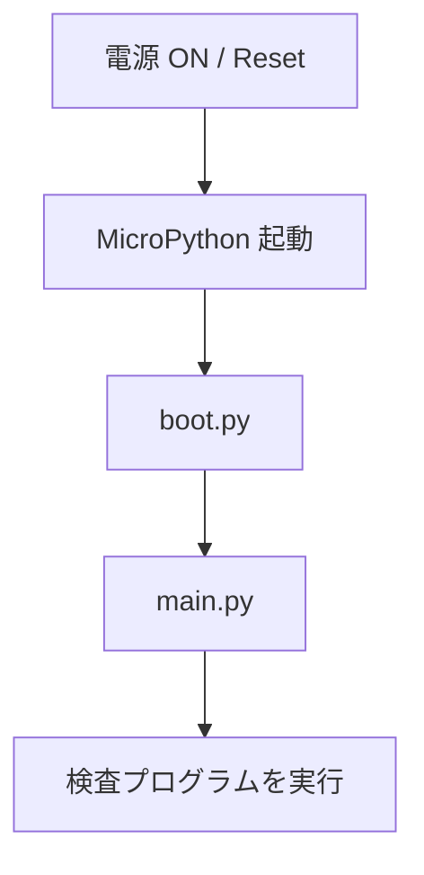
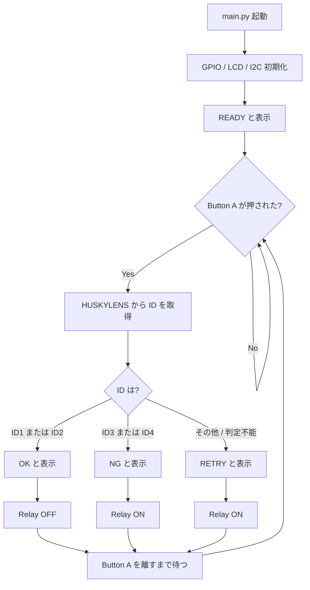

# 第5回 技術補足資料
## M5StickC PLUS2 + HUSKYLENS + Relay Unit の接続とプログラミング

この資料は、第5回の作業指示書
`05_huskylens_m5_inspection_v4.md` のうち、
**M5StickC PLUS2への配線・接続・プログラミング方法**を説明する技術資料である。

---

# 1. 今回つくるもの

今回の検査システムでは、HUSKYLENS がワークを4種類に分類し、
M5StickC PLUS2 がその ID を **OK / NG** に変換する。

```text
HUSKYLENS

ID1 : 青・青・青 ─┐
                   ├──→ OK
ID2 : 黄・黄・黄 ─┘

ID3 : 青・青・赤 ─┐
                   ├──→ NG
ID4 : 黄・黄・赤 ─┘
```

さらに、Button A を「ワークが検査位置へ来た」という信号の代わりにして、
判定結果を LCD と Relay Unit に出力する。

```text
Button A
   ↓
HUSKYLENS の ID を読む
   ↓
M5StickC PLUS2 が OK / NG を判断
   ↓
LCD表示 + Relay Unit
```

後の授業では、Button A の部分を IR センサーに置き換える予定である。

---

# 2. 思い出そう：MicroPython の `main.py`

Raspberry Pi Pico の実習でも使用したように、MicroPython では
マイコン本体に **`main.py`** という名前で保存されたプログラムが、
電源ONやリセット後に自動実行される。

M5StickC PLUS2 でも考え方は同じである。



M5StickC PLUS2 には、教員側で次のファイルを準備済みである。

| ファイル | 役割 |
|---|---|
| `boot.py` | M5StickC PLUS2 の起動時初期設定 |
| `display.py` | LCD表示用モジュール |
| `huskylens.py` | HUSKYLENSとの通信モジュール |
| `main.py` | **今回、学生が作成する検査プログラム** |

> `boot.py`、`display.py`、`huskylens.py` は変更しない。

---

# 3. Thonnyの「実行」と「本体へ保存」は違う

Thonny の ▶ ボタンでプログラムを実行できても、
それだけでは電源を入れ直したときに自動実行されない。

完成したプログラムは、Thonny から

```text
MicroPython device
      ↓
main.py
```

として **M5StickC PLUS2本体へ保存する**。

## 最後の確認

1. `main.py` を M5StickC PLUS2 本体へ保存する
2. リセットする、またはUSBを抜き差しする
3. Thonny の ▶ を押さなくても `READY` から動作することを確認する

---

# 4. 今回使用するピン

M5StickC PLUS2 の今回使用するピンは次の通り。

| 用途 | GPIO | 備考 |
|---|---:|---|
| 電源保持 HOLD | GPIO4 | `boot.py` で設定済み |
| Button A | GPIO37 | 検査開始ボタン |
| HUSKYLENS SDA | GPIO25 | I2C通信 |
| HUSKYLENS SCL | GPIO26 | I2C通信 |
| Relay Unit DIN | GPIO32 | Grove端子の黄色線 |
| GPIO33 | 今回は未使用 | Grove端子の白色線 |

## ピン番号は最初にまとめる

プログラムの途中に `25` や `32` を何度も直接書くのではなく、
最初に名前をつけておく。

```python
BUTTON_PIN = 37
RELAY_PIN = 32

HUSKY_SDA = 25
HUSKY_SCL = 26
```

これによって、

```python
relay = Pin(RELAY_PIN, Pin.OUT)
```

のように、「何のピンか」が分かるプログラムになる。

---

# 5. HUSKYLENS と M5StickC PLUS2 を結線する

## 重要：配線中はUSBを外す

**配線を変更するときは、M5StickC PLUS2 から USB ケーブルを外すこと。**

配線完了後、**通電前に2人で確認し、その後教員のチェックを受ける。**

## 配線

| HUSKYLENS | M5StickC PLUS2 |
|---|---|
| VCC | 5V |
| GND | GND |
| SDA | GPIO25 |
| SCL | GPIO26 |

```text
HUSKYLENS                 M5StickC PLUS2

 VCC  -------------------- 5V
 GND  -------------------- GND
 SDA  -------------------- GPIO25
 SCL  -------------------- GPIO26
```

### 注意

- VCC と GND を逆にしない
- SDA と SCL を逆にしない
- GPIO0 は今回使用しない
- 配線を引っ張った状態で使用しない

---

# 6. Relay Unit の接続

Relay Unit は M5StickC PLUS2 の Grove（HY2.0-4P）端子へ接続する。

M5StickC PLUS2 の Grove端子は今回、次のように使用する。

| Grove線 | M5StickC PLUS2 | Relay Unit |
|---|---|---|
| 黒 | GND | GND |
| 赤 | 5V | 5V |
| 黄 | GPIO32 | DIN |
| 白 | GPIO33 | NC（未使用） |

したがって、Relay Unit の制御ピンは **GPIO32** となる。

```text
GPIO32 = 0  → Relay OFF
GPIO32 = 1  → Relay ON
```

---

# 7. 配線後の検収：I2C Scan

配線後、いきなり完成プログラムを動かさない。

まず HUSKYLENS が通信相手として見えているか確認する。

```python
from machine import Pin, I2C

HUSKY_SDA = 25
HUSKY_SCL = 26

i2c = I2C(
    0,
    sda=Pin(HUSKY_SDA),
    scl=Pin(HUSKY_SCL),
    freq=100000
)

print(i2c.scan())
```

正常なら、Shell に

```text
[50]
```

と表示される。

`50` は16進数では `0x32` で、HUSKYLENS の I2C アドレスである。

## `[50]` が出ない場合

プログラムを変更する前に、次の順番で確認する。

```text
VCC / GND
   ↓
SDA / SCL
   ↓
コネクタの抜け
   ↓
M5StickC PLUS2 を再起動
   ↓
i2c.scan() を再実行
```

> **配線が間違っている状態をプログラムで直すことはできない。**

---

# 8. M5StickC PLUS2 の動作を一つずつ確認する

最初から全部を組み合わせない。

```text
① Thonny / REPL
      ↓
② LCD
      ↓
③ Relay Unit
      ↓
④ HUSKYLENS I2C
      ↓
⑤ HUSKYLENS ID取得
      ↓
⑥ Button A
      ↓
⑦ main.py に統合
```

---

# 9. STEP 1：Thonny / REPL

1. M5StickC PLUS2 をUSBでPCへ接続する
2. Thonnyを起動する
3. Interpreter に `MicroPython (ESP32)` を選ぶ
4. M5StickC PLUS2 のシリアルポートを選ぶ
5. Shell に `>>>` が表示されることを確認する

Shell で、

```python
print("hello")
```

を実行する。

```text
hello
```

と表示されればOK。

---

# 10. STEP 2：LCD表示

`display.py` は準備済み。

```python
from display import Display

lcd = Display()

lcd.clear()
lcd.text2x("HELLO", 10, 20)
lcd.show()
```

LCD に `HELLO` が表示されればOK。

今回の LCD は、装置の状態を確認するためにも使用する。

```text
READY
OK
NG
RETRY
```

などを表示する。

---

# 11. STEP 3：Relay Unit

```python
from machine import Pin
import time

relay = Pin(32, Pin.OUT)

relay.value(1)
time.sleep(1)

relay.value(0)
```

確認すること：

- Relay Unit のLED
- 「カチッ」という動作音

> テスト終了時は Relay を **OFF** にする。

---

# 12. STEP 4：HUSKYLENS の判定IDを読む

`huskylens.py` は準備済み。

```python
from machine import Pin, I2C
from huskylens import HuskyLens

HUSKY_SDA = 25
HUSKY_SCL = 26

i2c = I2C(
    0,
    sda=Pin(HUSKY_SDA),
    scl=Pin(HUSKY_SCL),
    freq=100000
)

husky = HuskyLens(i2c)

object_id = husky.get_id()
print(object_id)
```

今回の学習内容は次の通り。

| ID | ワーク | M5での判定 |
|---:|---|---|
| 1 | 青・青・青 | OK |
| 2 | 黄・黄・黄 | OK |
| 3 | 青・青・赤 | NG |
| 4 | 黄・黄・赤 | NG |

ワークを交換し、IDが変化することを確認する。

---

# 13. STEP 5：Button A を読む

Button A は **GPIO37**。

今回のプログラムでは、

```text
押していない → 1
押している   → 0
```

として扱う。

```python
from machine import Pin
import time

button = Pin(37, Pin.IN)

while True:
    print(button.value())
    time.sleep_ms(100)
```

Button A を押し、`1` と `0` が切り替わることを確認する。

---

# 14. 今回のプログラムの流れ



## なぜ「判定不能 → Relay ON」なのか

検査装置では、判定できないワークを勝手に良品として流してはいけない。

今回は、

```text
分からない → OKにしない
```

という **安全側の処理** を行う。

---

# 15. `main.py` テンプレート

次のテンプレートを使用し、`TODO` 部分を完成させる。

```python
from machine import Pin, I2C
import time

from display import Display
from huskylens import HuskyLens


# ========================================
# ピン設定
# ========================================

BUTTON_PIN = 37
RELAY_PIN = 32

HUSKY_SDA = 25
HUSKY_SCL = 26


# ========================================
# 初期化
# ========================================

button = Pin(BUTTON_PIN, Pin.IN)

relay = Pin(RELAY_PIN, Pin.OUT)
relay.value(0)

lcd = Display()

i2c = I2C(
    0,
    sda=Pin(HUSKY_SDA),
    scl=Pin(HUSKY_SCL),
    freq=100000
)

husky = HuskyLens(i2c)


# ========================================
# LCD表示
# ========================================

def show_message(message):
    lcd.clear()
    lcd.text2x(message, 10, 20)
    lcd.show()


# ========================================
# ワーク判定
# ========================================

def inspect_work():

    object_id = husky.get_id()
    print("ID =", object_id)

    if object_id in (1, 2):
        # TODO: LCDに OK と表示
        # TODO: RelayをOFF
        pass

    elif object_id in (3, 4):
        # TODO: LCDに NG と表示
        # TODO: RelayをON
        pass

    else:
        # TODO: LCDに RETRY と表示
        # TODO: 安全側としてRelayをON
        pass


# ========================================
# メイン処理
# ========================================

show_message("READY")

try:
    while True:

        # Button A は押すと 0
        if button.value() == 0:

            inspect_work()

            # 押しっぱなしで何度も検査しないよう、
            # ボタンを離すまで待つ
            while button.value() == 0:
                time.sleep_ms(10)

        time.sleep_ms(10)

finally:
    # Thonnyで停止した場合はRelayをOFFにする
    relay.value(0)
```

---

# 16. TODO部分で考えること

## ID1 / ID2

```text
LCD   : OK
Relay : OFF
```

## ID3 / ID4

```text
LCD   : NG
Relay : ON
```

## その他 / 判定不能

```text
LCD   : RETRY
Relay : ON
```

Pythonの難しい文法を増やすことが目的ではない。

今回重要なのは、

```text
HUSKYLENSの分類結果
        ↓
設備としてのOK / NG
```

へ変換する処理である。

---

# 17. 動作確認

## 配線

- [ ] USBを外して配線した
- [ ] VCC / GND を確認した
- [ ] SDA = GPIO25 を確認した
- [ ] SCL = GPIO26 を確認した
- [ ] Relay Unit が Grove端子に接続されている
- [ ] 通電前に教員チェックを受けた

## I2C

- [ ] `i2c.scan()` で `[50]` が表示された

## M5単体

- [ ] LCDに文字を表示できた
- [ ] Button A の値を読めた
- [ ] Relay Unit を単独でON/OFFできた

## 検査

- [ ] ID1 → `OK` / Relay OFF
- [ ] ID2 → `OK` / Relay OFF
- [ ] ID3 → `NG` / Relay ON
- [ ] ID4 → `NG` / Relay ON

## `main.py`

- [ ] M5StickC PLUS2 本体へ `main.py` として保存した
- [ ] リセット後に `READY` が表示された
- [ ] Thonny の ▶ を押さなくても検査できた

---

# 18. 動かないときの確認順序

## HUSKYLENS

```text
配線
 ↓
i2c.scan()
 ↓
[50] が出るか
 ↓
huskylens.py
 ↓
get_id()
```

## Relay Unit

```text
Grove接続
 ↓
GPIO32
 ↓
relay.value(1)
 ↓
relay.value(0)
```

## LCD

```text
display.py
 ↓
Display()
 ↓
clear()
 ↓
text2x()
 ↓
show()
```

## Button A

```text
GPIO37
 ↓
button.value()
 ↓
押したとき 0 になるか
```

> **全部を同時にデバッグしない。一つずつ確認する。**

### M5StickC PLUS2 がうまく再起動しない場合

外部機器を接続した状態で起動が不安定な場合は、
いったん HUSKYLENS を外して M5StickC PLUS2 単体で起動を確認し、
その後もう一度接続を確認する。

---

# 19. 今回の制御プログラムの基本

今回覚えてほしい基本形は、

```text
入力
 ↓
判断
 ↓
出力
```

である。

今回の場合は、

```text
入力
Button A + HUSKYLENS

       ↓

判断
ID1 / ID2 → OK
ID3 / ID4 → NG

       ↓

出力
LCD + Relay Unit
```

となる。

後日、Button A を IR センサーへ置き換えても、
この基本構造は変わらない。

---

# 完成状態

```text
電源 ON
   ↓
main.py 自動起動
   ↓
READY
   ↓
ワークを置く
   ↓
Button A
   ↓
HUSKYLENS
   ↓
ID1 ～ ID4
   ↓
M5StickC PLUS2
   ↓
OK / NG
   ↓
LCD + Relay Unit
```

ここまで動けば完成。
