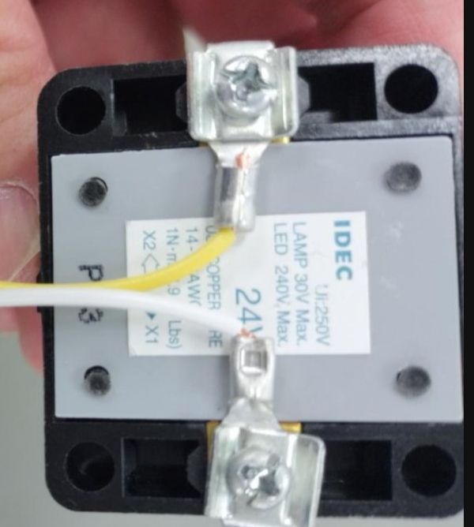

# 第5回 2nd turn 追補：24V表示灯用ケーブル製作と Relay 回路

この資料は `050_huskylens_m5_inspection.md`、`051_ai_learning_m5_connection.md` の追補です。  
**050 の Relay Unit 連携確認に入る前に実施**してください。作業時間の目安は **30～45分** です。

## 1. この作業の目的

Relay Unit を使って、M5側とは別の **24V表示灯回路**を ON / OFF します。

必ず次の4点を理解してください。

1. **Relay は昇圧器ではない。** M5の5Vを24Vへ変換しているわけではない。
2. **M5はRelayをON/OFFしているだけ。** M5が24V表示灯を直接動かしているわけではない。
3. **RelayのCOM-NO接点は、24V側回路のスイッチとして働く。**
4. **M5側回路と24V側回路は電気的につながっていない。**

> M5側から24V側へ電気が流れているのではありません。  
> M5側は、24V回路にある「スイッチ」を遠隔操作しています。

---

## 2. 1グループで作るケーブル

使用電線：**0.3 mm²**

| 色 | 長さ | 接続 | 端末加工 |
|---|---:|---|---|
| 赤 | 60 cm | 24V電源 + → Relay COM | 24V電源側：Y端子 / Relay側：裸線をねじる |
| 黄 | 30 cm | Relay NO → 24V表示灯 | 表示灯側：Y端子 / Relay側：裸線をねじる |
| 白 | 60 cm | 24V表示灯 → 24V電源 0V | **両端ともY端子** |

Y端子は **1.25-YS3A** を使用します。

### ケーブル加工

1. 赤60 cm、黄30 cm、白60 cmを測って切る。
2. Y端子を取り付ける側は、被覆を約 **6.5 mm** むく。
3. Y端子に芯線を奥まで入れ、教員指定の圧着工具・ダイスで圧着する。
4. 圧着後、軽く引っ張り、端子が抜けないことを確認する。
5. 赤線・黄線の **Relay Unit 側**は、端子台に入る長さだけ被覆をむく。
6. Relay Unit 側の芯線は、ばらけないように軽くねじってから端子台へ差し込む。

端末加工は次のようになります。

```text
赤  24V電源側 [Y端子] ───────── [ねじった裸線] Relay COM側
黄  表示灯側   [Y端子] ───────── [ねじった裸線] Relay NO側
白  表示灯側   [Y端子] ───────── [Y端子] 24V電源0V側
```

**加工・結線は必ず無通電で行うこと。**

<div align="center">

</div>
---

## 3. 24V表示灯回路を作る

安定化電源はまだONにしません。

```text
安定化電源 +24V
      │
      │ 赤 60 cm
      ▼
 Relay COM
      │
      │  ← Relay の接点（スイッチ）
      ▼
 Relay NO
      │
      │ 黄 30 cm
      ▼
 24V表示灯
      │
      │ 白 60 cm
      ▼
安定化電源 0V
```

今回使用する24V表示灯には極性がないため、表示灯の2端子はどちら向きでも使用できます。

### M5側との関係

```text
【M5側】                         【24V側】

M5StickC PLUS2                  +24V
      │                           │
   GPIO32                     Relay COM
      │                           │
Relay Unit 制御部            Relay NO
                                  │
                               表示灯
                                  │
                                 0V

     ← 電気的には別回路 →
```

**M5のGNDと24V電源の0Vは接続しません。**

---

## 4. 通電前チェック【教員確認】

グループ全員で次を確認してから教員を呼んでください。

- 赤：`+24V → Relay COM`
- 黄：`Relay NO → 表示灯`
- 白：`表示灯 → 24V 0V`
- Relay端子が **COM と NO** になっている
- M5のGNDを24V側へ接続していない
- 裸線が隣の端子へ触れていない
- Y端子・ねじ端子を軽く引いても抜けない
- 安定化電源がOFFになっている

**教員確認後に24Vを通電します。**

---

## 5. Relay単体で表示灯を確認する

```python
relay.value(0)  # Relay OFF → 表示灯 消灯
relay.value(1)  # Relay ON  → 表示灯 点灯
```

### 到達条件 A

- Relay OFF → 表示灯が消灯する
- Relay ON → 表示灯が点灯する

---

## 6. 検査システムと統合する

`main.py` の判定と表示灯を次のように対応させます。

| 判定 | Relay | 24V表示灯 |
|---|---|---|
| OK | OFF | 消灯 |
| NG | ON | 点灯 |
| RETRY / 未認識 | ON | 点灯 |

```text
ワーク
 ↓
HUSKYLENS
 ↓ Class ID
M5StickC PLUS2
 ↓ OK / NG / RETRY
Relay Unit
 ↓ 接点
24V表示灯
```

### 到達条件 B

Button Aで検査を開始し、**OKなら消灯、NG / RETRYなら点灯**まで一連で動作すること。

---

## 7. 理解確認

グループ全員が説明できれば完了です。

1. RelayはM5の5Vを24Vへ変換しているか。
2. 24V表示灯を動かす電力はどこから来るか。
3. RelayのCOM-NO接点は何をしているか。
4. M5のGNDと24V側の0Vはつながっているか。
5. 24V電源を外してRelayだけONにした場合、表示灯は点灯するか。なぜか。

> **まとめ**  
> M5はRelayを操作する。Relayは電圧を作らない。  
> 24V表示灯は別の24V電源で動き、Relay接点がその回路のスイッチになる。  
> M5側と24V側は電気的には別回路である。

※ 今回は PLC 接続、ラダー制御、オープンコレクタ出力は扱いません。
