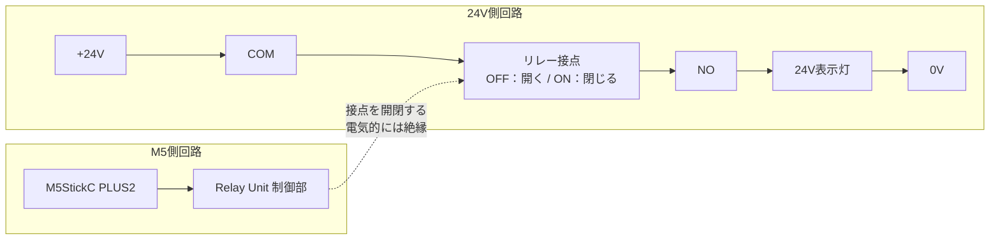

# 第6回 メカトロニクス実習
## 第5回の完成とワーク検出の自動化

### 今日のゴール

第5回では、HUSKYLENS の認識結果を M5StickC PLUS2 で受け取り、
OK / NG / RETRY を判定して Relay Unit を ON / OFF するところまで進みました。

第6回 1st turn では、まず第5回で十分に確認できなかった

- HUSKYLENS の複数学習操作
- Relay Unit と 24V表示灯の接続
- Relay の役割

を確認します。

その後、第5回まで Button A で代用していた

> **「ワークが来たので検査を開始する」**

という入力を、実際の IR センサへ置き換えます。

```text
ワーク
  ↓
IRセンサ
  ↓
M5StickC PLUS2
  ↓
HUSKYLENS から Class ID を取得
  ↓
M5 で OK / NG / RETRY を判断
  ↓
Relay Unit
  ↓
24V表示灯
```

---

# 1. 今日の到達目標

## 最低到達点

- HUSKYLENS に複数の Class ID を自分たちで学習させられる
- 24V表示灯用ケーブルを製作できる
- Relay Unit と 24V表示灯の回路を組める
- Relay ON / OFF で表示灯を点灯 / 消灯できる
- Relay の役割を説明できる

## 標準到達点

- IRセンサを M5StickC PLUS2 に接続できる
- REPL で IRセンサの `0 / 1` を確認できる
- ワークの有 / 無を安定して検出できるよう、位置と感度を調整できる
- Button A の代わりに IRセンサで検査を開始できる

## 発展

- IRセンサ
  → HUSKYLENS
  → M5判定
  → Relay
  → 24V表示灯

  までを一連で動作させる
- ワークを繰り返し置いて、誤検出や二重判定がないか確認する

---

# 2. 今日のタイムスケジュール

| 時間 | 内容 | 到達条件 |
|---|---|---|
| 0～10分 | 今日の目標・システム全体の確認 | 今日変更する部分が「入力」であると分かる |
| 10～25分 | HUSKYLENS 学習操作の拡大デモ | 学習操作の流れを確認する |
| 25～40分 | 各グループで HUSKYLENS 学習練習 | 自分たちだけで複数学習できる |
| 40～65分 | 24V表示灯用ケーブル製作 | 1グループ1セット完成 |
| 65～80分 | Relay－24V表示灯回路の構築 | 教員の通電前確認に合格 |
| 80～95分 | REPLで Relay 単体実験・理解確認 | Relay の役割を説明できる |
| 95～105分 | 休憩 | |
| 105～120分 | IRセンサ接続・REPL確認 | ワーク有 / 無で `0 / 1` が変わる |
| 120～140分 | IRセンサの位置・感度調整・仮固定 | 約3 cmで安定して検出できる |
| 140～155分 | 置き直し試験 | 10回程度、安定して検出できる |
| 155～175分 | Button A → IRセンサへプログラム変更 | センサ検出で検査を開始できる |
| 175～190分 | 全体統合・動作確認 | 入力→認識→判定→出力が一連で動く |
| 190～200分 | 結果記録・片付け | 班の到達点を記録する |

※ センサ調整やデバッグに時間がかかった場合は、
無理に全体統合まで進まず、**各段階の動作確認を確実に終えること**を優先する。

---

# 3. HUSKYLENS 学習操作のおさらい

HUSKYLENS の `Object Classification` は、画面上の状態とボタン操作の関係が分かりにくいため、
最初に教員が **Webカメラで HUSKYLENS の画面と操作する指を拡大表示**して実演します。

## 複数学習の流れ

1. `Object Classification` を選ぶ
2. 必要なら以前の学習内容を消す
3. 覚えさせたい物体をフレームに入れる
4. 学習ボタンを押し続けて **ID1** を学習する
5. `Learn Multiple` が有効な場合、カウントダウン中にボタンを1回押す
6. 次の物体をフレームに入れ、押し続けて **ID2** を学習する
7. 必要な数だけ繰り返す
8. 最後はカウントダウン中に何も押さず、学習を終了する

### 確認

> **ID1 の学習後、ID2 を覚えさせたい場合、カウントダウン中に何をするか？**

まず2種類程度の身近な物体を使って操作を練習し、
操作が分かったら実ワークの学習へ進みます。

---

# 4. 24V表示灯用ケーブルを製作する

1グループで1セット製作します。

使用電線：**0.3 mm²**

| 色 | 長さ | 接続 | 端末加工 |
|---|---:|---|---|
| 赤 | 60 cm | 24V電源 + → Relay COM | 電源側：Y端子 / Relay側：裸線 |
| 黄 | 30 cm | Relay NO → 24V表示灯 | 表示灯側：Y端子 / Relay側：裸線 |
| 白 | 60 cm | 24V表示灯 → 24V電源 0V | 両端ともY端子 |

Y端子：`1.25-YS3A`

## 加工手順

1. 指定された長さに電線を切る
2. Y端子を取り付ける側の被覆を約 **6.5 mm** むく
3. Y端子へ芯線を奥まで差し込む
4. 指定された圧着工具で圧着する
5. 軽く引っ張り、端子が抜けないことを確認する
6. 赤線・黄線の Relay Unit 側は、端子台に入る長さだけ被覆をむく
7. Relay Unit 側の芯線は、ばらけないよう軽くねじる

```text
赤  24V電源側 [Y端子] ───────── [裸線] Relay COM側
黄  表示灯側   [Y端子] ───────── [裸線] Relay NO側
白  表示灯側   [Y端子] ───────── [Y端子] 24V電源0V側
```

**加工・結線は必ず無通電で行うこと。**

---

# 5. Relay と 24V表示灯の回路を作る

```text
安定化電源 +24V
      │
      │ 赤
      ▼
 Relay COM
      │
      │  Relay の接点
      ▼
 Relay NO
      │
      │ 黄
      ▼
 24V表示灯
      │
      │ 白
      ▼
安定化電源 0V
```

## 通電前チェック【教員確認】

- 赤線：`+24V → COM`
- 黄線：`NO → 表示灯`
- 白線：`表示灯 → 24V側 0V`
- Relay の端子が **COM と NO** になっている
- 裸線が隣の端子へ触れていない
- Y端子を軽く引いても抜けない
- 安定化電源が OFF になっている

**教員確認後に通電すること。**

---

# 6. REPLで Relay の動作を確認する

いきなり全体プログラムを動かさず、
まず REPL から Relay だけを操作します。

```python
relay.value(0)   # Relay OFF → 24V表示灯 消灯
relay.value(1)   # Relay ON  → 24V表示灯 点灯
```

## 24V電源の有無も確認する

### 24V電源なし

- Relay OFF → 表示灯は点かない
- Relay ON → 表示灯は点かない

### 24V電源あり

- Relay OFF → 表示灯は消灯
- Relay ON → 表示灯は点灯

## 必ず理解する4点

1. **Relay は昇圧器ではない**
2. **M5 は Relay を ON / OFF しているだけ**
3. **Relay の COM-NO 接点は、24V側回路のスイッチとして働く**
4. **M5側回路と24V側回路は電気的につながっていない**



**点線は配線ではありません。**  
M5側の制御によって、24V側の **COM と NO の間の接点が機械的に開閉する**ことを表しています。

| Relay | COM-NO の状態 | 24V側の電流 | 表示灯 |
|---|---|---|---|
| `0`（OFF） | 開いている | 流れない | 消灯 |
| `1`（ON） | 閉じている | `+24V → COM → NO → 表示灯 → 0V` に流れる | 点灯 |

### 理解確認

- 24Vはどこから供給されているか？
- Relayは何をしているか？
- 24V電源を外して Relay を ON にしたら表示灯は点くか？
- M5 の GND と24V側の0Vは今回つながっているか？

---

# 7. IRセンサを接続する

使用するセンサ：

> **Keyestudio KS0487 37-in-1 Sensor Kit 内  
> Infrared Obstacle Avoidance Sensor**

このセンサはアナログ距離値を返すセンサではありません。

> **コンベアの横からワークを検出した / していない**

をデジタルの `0 / 1` で返します。

## 使用端子

| IRセンサ端子 | 接続先 |
|---|---|
| `+` | M5StickC PLUS2 の 3.3V |
| `-` | 自作分岐ケーブルの GND |
| `S` | 自作分岐ケーブル → GPIO33 |
| `EN` | 使用しない |

### 自作分岐ケーブルについて

- 下側 Grove コネクタ → M5StickC PLUS2
- 上側 Grove コネクタ → Relay Unit
- GND を Relay Unit と IRセンサへ分岐
- Relay Unit の信号 → GPIO32
- IRセンサの信号 → GPIO33

**注意：自作ケーブルの黄色線は IRセンサ信号（GPIO33）です。  
M5StickC PLUS2 の標準的なケーブル色の対応とは異なるため、色だけで判断しないこと。**

IRセンサの電源 3.3V は、Groveケーブルからではなく、
M5StickC PLUS2 の GPIO 側から別に取り出します。

---

# 8. REPLで IRセンサの入力を確認する

まずセンサだけを確認します。

```python
from machine import Pin

sensor = Pin(33, Pin.IN)
print(sensor.value())
```

実機確認では、このセンサは **負論理（Active Low）** でした。

```text
ワークなし → 約3.3V → sensor.value() == 1

ワークあり → 約0V   → sensor.value() == 0
```

つまり、

> **0 になったらワークを検出した**

と考えます。

何度も確認したい場合：

```python
import time

while True:
    print(sensor.value())
    time.sleep_ms(200)
```

停止するときは `Ctrl + C`。

---

# 9. IRセンサの感度と位置を調整する

IRセンサには調整用のポテンショメータが2個あります。

今回の実機では、

> **2個とも反時計回り端まで回した状態で、約3 cm先のワークを検出できる**

ことを教員が確認しています。

まずこの位置を初期設定とします。

**端まで回すときに無理な力をかけないこと。**

## 調整手順

1. 2つのポテンショメータを反時計回り端を基準位置にする
2. センサから約3 cmの位置にワークを置く
3. REPLで `sensor.value()` を確認する
4. ワークなしで `1`
5. ワークありで `0`
6. 安定しない場合だけ、少しずつ調整する

最大検出距離を競うことが目的ではありません。

> **実際にワークを置く位置で、確実に有 / 無を区別できること**

を優先します。

---

# 10. IRセンサを仮固定する

今回はセンサ固定ジグの完成度を競いません。

次の条件を満たせば、両面テープ・養生テープによる仮固定で構いません。

- センサとワークの距離を約3 cmにできる
- センサ位置が作業中に大きく動かない
- 基板裏面が DINレールなどの金属部へ直接触れない
- ケーブルを引いてもセンサ位置がずれない

## 固定例

```text
IRセンサ基板
     │
絶縁物・厚めの両面テープ
     │
DINレール等
```

ケーブルも別に養生テープなどで固定し、
ケーブルの重さや引っ張りがセンサ本体へ直接かからないようにします。

---

# 11. ワーク検出を10回確認する

ワークを毎回置き直しながら確認します。

| 回数 | ワークなし = 1 | ワークあり = 0 |
|---:|---|---|
| 1 | | |
| 2 | | |
| 3 | | |
| 4 | | |
| 5 | | |
| 6 | | |
| 7 | | |
| 8 | | |
| 9 | | |
| 10 | | |

安定しない場合は、

1. センサ位置
2. ワーク位置
3. 距離
4. センサの向き
5. ポテンショメータ

の順に確認します。

---

# 12. Button A を IRセンサへ置き換える

第5回では Button A が検査開始入力でした。

```python
if button.value() == 0:
    inspect_work()
```

Button A も Active Low なので、

> 押す → `0`

でした。

今回の IRセンサも、

> ワーク検出 → `0`

です。

そのため、検査開始の条件は次のように書けます。

```python
sensor = Pin(33, Pin.IN)

def work_sensor_detected():
    return sensor.value() == 0
```

メイン処理は、

```python
if work_sensor_detected():
    inspect_work()
```

のように変更できます。

> **入力装置が変わっても、その後の「認識 → 判定 → 出力」の構造は変わらない。**

## しかし、このままでよいだろうか？

ここで、ワークをセンサの前に置いたままにして、
プログラムがどのように動くか考えてみます。

IRセンサは、

> 「ワークが置かれた瞬間」だけ `0` を出す

のではありません。

**ワークがそこに存在している間、ずっと `0` を出し続けます。**

次の時系列を見てください。

```text
時刻        ワーク        センサ        プログラム
---------------------------------------------------------
①          なし            1           待機
②          置く            0           検出 → 検査・判定
③          まだある        0           ？
④          まだある        0           ？
⑤          取り除く        1           待機
```

### 考えてみよう

③、④では、ワークはまだセンサの前にあります。

このとき、

```python
if work_sensor_detected():
    inspect_work()
```

はどうなるでしょうか。

---

プログラムは繰り返し動いているため、検査が1回終わったあとも
センサをもう一度確認します。

ところが、ワークはまだそこにあります。

```text
ワークを検出
     ↓
検査・判定
     ↓
まだワークがある
     ↓
センサは 0
     ↓
もう一度「検出」
     ↓
もう一度 検査・判定
     ↓
まだワークがある
     ↓
     ⋯
```

つまり、このままでは、

> **1個のワークを何度も検査してしまう**

可能性があります。

## 1個のワークを1回だけ検査するには？

今回ほしい動作は次のような流れです。

```text
ワークを待つ
    ↓
ワークを検出
    ↓
1回だけ検査・判定
    ↓
ワークがなくなるまで待つ
    ↓
次のワークを待つ
```

検査が終わったあと、ワークがなくなるまで待つ処理を追加します。

```python
if work_sensor_detected():
    inspect_work()

    # 同じワークをもう一度検出しないように、
    # ワークがなくなるまで待つ
    while work_sensor_detected():
        time.sleep_ms(50)
```

`while work_sensor_detected():` の間は、
センサがまだワークを検出しているので、次の検査へ進みません。

ワークを取り除くと、

```text
sensor.value() == 1
```

となり、`while` を抜けて次のワークを待ちます。

### 動作確認

実際にワークを1個置いたままにして確認します。

- ワークを置いたとき、検査は1回だけ実行されるか
- ワークを置いたままでも、再検査されないか
- ワークを取り除いたあと、次のワークを検出できるか

> **センサの「検出状態」と、ワークが新しく来たことは同じではない。**

入力信号がどのように時間変化するかを考えて、
必要な動作をプログラムに追加します。

---

# 13. 最終動作確認

```text
ワークを置く
   ↓
IRセンサが検出
   ↓
GPIO33 が 0
   ↓
HUSKYLENS が Class ID を返す
   ↓
M5 が OK / NG / RETRY を判断
   ↓
Relay Unit
   ↓
24V表示灯
```

確認項目：

- ワークなしでは検査を開始しない
- ワークを置くと検査を開始する
- OK では Relay OFF
- NG / RETRY では Relay ON
- 24V表示灯の動作が判定結果と一致する

---

# 14. 今日の記録

グループ名：

## HUSKYLENS

- [ ] 自分たちで複数学習できた
- [ ] 教員の補助が必要だった

## 24V表示灯回路

- [ ] ケーブル製作完了
- [ ] Relayで点灯 / 消灯確認
- [ ] Relayの4つのポイントを説明できる

## IRセンサ

- [ ] REPLで `1 / 0` を確認
- [ ] センサを仮固定
- [ ] 約3 cmで安定検出
- [ ] 10回確認を実施

## 全体統合

- [ ] IRセンサで検査開始
- [ ] HUSKYLENSでID取得
- [ ] M5でOK / NG / RETRY判定
- [ ] Relay / 24V表示灯まで動作

## 今日の到達点

- [ ] 最低到達点
- [ ] 標準到達点
- [ ] 発展まで到達

## 問題・次回へ残ったこと

記入：


<!--
# 教員確認ポイント

1. HUSKYLENS の複数学習を学生自身で再現できるか
2. 24V回路は通電前に必ず確認
3. Relay を「電圧変換器」と理解していないか
4. M5側と24V側が電気的に別回路であることを説明できるか
5. IRセンサの負論理 `なし=1 / あり=0` を理解しているか
6. 自作ケーブルでは黄色線が GPIO33 であることを確認したか
7. IRセンサ基板を金属部へ直接接触させていないか
8. 全体統合を急がず、REPLによる単体確認を終えてから先へ進んでいるか
9. 190分時点で作業を止め、記録と片付けへ移る
-->
