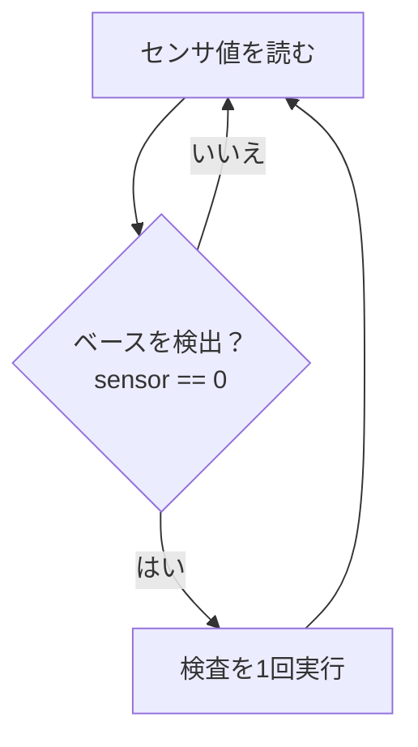
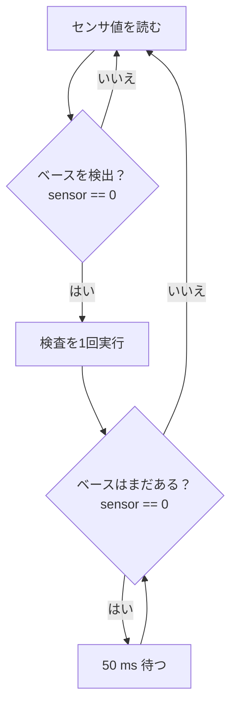

# 第6回 メカトロニクス実習 2nd turn
## IRセンサによるワーク到着検出

### 今日のテーマ

第5回では、Button A を押すことで検査を開始し、

> Button A → HUSKYLENS → M5判定 → Relay → 24V警告灯

という一連の動作を確認しました。

今回は、Button A を **IRセンサ** に置き換えます。

IRセンサは、赤・青・黄の部品を識別するためのセンサではありません。

> **コンベアを流れる真鍮ベースが検査位置に到着したことを検出する**

ために使用します。

HUSKYLENS と IRセンサの役割を分けて考えます。

```text
IRセンサ
  ↓
真鍮ベースが検査位置に来たことを検出
  ↓
M5StickC PLUS2
  ↓
HUSKYLENS から Class ID を取得
  ↓
OK / NG / RETRY を判断
  ↓
Relay Unit
  ↓
24V警告灯
```

---

# 1. 今日の到達目標

## 最低到達点

- IRセンサを M5StickC PLUS2 に正しく接続できる
- REPL で `sensor.value()` を確認できる
- IRセンサが **負論理（検出時 0）** であることを説明できる
- 可変抵抗とセンサ位置を調整し、真鍮ベースを検出できる

## 標準到達点

- IRセンサを実設備へ仮固定できる
- 真鍮ベースを通過させたとき、安定して `1 → 0 → 1` が得られる
- ベースがセンサ前に存在している間は `0` が続くことを理解する
- 同じベースを繰り返し検査しないための `while` 待機処理を説明できる

## 発展

時間に余裕があれば、

> IRセンサ → HUSKYLENS → M5判定 → Relay → 24V警告灯

まで一連の検査動作を確認する。

**今日は全体統合を急がず、IRセンサによる安定したワーク到着検出を優先する。**

---

# 2. 今日のタイムスケジュール

| 時間 | 内容 | 到達条件 |
|---|---|---|
| 0～10分 | 今日の目的・IRセンサの役割 | IRセンサとHUSKYLENSの役割の違いが分かる |
| 10～30分 | 自作ケーブルとIRセンサの接続 | GND共有、GPIO33、3.3V給電を確認 |
| 30～50分 | REPLで `sensor.value()` | ベースなし=`1`、検出=`0` を確認 |
| 50～70分 | 可変抵抗・検出距離の調整 | 実際の真鍮ベースを安定して検出 |
| 70～90分 | Button A → IRセンサへ変更 | IRセンサを検査開始条件として使える |
| 90～100分 | 休憩 | |
| 100～125分 | 再検出問題を考える | 「ベースがある間は0が続く」ことを理解 |
| 125～140分 | `while` による待機処理 | 1個のベースにつき1回だけ処理できる |
| 140～150分 | FA実習室へ移動 | 実設備での確認準備 |
| 150～165分 | IRセンサを仮固定 | 絶縁・位置・ケーブル固定を確認 |
| 165～185分 | 真鍮ベース通過試験 | `1 → 0 → 1` を繰り返し安定確認 |
| 185～190分 | 結果確認 | 今日の到達点を確認 |
| 190～200分 | 記録・片付け | 班の結果と残課題を記録 |

※ 真鍮ベース通過試験までを標準到達点とする。  
※ 一連の検査システムの最終統合は、時間に余裕がある場合のみ行う。

---

# 3. IRセンサを接続する

使用するセンサ：

> **Keyestudio 37-in-1 Sensor Kit  
> Infrared Obstacle Avoidance Sensor**

このセンサは、距離を数値で返すセンサではありません。

> **対象物を検出している / 検出していない**

をデジタル信号 `0 / 1` で M5StickC PLUS2 に伝えます。

## 使用端子

| IRセンサ端子 | 接続先 |
|---|---|
| `+` | M5StickC PLUS2 の 3.3V |
| `-` | M5側 GND |
| `S` | GPIO33 |
| `EN` | 今回は使用しない |

## 自作ケーブルの接続

今回使用する自作ケーブルでは、

- Relay Unit の信号 → GPIO32
- IRセンサの信号 → GPIO33
- M5側 GND → Relay Unit と IRセンサで共有

します。

```text
M5StickC PLUS2
    │
    ├─ GPIO32 ───── Relay Unit 信号
    │
    ├─ GPIO33 ───── IRセンサ S
    │
    ├─ GND ──┬──── Relay Unit GND
    │        └──── IRセンサ -
    │
    └─ 3.3V ────── IRセンサ +
```

**注意：自作ケーブルの黄色線は IRセンサ信号（GPIO33）です。  
標準的な Grove ケーブルの色と役割が一致するとは限らないので、色だけで判断しないこと。**

### GND共有について

IRセンサと Relay Unit は、どちらも **M5側の回路**なので GND を共有します。

一方、24V警告灯側の `0V` は別回路です。

> **M5側 GND と 24V側 0V を接続する、という意味ではありません。**

---

# 4. REPLで IRセンサを確認する

全体プログラムへ組み込む前に、まずセンサだけを確認します。

```python
from machine import Pin

sensor = Pin(33, Pin.IN)
print(sensor.value())
```

真鍮ベースをセンサの前へ近づけたり離したりして、
値が変化することを確認します。

実機では、

```text
真鍮ベースなし → 1
真鍮ベースあり → 0
```

となります。

つまり、このセンサは、

> **検出すると 0 になる**

センサです。

このような論理を **負論理（Active Low）** と呼びます。

何度も確認するときは、

```python
import time

while True:
    print(sensor.value())
    time.sleep_ms(200)
```

とします。

停止するときは `Ctrl + C`。

---

# 5. IRセンサを調整する

IRセンサには可変抵抗が2個あります。

今回は、2個の可変抵抗の内部回路上の詳細を学ぶことが目的ではありません。

> **実際に使用する真鍮ベースを、実際に近い位置で安定して検出できるように調整する**

ことを目的とします。

## 初期位置

教員の実機確認では、

> **2個とも反時計回り端を基準位置**

として使用できます。

端まで回すときは、無理な力をかけないこと。

## 調整手順

1. 2個の可変抵抗を反時計回り端を基準位置にする
2. REPLで `sensor.value()` を表示する
3. 実際に使用する真鍮ベースをセンサ前へ近づける
4. ベースなしで `1`
5. ベースありで `0`
6. 安定しない場合は、距離・向き・可変抵抗を少しずつ調整する

### 重要

IRセンサの反応は、対象物の材質・表面・向きなどによって変化します。

したがって、

> **「何 cm なら必ず検出できる」と考えるのではなく、実際の検出対象で確認する**

ことが重要です。

今回の検出対象は、赤・青・黄の部品ではなく **共通の真鍮ベース** です。

---

# 6. Button A を IRセンサへ置き換える

第5回では、Button A を押すと検査を開始していました。

今回は、

> **真鍮ベースをIRセンサが検出したら検査開始**

に変更します。

```python
sensor = Pin(33, Pin.IN)

def work_sensor_detected():
    return sensor.value() == 0
```

検査開始部分は、

```python
if work_sensor_detected():
    inspect_work()
```

と書けます。

ここで重要なのは、

> **入力装置が Button A から IRセンサへ変わっても、その後の認識・判定・出力の構造は変わらない**

ということです。

---

# 7. このままだと何が起こる？

ここが今日の重要なポイントです。

IRセンサは、

> 「真鍮ベースが到着した瞬間だけ 0 を出す」

わけではありません。

**真鍮ベースがセンサの前に存在している間、ずっと `0` を出し続けます。**

まず時系列で考えてみます。

```text
時刻       真鍮ベース          センサ値       プログラム
-------------------------------------------------------------
①          まだ来ていない          1          待機
②          先端が到着              0          検査開始
③          通過中                  0          ？
④          まだ通過中              0          ？
⑤          後端が通過              1          次のベース待ち
```

③と④では、同じ真鍮ベースがまだセンサの前にあります。

それでもプログラムは繰り返し動いています。

## 対策をしない場合



このプログラムでは、

```text
ベースを検出
    ↓
検査
    ↓
もう一度センサを読む
    ↓
ベースはまだいるので 0
    ↓
また検査
    ↓
また 0
    ↓
……
```

となります。

つまり、

> **1個の真鍮ベースを何度も検査してしまう**

可能性があります。

---

# 8. 1個のベースを1回だけ処理する

欲しい動作は次の流れです。

```text
ベースを待つ
    ↓
ベースを検出
    ↓
1回だけ検査する
    ↓
同じベースが通り過ぎるまで待つ
    ↓
次のベースを待つ
```

フローチャートで表すと、



コードでは、

```python
if work_sensor_detected():
    inspect_work()

    # 同じベースをもう一度検出しないように、
    # ベースが通り過ぎるまで待つ
    while work_sensor_detected():
        time.sleep_ms(50)
```

となります。

### `if` と `while` の役割

```text
if
↓
「ベースが来た。1回検査する」

while
↓
「同じベースがまだいるので、通り過ぎるまで待つ」
```

ベースが通り過ぎると、

```text
sensor.value() == 1
```

になるため、`while` を抜けて次のベースを待ちます。

> **「センサが検出中である」ことと、「新しいベースが来た」ことは同じではありません。**

---

# 9. FA実習室で IRセンサを仮固定する

IRセンサは、コンベアの横から **真鍮ベースの側面** を狙います。

```text
            真鍮ベース
         ( ◯  O  ◯ )  → ワーク進行方向

────────────────────────
        [ IRセンサ ]
────────────────────────
```

部品A・B・Cではなく、毎回共通して通過する真鍮ベースを検出します。

## 絶縁

IRセンサ基板の裏面を、DINレールなどの金属部へ直接触れさせません。

使用済みA4クリアフォルダを、

> **IRセンサ基板より少し大きめ**

に切り、絶縁シートとして使用します。

```text
IRセンサ基板
     │
A4クリアフォルダから切り出した
絶縁シート
     │
DINレール等
```

## 固定

今回は仮設です。

- 養生テープ等で固定する
- 強力な両面テープで外しにくくしない
- センサ位置が作業中に動かない
- ケーブルを引いても基板が動かない
- センサの光軸が真鍮ベース側面へ当たる

ことを確認します。

ケーブルも別の位置で固定し、
ケーブルの重さや引っ張りがセンサ本体へ直接かからないようにします。

---

# 10. 真鍮ベースを通過させて確認する

真鍮ベースを実際の進行方向へ通過させます。

期待する変化は、

```text
ベース接近前       → 1
ベース先端が到着   → 0
ベース通過中       → 0
ベース後端が通過   → 1
```

つまり、

> **1 → 0 → 1**

です。

同じ条件で繰り返し確認します。

| 回数 | 接近前 `1` | 通過中 `0` | 通過後 `1` | 結果 |
|---:|:---:|:---:|:---:|---|
| 1 | | | | |
| 2 | | | | |
| 3 | | | | |
| 4 | | | | |
| 5 | | | | |
| 6 | | | | |
| 7 | | | | |
| 8 | | | | |
| 9 | | | | |
| 10 | | | | |

安定しない場合は、次の順で確認します。

1. センサが真鍮ベース側面を狙っているか
2. センサとベースの距離
3. センサの向き
4. センサ本体が動いていないか
5. ケーブルに引っ張られていないか
6. 必要なら可変抵抗を微調整する

---

# 11. 時間に余裕がある場合：一連の検査

真鍮ベースの通過検出が安定した班だけ進みます。

```text
真鍮ベース到着
    ↓
IRセンサが 0
    ↓
HUSKYLENS から Class ID
    ↓
M5で OK / NG / RETRY 判定
    ↓
Relay Unit
    ↓
24V警告灯
    ↓
真鍮ベースが通過するまで待つ
```

確認項目：

- ベース到着で検査が1回だけ始まる
- ベースがセンサ前に残っていても再検査しない
- OK / NG / RETRY の判定と Relay 出力が一致する
- ベース通過後、次のベースを待てる

---

# 12. 今日の記録

グループ名：

## IRセンサ接続

- [ ] GPIO33を入力として使用した
- [ ] M5側GNDをIRセンサとRelay Unitで共有した
- [ ] IRセンサを3.3Vで給電した
- [ ] REPLで `sensor.value()` を確認した

## センサの動作

- [ ] ベースなし=`1`
- [ ] ベースあり=`0`
- [ ] 「検出時0＝負論理」を説明できる
- [ ] 実際の真鍮ベースで調整した

## 再検出防止

- [ ] ベースが存在する間 `0` が続くことを理解した
- [ ] 対策なしでは再検査される理由を説明できる
- [ ] `while` が「同じベースが通り過ぎるまで待つ」処理だと説明できる

## 実設備

- [ ] クリアフォルダ製の絶縁シートを使用した
- [ ] IRセンサをコンベア横へ仮固定した
- [ ] 真鍮ベースの側面を検出した
- [ ] 通過時に `1 → 0 → 1` を安定して確認した

## 発展

- [ ] IRセンサから24V警告灯まで一連で動作した

## 今日の到達点

- [ ] 最低到達点
- [ ] 標準到達点
- [ ] 発展まで到達

## 問題・次回へ残ったこと

記入：

---

<!--
# 教員確認ポイント

1. C・Dグループは第5回で24Vケーブル製作・Relay・警告灯確認まで完了済みなので、そこへ時間を戻しすぎない。
2. 自作ケーブルの黄色線がGPIO33のIRセンサ信号であることを接続前に確認する。
3. IRセンサの3.3VはM5StickC PLUS2のGPIO側から別途給電する。
4. M5側GNDの共有と、24V側0Vとの絶縁を混同していないか確認する。
5. REPLで単体確認してからプログラムへ統合する。
6. 可変抵抗の内部回路の詳細説明へ入りすぎない。実際の真鍮ベースによる調整を優先する。
7. 再検出問題は、時系列 → 対策なしフロー → 対策ありフロー → コードの順で扱う。
8. 実設備では、基板裏面と金属部の間にクリアフォルダ製の絶縁シートを必ず入れる。
9. 標準到達点は真鍮ベース通過試験まで。全体統合を無理に実施しない。
10. 190分時点で作業を止め、記録・片付けへ移る。
-->
