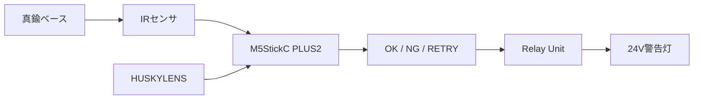
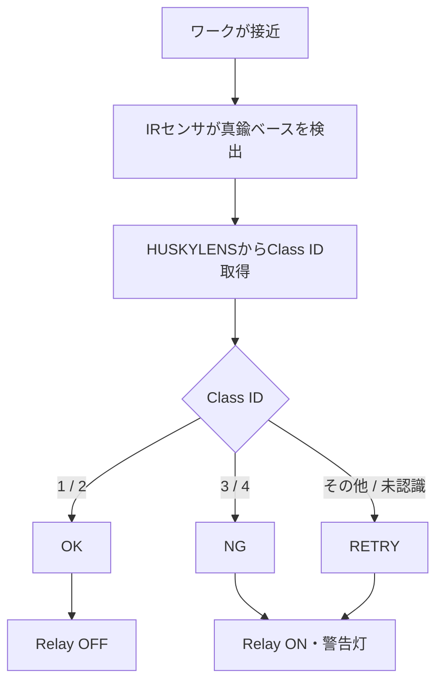

# 第6回 メカトロニクス実習 2nd turn
## 検査装置をFAラインへ実装し、移動ワークを評価する

**実施日：2026年9月10日**  
**対象：2nd turn（C・Dグループ）**

---

## 今日のテーマ

前回までに、

> IRセンサでワーク到着を検出  
> → HUSKYLENSでClass IDを取得  
> → M5StickC PLUS2でOK / NG / RETRYを判定  
> → Relay Unitで24V警告灯を制御

するところまで作ってきました。

今日は、この検査装置を**実際のFAラインへ取り付けて、コンベア上を移動するワークを判定**します。



今日の重要ポイントは、

> **プログラムが動くだけでは、設備として完成ではない**

ということです。

センサ位置、カメラ位置、角度、背景、配線なども含めて、
実際のFAライン上で動作するように調整します。

**今日はPLCへの接続は行いません。**  
まず、現在の構成で実ライン上の検査を成立させ、判定結果を記録することを優先します。

---

# 1. 今日の到達目標

## 最低到達点

- 自分のノートPCへThonnyをインストールし、M5StickC PLUS2へ接続できる
- IRセンサ固定ジグを製作できる
- IRセンサをFAラインへ安全に設置できる
- 真鍮ベース通過時にIRセンサの `1 → 0 → 1` を確認できる
- 最終設置状態でHUSKYLENSからClass IDを取得できる
- Relay Unitと24V警告灯が動作する

## 標準到達点

- コンベアを実際に動かした状態で、
  **ワーク検出 → Class ID取得 → OK / NG判定 → 警告灯**
  の一連動作を確認できる
- 移動ワークについて**10回の判定試験**を行い、結果を記録できる
- 実験結果をまとめ、判定精度と残った課題を説明できる

## 余裕がある場合

誤判定が多かったClassについて、

- 静止状態では正しく認識するか
- 移動中だけ誤判定が増えるか
- カメラ位置や学習状態によって変化するか

を追加確認してよいです。

新しい複雑なプログラムを追加するより、まず**現在のシステムの状態を確認すること**を優先します。

---

# 2. 今日のタイムスケジュール

| 時間 | 内容 | 到達条件 |
|---|---|---|
| 0～15分 | **Thonnyインストール・M5接続確認** | 自分のノートPCからM5のREPLを使える |
| 15～25分 | 今日の目標・作業手順確認 | 最終的に何を試験するか分かる |
| 25～50分 | IRセンサ用ケーブル確認・固定ジグ製作 | FAラインへ取り付けられる状態にする |
| 50～60分 | 配線・ジグの相互確認 | G / V / S、固定状態を確認する |
| 60～70分 | FA実習室へ移動・機材配置 | PCを含め安全に作業できる状態にする |
| 70～90分 | IRセンサ設置・REPL確認 | 真鍮ベースで `1 → 0 → 1` |
| 90～105分 | HUSKYLENS設置・静止確認 | 最終位置でClass IDを取得できる |
| 105～115分 | 休憩 | |
| 115～140分 | コンベア運転・一連動作の調整 | 移動ワークで検査が動作する |
| 140～170分 | **10回判定試験** | 判定結果をすべて記録する |
| 170～190分 | 実験結果まとめ | レポートを作成する |
| 190～200分 | 提出・片付け | 機材・配線を安全な状態に戻す |

※ 進捗によって多少前後します。  
※ Thonnyは授業用PC環境を整えるために導入します。インストール作業そのものを学習課題にはしません。  
※ うまく動かない場合は、原因を一度に全部変更せず、一つずつ確認します。

---

# 3. ノートPCへThonnyを準備する

今日は、FA実習室で各自の **GX WorksがインストールされたノートPC** を使用します。

同じノートPCを、

- M5StickC PLUS2のMicroPythonデバッグ：**Thonny**
- PLCプログラムの確認：**GX Works**

の両方に使えるようにします。

## 3.1 Thonnyをインストールする

教員が用意したUSBメモリ等からThonnyのインストーラを実行してください。

Thonnyは管理者権限なしでインストールできます。

インストールが終わったらThonnyを起動します。

## 3.2 M5StickC PLUS2へ接続する

1. M5StickC PLUS2をUSBケーブルでノートPCへ接続する
2. Thonnyを起動する
3. Interpreterを **MicroPython (ESP32)** にする
4. M5StickC PLUS2のシリアルポートを選択する
5. REPLが使えることを確認する

### 合格条件

ThonnyのShellに、

```text
>>>
```

が表示され、REPLへ命令を入力できること。

確認例：

```python
print("M5 OK")
```

```text
M5 OK
```

と表示されれば接続確認は完了です。

> この確認が終わってから、ジグ製作・FAラインでの実験へ進みます。

---

# 4. IRセンサ用ケーブルを確認する


IRセンサの設置位置まで届くよう、約20 cmの3線一体ジャンパワイヤーを使用します。

現在の接続は次のとおりです。

| 信号 | 接続先 |
|---|---|
| G | IRセンサ `-` |
| V | IRセンサ `+` |
| S | IRセンサ `S` |

M5StickC PLUS2側では、

- IRセンサ Signal → **GPIO33**
- IRセンサ `+` → **3.3V**
- IRセンサ `-` → **GND**

です。

## 注意：線の色だけで判断しない

使用する延長線の色は、G / V / S の意味と一致しているとは限りません。

> **色ではなく、両端がどこにつながっているかを確認してください。**

### 通電前チェック

- [ ] `G → IRセンサ -`
- [ ] `V → IRセンサ +`
- [ ] `S → IRセンサ S`
- [ ] 班内で相互確認した

**GとVを取り違えた状態で通電しないこと。**

---

# 5. IRセンサ固定ジグを製作する

FAライン周辺には、IRセンサ基板を直接取り付けられる場所がほとんどありません。

次の部品を使って、位置調整できる固定ジグを作ります。

- IRセンサ基板
- 約5 mmのスペーサ
- タミヤの長いアームパーツ（約20 cm）
- ねじ・ナット
- マグネットスタンド

基本構成：

```text
IRセンサ基板
     │
約5 mm スペーサ
     │
タミヤ 長アーム
     │
マグネットスタンド
```

スペーサは、基板裏面のはんだ部やリード部を
アームへ直接押し付けないために使用します。

### ジグ完成チェック

- [ ] センサ基板がぐらつかない
- [ ] 基板裏面とアームの間に隙間がある
- [ ] センサ位置・角度を調整できる
- [ ] FA設備へ穴あけなどの加工をしていない

---

# 6. FAラインへ設置する

## IRセンサは真鍮ベースへできるだけ正対させる

今回、IRセンサが検出する対象は、
赤・青・黄のパーツではなく**真鍮ベース**です。

IRセンサの光軸を、真鍮ベースの側面へできるだけ垂直に向けます。

```text
上から見たイメージ

                ワーク進行方向 →
────────────────────────────

       真鍮ベース
          [ ○ ]  →→→

             ↑
             │
             │ センサ光軸
             │
        [ IRセンサ ]
```

斜めに向けると、ワークが移動するにつれて反射条件が変わり、
検出信号が不安定になりやすくなります。

信号が不安定な場合は、いきなりプログラムを変更せず、

1. 位置
2. 距離
3. 角度
4. 可変抵抗

の順で確認してください。

---

# 7. HUSKYLENSを設置する

IRセンサを真鍮ベースへ正対させるため、
HUSKYLENSはIRセンサを避けて**斜め上方から撮像**します。

```text
               HUSKYLENS
                    ＼
                     ＼
                      ▼
────────────────────────────
             [ ワーク ]
────────────────────────────
```

現在のClass IDは次のとおりです。

| ID | ワーク | M5側の判定 |
|---:|---|---|
| 1 | 青・青・青 | OK |
| 2 | 黄・黄・黄 | OK |
| 3 | 青・青・赤 | NG |
| 4 | 黄・黄・赤 | NG |

### 最終設置前の確認

- [ ] ワーク全体がHUSKYLENS画面に入る
- [ ] カメラがIRセンサやジグに遮られていない
- [ ] ID1～ID4を静止状態で確認できる
- [ ] 背景が大きくずれていない

認識が不安定な場合は、最終位置を決めてから必要に応じて再学習します。

---

# 8. REPLでIRセンサだけを確認する

全体プログラムを実行する前に、
IRセンサが正しく反応するかを単独で確認します。

```python
from machine import Pin

sensor = Pin(33, Pin.IN)
print(sensor.value())
```

IRセンサは負論理です。

```text
真鍮ベースなし  → 1
真鍮ベース検出  → 0
```

連続確認：

```python
import time
from machine import Pin

sensor = Pin(33, Pin.IN)

while True:
    print(sensor.value())
    time.sleep_ms(100)
```

停止は `Ctrl + C`。

## 合格条件

真鍮ベースを通過させたとき、

```text
1 → 0 → 1
```

を確認できること。

---

# 9. コンベア運転前の安全確認

実際にFAラインを動かす前に、必ず確認します。

- [ ] ジグがコンベアや可動部へ入っていない
- [ ] 長アームがワークへ接触しない
- [ ] マグネットスタンドが動かない
- [ ] 配線が可動部へ巻き込まれない
- [ ] HUSKYLENSが落下しない
- [ ] M5StickC PLUS2、Relay Unit、24V警告灯の配線を確認した
- [ ] 教員と安全確認を行った

FAラインの起動・停止は、
既存実習で学んだ正しい手順に従ってください。

---

# 10. 移動ワークで一連動作を確認する

まず数回ワークを流して、システム全体が動くことを確認します。

確認する流れ：



### 確認ポイント

- [ ] IRセンサが毎回ワークを検出する
- [ ] 1個のワークを何度も再判定しない
- [ ] HUSKYLENSからIDを取得できる
- [ ] OKワークでOK表示になる
- [ ] NGワークでNG表示・警告灯ONになる
- [ ] 未認識時に安易にOKにならない

> **未認識・不明IDはOKにしません。**
>
> 分からない場合は RETRY / 警告側にします。

---

# 11. 10回の判定試験を行う

一連動作が確認できたら、正式に**10回**試験します。

少数回うまく動いただけで「成功」としません。

別紙の

> `071_fa_line_test_summary_2nd.docx`

へ結果を記録してください。

## 記録するときに区別するもの

今回から、次の2種類の「正しさ」を分けて考えます。

### 1. Class IDが正しいか

例：

```text
投入ワーク：黄・黄・赤
正解ID：4
取得ID：2
```

この場合、**Class IDとしては誤り**です。

### 2. 設備としてOK / NG / RETRYが正しいか

同じ例では、

```text
正解：NG
取得ID 2 → M5判定：OK
```

なので、**設備判定としても誤り**です。

一方、

```text
正解ID：3
取得ID：4
```

であればClass IDは誤っていますが、

```text
ID3 → NG
ID4 → NG
```

なので、設備としてのNG判定は正しい場合があります。

> **AIのClass IDと、設備上のOK / NGは同じものではありません。**

この違いも記録してください。

---

# 12. うまく動かないとき

全部を同時に変更しないでください。

## IRセンサが反応しない / 揺れる

まず、

1. 真鍮ベースへ正対しているか
2. 距離
3. 高さ
4. 可変抵抗

を確認します。

## 静止ワークでは認識するが、移動すると誤判定する

- IRセンサが反応する位置
- HUSKYLENSが最もワークを見やすい位置

の関係を確認します。

## 特定のClassだけ間違える

- カメラ位置
- 背景
- 照明
- 学習状態

を確認します。

必要なら教員と相談して再学習します。

## IDは正しいのに警告灯がおかしい

- M5側のOK / NG判定
- Relay ON / OFF
- 24V警告灯側の回路

の順で切り分けます。

---

# 13. 実験結果をまとめる

試験終了後、別紙レポートを完成させます。

今日のまとめでは、単に

> 「動いた」

だけではなく、

- どの条件で実験したか
- 10回中何回正しかったか
- Class IDの精度はどうだったか
- 設備としてのOK / NG判定はどうだったか
- コンベア速度には追従できたか
- 何が問題だったか
- 次に改善するなら何をするか

を、**実験結果の数値を使って**説明してください。

---

# 14. 今日の最終チェック

## PC環境

- [ ] 自分のノートPCへThonnyをインストールした
- [ ] M5StickC PLUS2へ接続した
- [ ] REPLで `>>>` を確認した

## 機械・センサ

- [ ] IRセンサ固定ジグを製作した
- [ ] IRセンサを真鍮ベースへほぼ垂直に設置した
- [ ] HUSKYLENSを適切な角度へ設置した
- [ ] 運転中に機材が動かなかった

## システム

- [ ] IRセンサでワーク到着を検出した
- [ ] HUSKYLENSからClass IDを取得した
- [ ] M5StickC PLUS2でOK / NG / RETRYを判定した
- [ ] Relay Unitと24V警告灯が動作した

## 評価

- [ ] 移動ワークで10回試験した
- [ ] 10回すべての結果を記録した
- [ ] 正答率を計算した
- [ ] Class IDと設備判定を区別して考えた
- [ ] レポートをまとめた

---

# 今日のゴール

今日のゴールは、

> **AIカメラを動かすこと**

だけではありません。

```text
ワーク
 ↓
IRセンサ
 ↓
HUSKYLENS
 ↓
M5StickC PLUS2
 ↓
OK / NG / RETRY
 ↓
Relay Unit
 ↓
24V警告灯
```

という一連のシステムを、

> **実際のFAライン上で動かし、結果を数字で評価する**

ところまでが今日の実習です。

---

<!--
# 教員用確認メモ

- 正式な第6回 2nd turn。対象はC・Dグループ（計5名）。
- 学生はFA実習室で各自のGX Works入りノートPCを使用する。授業冒頭にThonnyをインストールし、同じPCをM5デバッグとPLC確認の両方に使える状態にする。
- ThonnyインストーラはUSBメモリ等で教員が準備しておく。Thonnyは管理者権限なしで導入可能。
- Thonny導入後は、MicroPython (ESP32) とM5のシリアルポートを選び、REPLの `>>>` まで確認する。
- 第5回2nd turnでは、Button A → IRセンサ（GPIO33）への置換と、同一ワーク再判定防止のwhile待機まで実施済み。
- 第6回1st turnでは、実FAライン上で一連動作まで成立。A・Bとも10回中7回正答（70%）。
- 1st turnでは特にID4（黄・黄・赤）の成績が低かったが、原因は未確定。
- 実コンベア速度には現行の比較的単純なMicroPythonコードで追従できた。
- 2nd turnでも実習内容を大幅には変更しない。
- PLC接続・多数決処理は第6回の必須課題にしない。
- まず現在の一発判定方式で実ライン試験を成立させる。
- 10回試験を必須にし、Class IDの正誤と設備判定（OK/NG/RETRY）の正誤を分けて記録させる。
- IRセンサ：真鍮ベース側面へほぼ垂直。
- HUSKYLENS：IRセンサを避け、斜め上方から撮像。
- IRセンサ信号が揺れる場合、高度なソフト処理より位置・距離・角度・可変抵抗を先に確認。
- FA実習室では学生ノートPCの置き場、100V電源、USBケーブル・配線の取り回しを午前中に教員側で確認しておく。
- レポート時間を20分程度確保する。
- 片付け時間を最低10～15分確保する。
-->
