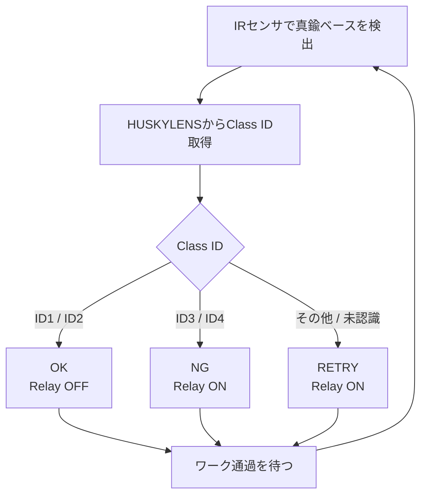
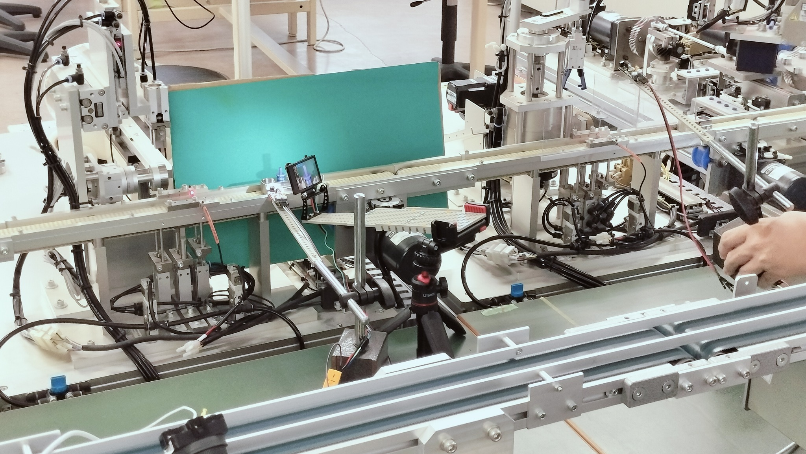
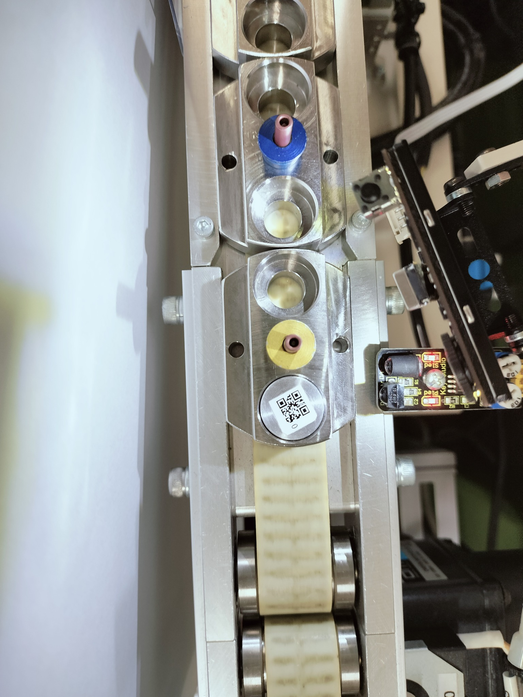
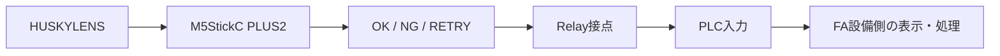

# 第7回 メカトロニクス実習 1st turn

## 検査設備を改善し、PLCへ検査結果を伝える

対象：A・Bグループ  
授業時間：200分

---

## 1. 今日の目標

第6回では、実FAライン上で

> IRセンサ → M5StickC PLUS2 → HUSKYLENS → OK / NG / RETRY → Relay → 24V警告灯

まで動作させました。

A・Bグループの10回試験は、どちらも **7 / 10（70%）** でした。

今回は、次の順で設備を一段階完成へ近づけます。

1. PC・M5・センサ・カメラを使える状態にする
2. 配布された標準 `main.py` にプログラムをそろえる
3. 現在の動作を確認する
4. 誤判定の原因候補を考え、**1項目だけ改善する**
5. 改善後に10回試験を行う
6. Relayの接点をPLC入力へ接続し、PLCまで検査結果を伝える

> **重要：今回はPythonプログラムを作り直すことが目的ではありません。**  
> 配布された標準プログラムを使い、検査設備全体を改善・統合します。

---

## 2. 今日の到達点

### 最低到達点

- ThonnyからM5StickC PLUS2へ接続できる
- IRセンサでワークを検出できる
- HUSKYLENSからClass IDを取得できる
- 改善後の10回試験を完了し、結果を記録できる

### 標準到達点

- 試験結果から原因候補を考え、1項目を変更して評価できる
- Relay OFF / ON をPLC入力の OFF / ON としてGX Works上で確認できる

### 発展

- NG / RETRY をPLC側の警告表示などへ反映できる

※ 安全回路・非常停止回路は変更しません。

---

## 3. 時間の目安

| 時間 | 作業 |
|---:|---|
| 0～20分 | Thonnyインストール |
| 20～35分 | M5接続・標準 `main.py` の保存 |
| 35～55分 | IRセンサ・HUSKYLENS・Relayの動作確認 |
| 55～70分 | 実ラインで現在の状態を3～5回確認 |
| 70～85分 | 原因候補を考え、改善項目を1つ決める |
| 85～100分 | 改善作業 |
| 100～105分 | 休憩 |
| 105～125分 | 改善後10回試験 |
| 125～135分 | 結果整理 |
| 135～150分 | PLC I/O・既存ラダー確認 |
| 150～165分 | Relay → PLC入力 接続・確認 |
| 165～180分 | 可能ならPLC側の警告表示まで統合 |
| **180～200分** | **まとめ・記録・片付け** |

> **時間が押しても、180分からはまとめ・片付けに入ります。**

---

# STEP 1　Thonnyを準備する

FA実習室の学生ノートPCへThonnyをインストールします。

インストール後、次を確認します。

- Interpreter：`MicroPython (ESP32)`
- M5StickC PLUS2のシリアルポートを選択
- REPLに `>>>` が表示される

### 到達条件

```text
>>>
```

が表示され、M5StickC PLUS2へ接続できていること。

---

# STEP 2　標準 `main.py` にそろえる

今回は、これまで各自で作成した `main.py` を修復するところから始めません。

Google Classroom で配布した **標準IRセンサ版プログラム** を使用します。

配布ファイル：

```text
071_m5_main_ir_standard.py
```

1. Thonnyで配布ファイルを開く
2. M5StickC PLUS2へ接続する
3. **M5StickC PLUS2側へ `main.py` という名前で保存する**
4. 実行する
5. REPLに次の文字が表示されることを確認する

```text
S7 IR STANDARD
```

> この表示が出ない場合は、古い `main.py` を実行している可能性があります。

## コード確認

標準プログラムを見て、次の3か所を確認してください。

1. IRセンサの値を読んでいる部分はどこか
2. ID1・ID2をOK、ID3・ID4をNGにしている部分はどこか
3. ワークが通過するまで待つ `while` は何のためにあるか

処理の流れは次のとおりです。



未認識や不明なIDをOKにはしません。

---

# STEP 3　設備を復元して個別確認する

本試験の前に、各要素を順番に確認します。

### 実際の設置例

第6回にFAラインへ設置したときの配置例です。IRセンサ、HUSKYLENS、背景板などの位置関係を確認してください。

<div align="center">

</div>

## 3-1 IRセンサ

現在の仕様：

- Signal → GPIO33
- 真鍮ベースなし → `1`
- 真鍮ベース検出 → `0`

ワークを通過させ、

```text
1 → 0 → 1
```

となることを確認します。

> IRセンサは移動・再設置すると反応条件が変わることがあります。反応しない場合は、まず位置・距離・角度・感度を確認してください。

## 3-2 HUSKYLENS

- Algorithm：Object Classification
- Protocol：**I2C**
- I2C Address：`0x32`（10進50）

> **Protocol は `Auto Detect` ではなく、`I2C` に明示的に設定してください。**  
> 実習では `Auto Detect` のままだと I2C エラーが出やすいことがあり、`I2C` に固定した方が安定しました。

必要に応じて、

```python
print(i2c.scan())
```

で

```text
[50]
```

を確認します。

Class IDは次の4種類です。

| ID | ワーク | 設備判定 |
|---:|---|---|
| 1 | 青・青・青 | OK |
| 2 | 黄・黄・黄 | OK |
| 3 | 青・青・赤 | NG |
| 4 | 黄・黄・赤 | NG |

## 3-3 Relay

- GPIO32
- `0` = Relay OFF
- `1` = Relay ON

OKではOFF、NG / RETRYではONになることを確認します。

### 教員確認

IRセンサ、HUSKYLENS、Relayの3つが個別に動作してから、実ラインを流します。

---

# STEP 4　現在の状態を3～5回確認する

第6回のA・Bグループは10回試験で **70%** でした。

今回は、改善前の10回試験をもう一度最初から行うのではなく、まず3～5回程度流して、現在どのような失敗が起きるか観察します。

確認すること：

- 特定のIDだけ間違うか
- 静止時は読めるのに、移動時に間違うか
- 同じワークでも取得IDが変わるか
- RETRY / 未認識が多いか
- IRセンサの検出が不安定か

---

# STEP 5　改善する項目を1つ決める

**一度に複数の条件を変えないでください。**

複数を同時に変更すると、何が結果へ影響したのか分からなくなります。

## 症状から考える改善のヒント

| 観察された症状 | 最初に調べるところ・改善のヒント |
|---|---|
| ID4だけ間違いが多い | ID4の学習状態、撮像角度、背景・照明を確認する。必要ならID4の再学習を候補にする |
| 静止させると読めるが、流すと間違う | IRセンサが反応する位置と、HUSKYLENSがワークを見る位置・タイミングを確認する |
| 同じワークでも取得IDが変わる | カメラ角度、距離、背景、照明を確認する |
| RETRY / 未認識が多い | まず撮像条件を確認する。それでも不安定ならThreshold調整を候補にする |
| IRセンサが安定しない | 真鍮ベースへの角度、距離、感度を確認する |
| 同条件でもClass IDが細かくばらつく | 複数回読取りも改善候補。ただし必要性を確認してから検討する |

### タイミングを考えるヒント

標準プログラムでは、IRセンサがワークを検出した時点でHUSKYLENSのIDを取得します。

下の写真は、IRセンサとHUSKYLENSの位置関係を上から見た例です。**ワークは写真の下から上へ移動します。** IRセンサが真鍮ベースを検出する位置と、HUSKYLENSがワークを撮像する位置の関係に注目してください。

<div align="center">

</div>

考えてください。

> **IRセンサが反応した瞬間、ワークはHUSKYLENSの画面のどこにありますか？**

IRセンサ位置と撮像位置がずれている場合は、センサやカメラの位置、または検出後のタイミングが改善候補になります。

## 改善内容を記録する

変更する前に次を書いてください。

```text
観察した症状：

原因として考えたこと：

今回変更する1項目：

この変更でどうなると予想するか：
```

### 到達条件

**各グループが変更項目を1つに決め、先生へ説明してから変更する。**

---

# STEP 6　改善後10回試験

改善後の状態で10回試験します。

結果は単なる○×だけでなく、**Class IDの正しさ**と**設備としてのOK / NG判断**を分けて記録します。

**投入順は全グループ共通とする。比較条件をそろえるため、順番を変更しないこと。**

| 回 | 投入ワーク | 正解ID | 取得ID | Class ID 正答 | M5判定 | 設備判定 正答 |
|---:|---|---:|---:|---|---|---|
| 1 | ID1 | 1 |  |  |  |  |
| 2 | ID2 | 2 |  |  |  |  |
| 3 | ID3 | 3 |  |  |  |  |
| 4 | ID4 | 4 |  |  |  |  |
| 5 | ID1 | 1 |  |  |  |  |
| 6 | ID2 | 2 |  |  |  |  |
| 7 | ID3 | 3 |  |  |  |  |
| 8 | ID4 | 4 |  |  |  |  |
| 9 | ID3 | 3 |  |  |  |  |
| 10 | ID4 | 4 |  |  |  |  |

## 集計

```text
Class ID 正答：        / 10
設備判定 正答：        / 10
NG品をOKとした回数：  回
```

### 注意

例えば、正解ID3のワークをID4と認識した場合、Class IDとしては誤りですが、設備判定はどちらもNGです。

一方、正解ID4のワークをID2と認識した場合は、NG品をOKとしてしまうため、設備として重大な誤判定です。

第6回の70%は **参考値** として比較する。設置条件（正確な位置、光の具合）などが異なるため、厳密な性能比較ではない。そのうえで今回の変更が有効だったか考えてください。

> 数値が改善しなくても、「この変更では改善しなかった」と判断できれば実験結果です。

---

# STEP 7　PLCへ検査結果を伝える

完成ワークは第3ステーション通過後に検査対象となります。

今回の基本構成は、



です。

## 7-1 PLC入力を決める前に確認する

具体的な `X` 番号を推測で決めてはいけません。

次の順で確認します。

1. `第1~6ステーション入出力表.pdf` を確認する
2. GX Worksで既存ラダーとI/O使用状況を確認する
3. 実機のPLC端子・配線を確認する
4. **教員確認を受ける**
5. Relay接点をPLC入力へ接続する

> I/O表に書かれていない番号でも、「空いている」とは限りません。

COM配線を含め、PLC側の接続は教員確認前に行わないでください。

## 7-2 最低到達点

**Relayの状態を切り替えたとき、対応するPLC入力が意図した状態へ変化することをGX Works上で確認する**

ここまで確認できれば、M5の検査結果をPLCへ渡せたことになります。

## 7-3 余裕がある場合

安全に使用できる出力・既存ラダー上の追加箇所を確認できた場合のみ、NG / RETRYをFA設備側の警告表示へ反映します。

既存の安全回路・非常停止回路は変更しません。

---

# STEP 8　まとめ・片付け（最後の20分）

180分になったら、新しい作業を始めず、まとめと片付けへ入ります。

グループで次を記録してください。

```text
今回変更した項目：

第6回の結果：        7 / 10
今回のClass ID正答：  / 10
今回の設備判定正答： / 10
NG品をOKとした回数： 回

変更は有効だったか：

PLC入力まで確認できたか：

使用したPLC入力：
（確認できた場合のみ記入）

次回までに残った課題：
```

## 最終チェック

- [ ] PC・M5・USBケーブルを整理した
- [ ] センサ・カメラ・ジグを指示された状態へ戻した
- [ ] 24V回路を安全な状態にした
- [ ] PLC側を変更した場合、変更内容を記録した
- [ ] 実験結果を保存した

---

## 今日覚えておくこと

外観検査設備は、AIカメラだけでは完成しません。

```text
物理的な設置条件
    ↓
センサ入力
    ↓
Class ID
    ↓
マイコンによる判断
    ↓
Relay
    ↓
PLC
    ↓
FA設備
```

どこか1か所が不安定でも、設備全体として正しく動作しなくなります。

また、分からないもの・未認識のものを安易にOKとしてはいけません。
