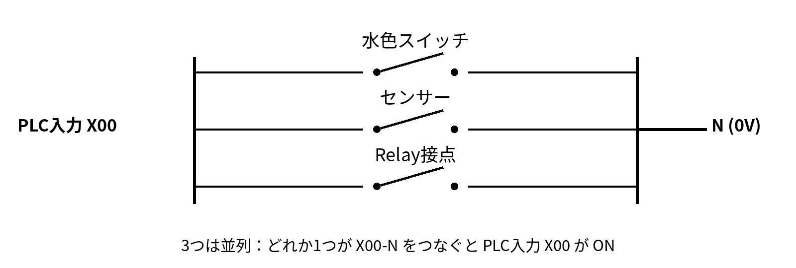

# 第7回 メカトロニクス実習 2nd turn
## 外観検査設備を PLC と統合する

対象：C・Dグループ  
実施日：2026年9月17日  
授業時間：200分

---

## 1. 今日のゴール

今回の最終ゴールは、これまで作ってきた外観検査設備を PLC へ接続し、

> **HUSKYLENS → M5StickC PLUS2 → Relay Unit → PLC入力 X00**

までを1つのシステムとして動作させることです。

今回の標準到達点は次の3つです。

1. 第6回で完了できなかった **10回試験を最後まで行う**
2. Relay Unit の ON / OFF で、PLC入力 `X00` が OFF / ON することを確認する
3. 実際のワーク判定結果が、Relay を通して PLC の `X00` に伝わることを確認する

余裕がある場合のみ、認識条件の改善にも取り組みます。

---

## 2. 今日の時間配分

| 時間 | 内容 | 到達条件 |
|---:|---|---|
| 0～25分 | FA実習室の環境復元・M5接続 | 正しい `main.py` が動く |
| 25～50分 | IR・HUSKYLENS・Relay・配置確認 | 一連動作が確認できる |
| 50～80分 | 第6回からの10回試験を完了 | 10回すべて記録 |
| 80～90分 | 結果整理 | Class ID精度・設備判断精度を計算 |
| 90～100分 | 休憩 |  |
| 100～115分 | PLC入力 X00 の確認 | 水色SWで X00 ON を確認 |
| 115～135分 | Relay と制御ボックスを接続 | 教員確認後に通電 |
| 135～155分 | Relay OFF / ON と PLC入力を確認 | GX Worksで X00 OFF / ON |
| 155～175分 | 外観検査とPLCを統合 | 判定結果が X00 に伝わる |
| 175～180分 | 余裕があれば追加確認 | 必要な1項目のみ確認 |
| **180～200分** | **結果整理・復旧・片付け** | 元配線へ戻して終了 |

**180分になったら、作業途中でも結果整理と片付けへ移ります。**

---

# STEP 1　FA実習室の環境を復元する

前回は、M5StickC PLUS2 に古いプログラムが残っていたため時間を使いました。  
今回は、試験を始める前に必ず正本コードを確認します。

## 1-1. M5StickC PLUS2 を確認

1. PCを起動する
2. Thonnyを起動する
3. M5StickC PLUS2 を接続する
4. 授業用の標準プログラムを確認する
5. 必要なら M5 の `main.py` として保存し直す
6. 実行して、REPL に次の表示が出ることを確認する

```text
S7 IR STANDARD
```

### 教員チェック 1

- [ ] 正しい `main.py` がM5で動作している

---

## 1-2. IRセンサを確認

IRセンサは、移動・再設置すると位置や感度がずれることがあります。

ワークを使って、入力が次のように変化することを確認します。

```text
ワークなし → 1
検出        → 0
通過後      → 1
```

反応しない場合は、次を1つずつ確認します。

- センサの向き
- ワークとの距離
- 高さ
- 感度調整
- 配線

---

## 1-3. HUSKYLENS を確認

HUSKYLENS の設定を確認します。

- Algorithm：`Object Classification`
- Protocol：**`I2C`**
- 使用する Class ID：1～4

### ワーク表記の意味

- `B`：Blue（青）
- `Y`：Yellow（黄）
- `R`：Red（赤）

例：

- `BBB`：青・青・青
- `YYY`：黄・黄・黄
- `BBR`：青・青・赤
- `YYR`：黄・黄・赤

Class ID と判定は次のとおりです。

| Class ID | ワーク | 意味 | M5判定 | Relay |
|---:|---|---|---|---|
| 1 | BBB | 青・青・青 | OK | OFF |
| 2 | YYY | 黄・黄・黄 | OK | OFF |
| 3 | BBR | 青・青・赤 | NG | ON |
| 4 | YYR | 黄・黄・赤 | NG | ON |
| その他・未認識 | - | - | RETRY | ON |

**未認識をOKにはしません。**  
未認識・異常時は `RETRY` として Relay を ON にします。

---

## 1-4. 一連動作を確認

まず2～3回だけワークを流し、次の流れを確認します。

```text
IR検出
  ↓
HUSKYLENSからClass ID取得
  ↓
M5で OK / NG / RETRY 判定
  ↓
LCD表示
  ↓
Relay OFF / ON
```

### 教員チェック 2

- [ ] IRセンサが安定して反応する
- [ ] Class ID が取得できる
- [ ] OK / NG / RETRY に応じて Relay が動く

---

# STEP 2　第6回からの10回試験を完了する

**10回試験が終わるまでは、認識条件を変更しません。**  
まず現在の状態を測定し、その結果を基準にします。

試験順序は全グループでそろえます。

| 回 | 正解ID | ワーク | 意味 | 取得ID | Class ID 正誤 | M5判定 | 設備判断 正誤 |
|---:|---:|---|---|---|---|---|---|
| 1 | 1 | BBB | 青・青・青 |  |  |  |  |
| 2 | 2 | YYY | 黄・黄・黄 |  |  |  |  |
| 3 | 3 | BBR | 青・青・赤 |  |  |  |  |
| 4 | 4 | YYR | 黄・黄・赤 |  |  |  |  |
| 5 | 1 | BBB | 青・青・青 |  |  |  |  |
| 6 | 2 | YYY | 黄・黄・黄 |  |  |  |  |
| 7 | 3 | BBR | 青・青・赤 |  |  |  |  |
| 8 | 4 | YYR | 黄・黄・赤 |  |  |  |  |
| 9 | 3 | BBR | 青・青・赤 |  |  |  |  |
| 10 | 4 | YYR | 黄・黄・赤 |  |  |  |  |

## 集計

- Class ID 正答：`____ / 10`
- 設備判断 正答：`____ / 10`
- NGワークをOKとした回数（誤OK）：`____ 回`
- 特に弱かった Class ID / ワーク：`____________________`

### Class ID正答と設備判断正答は分けて考える

例：正解が ID3 なのに ID4 と認識した場合、

- Class ID：誤り
- M5判定：NG
- 設備判断：正しい

となります。

一方、NGワークを ID1 / ID2 と認識して `OK` にした場合は、**誤OK**です。

---

# STEP 3　PLC入力 X00 の使い方を確認する

今回使用する制御ボックスでは、次のように考えます。

> **X00 と N をつなぐと、PLC入力 X00 が ON になる。**

細かい内部回路を考える必要はありません。

- 水色のスイッチも同じ
- センサーも同じ
- Relay接点も同じ

です。

## 3-1. 制御ボックスの考え方

<div align="center">

</div>

| `X00` と `N (0V)` の間に入るもの | 役割 |
|---|---|
| 水色スイッチ | 手で ON にする |
| センサー | ワークを検出して ON にする |
| Relay接点 | M5 の判定結果で ON にする |

この3つは **並列** につながっています。  
つまり、**どれか1つが `X00 - N` をつなぐと、PLC入力 `X00` が ON** になります。

---

## 3-2. 水色スイッチで確認

GX Works で `X00` をモニタします。

1. 水色スイッチを押していない状態を確認する
2. 水色スイッチを押す
3. GX Works の `X00` が ON になることを確認する
4. スイッチを離し、`X00` が OFF に戻ることを確認する

### 教員チェック 3

- [ ] 水色スイッチで PLC入力 `X00` の OFF / ON を確認した

---

# STEP 4　M5のRelayを PLC入力 X00 へ接続する

今回は、教員が準備した専用ケーブルを使います。

- **白ケーブル：X00**
- **黒ケーブル：N (0V)**

授業では接続方法を次のように統一します。

```text
制御ボックス X00 ── 白ケーブル ── Relay NO
制御ボックス N   ── 黒ケーブル ── Relay COM
```

Relay接点の役割は、水色スイッチと同じです。

```text
Relay OFF
X00 ── 開いている ── N
→ PLC X00 = OFF

Relay ON
X00 ── つながる ── N
→ PLC X00 = ON
```

## 重要：接続時のルール

1. **制御ボックスへの接続・取り外しは、24V電源を切って行う**
2. 既存の `X00` / `N` プラグを抜く
3. 白ケーブルを `X00` に接続する
4. 黒ケーブルを `N` に接続する
5. Relay側を `NO` / `COM` に接続する
6. **教員確認を受ける**
7. 確認後に通電する
8. 非常停止・安全回路・指定されていない端子には触れない

### 教員チェック 4

- [ ] 白ケーブル：X00 → Relay NO
- [ ] 黒ケーブル：N → Relay COM
- [ ] 教員確認後に通電した

---

# STEP 5　Relay OFF / ON が PLC に伝わるか確認する

まず外観検査とは切り離して、Relayだけを確認します。
ThonnyのREPLからRelayを単体でOFF / ONし、GX WorksでX00の変化を確認する。

```python
from machine import Pin

relay = Pin(32, Pin.OUT)

relay.value(0)   # Relay OFF
relay.value(1)   # Relay ON
relay.value(0)   # Relay OFF
```

## 確認すること

| M5 Relay | PLC X00 | 確認 |
|---|---|---|
| OFF | OFF |  |
| ON | ON |  |

GX Works で `X00` をモニタし、Relay の OFF / ON と一致することを確認します。

**ここまでできれば、M5 と PLC の電気的な接続は完成です。**

### 教員チェック 5

- [ ] Relay OFF → PLC `X00` OFF
- [ ] Relay ON → PLC `X00` ON

---

# STEP 6　外観検査と PLC を統合する

最後に、実際のワークを流します。

標準プログラムでは次のように動作します。

| HUSKYLENS | ワーク | 意味 | M5判定 | Relay | PLC X00 |
|---|---|---|---|---|---|
| ID1 | BBB | 青・青・青 | OK | OFF | OFF |
| ID2 | YYY | 黄・黄・黄 | OK | OFF | OFF |
| ID3 | BBR | 青・青・赤 | NG | ON | ON |
| ID4 | YYR | 黄・黄・赤 | NG | ON | ON |
| その他・未認識 | - | - | RETRY | ON | ON |

確認する流れは次のとおりです。

```text
ワーク通過
   ↓
IRセンサ検出
   ↓
HUSKYLENS Class ID
   ↓
M5判定
   ↓
Relay OFF / ON
   ↓
PLC入力 X00 OFF / ON
```

## 統合確認用 記録フォーム

最低でも各 ID を1回ずつ確認します。

| 回 | 正解ID | ワーク | 意味 | 取得ID | M5判定 | Relay | PLC X00 | 一致したか |
|---:|---:|---|---|---|---|---|---|---|
| 1 | 1 | BBB | 青・青・青 |  |  |  |  |  |
| 2 | 2 | YYY | 黄・黄・黄 |  |  |  |  |  |
| 3 | 3 | BBR | 青・青・赤 |  |  |  |  |  |
| 4 | 4 | YYR | 黄・黄・赤 |  |  |  |  |  |
| 5 | 任意 |  |  |  |  |  |  |  |

### 今日の最終到達条件

> **M5が NG または RETRY と判断したとき Relay が ON し、GX Works 上で PLC入力 X00 が ON することを確認できた。**

これが確認できれば、今回の「マイコンとPLCの統合」は達成です。

---

# STEP 7　余裕がある場合のみ改善する

PLC統合まで完了し、時間に余裕がある場合だけ、10回試験の結果から **1項目だけ** 改善します。

例：

- ID4だけ弱い → ID4の学習・カメラ角度・背景を確認
- 動いているときだけ誤る → IR検出位置とカメラ撮像位置を確認
- 同じワークでIDが変わる → カメラ位置・距離・照明を確認
- IRが不安定 → 距離・角度・感度を確認

一度に複数条件を変更しません。

---

# STEP 8　結果をまとめ、元に戻す

終了前に次を記録します。

## 8-1. 今日の結果

- Class ID 正答：`____ / 10`
- 設備判断 正答：`____ / 10`
- 誤OK：`____ 回`
- Relay → PLC X00：`成功 / 未完`
- OKワークで X00 OFF：`確認 / 未確認`
- NGワークで X00 ON：`確認 / 未確認`
- RETRYで X00 ON：`確認 / 未確認`

### 今日分かったこと

```text


```

### 次回へ残った課題

```text


```

---

## 8-2. 復旧・片付け

1. 24V電源を切る
2. 白・黒のRelay接続ケーブルを外す
3. 元の `X00` / `N` プラグを正しい位置へ戻す
4. RelayをOFFにする
5. M5・HUSKYLENS・IRセンサを片付ける
6. PC・電源・工具を片付ける
7. 教員確認を受ける

### 最終チェック

- [ ] 元の配線へ戻した
- [ ] Relay OFF
- [ ] 工具・ケーブルを回収した
- [ ] 記録を完成した

---

# 今回のポイント

今回のPLC接続で覚えておくことは、複雑な内部回路ではありません。

> **Relayはスイッチと同じ。**  
> **Relayはセンサー出力と同じように、PLC入力をONさせることができる。**  
> **この制御ボックスでは、それらが並列につながっている。**

そして、今回完成させるシステム全体は、

```text
入力           判断                 出力              FA側
IR / HUSKYLENS → M5StickC PLUS2 → Relay Unit → PLC X00
```

という流れです。
