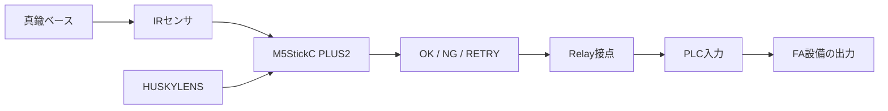
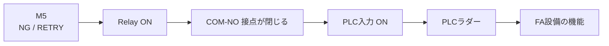
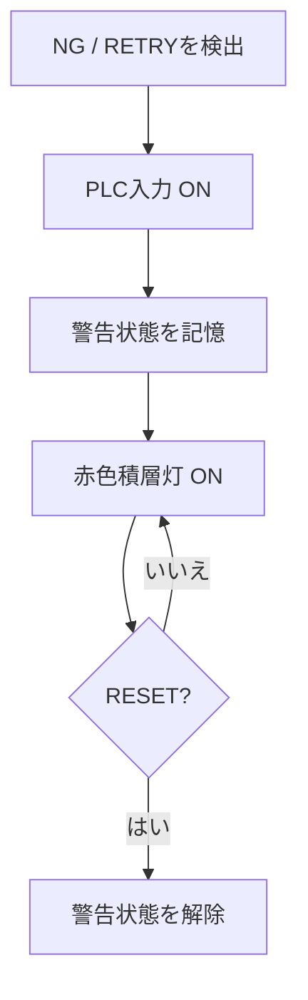

# 第7回 メカトロニクス実習 1st turn
## 検査装置をFAラインへ実装する

### 今日のテーマ

これまでに、

> HUSKYLENS → M5StickC PLUS2 → OK / NG / RETRY 判定 → Relay → 警告灯

まで確認しました。

また、第6回では Button A を IRセンサへ置き換え、

> **真鍮ベースが検査位置へ来たことを自動で検出する**

仕組みを作りました。

第7回では、検査装置を実際のFAラインへ取り付け、最後に **Relayの接点信号をPLCへ入力して、既存FA設備へ機能を追加**します。



---

# 1. 今日の到達目標

## 最低到達点

- IRセンサ固定ジグを製作し、FAラインへ安全に設置できる
- IRセンサを真鍮ベース側面へほぼ垂直に向けられる
- REPLで真鍮ベース通過時の `1 → 0 → 1` を確認できる
- 最終設置状態で HUSKYLENS が Class ID を取得できる
- Relay接点をPLCへ入力するために必要なI/Oを調査できる

## 標準到達点

- M5の NG / RETRY による Relay ON をPLC入力として受け取る
- PLCから既存FA設備の **赤色積層灯などの警告表示** をONできる

## 発展

- NG / RETRY を検出したあと、警告状態をPLC側で保持する
- 作業者の RESET 操作で警告状態を解除する

さらに時間と安全上の条件が整った場合のみ、

- NG / RETRY 中は次工程への搬送を許可しない

などのインターロックを検討してよい。

**既存の安全回路・非常停止回路は変更しないこと。**

---

# 2. 今日のタイムスケジュール

| 時間 | 内容 | 到達条件 |
|---|---|---|
| 0～10分 | 今日の要求・全体構成確認 | 今日追加する「物理実装」と「PLC接続」が分かる |
| 10～35分 | **班内で並行作業**：G/V/S延長・ジグ製作 / PLC既存I/Oの予備調査 | 配線延長とジグ部品準備、PLC調査を進める |
| 35～50分 | ジグ完成・FAラインへ設置 | 可動部へ干渉せず位置調整できる |
| 50～70分 | REPLでIRセンサ確認・調整 | ベース通過で `1 → 0 → 1` を確認 |
| 70～85分 | HUSKYLENS最終配置確認 | 最終角度で Class ID を取得できる |
| 85～95分 | 休憩 | |
| 95～120分 | FAラインを実際に動かして確認 | 実速度でIR検出・撮像条件を確認 |
| 120～140分 | Class IDの多数決処理を確認・組込み | 「複数回読む→代表IDを決める」が分かる |
| 140～155分 | PLCのI/O・ラダー調査を確定 | 使用する入力・出力を班で決定 |
| 155～170分 | Relay→PLCの接続計画・教員確認 | 配線とラダー変更案を説明できる |
| 170～190分 | PLCへ機能追加 | 警告表示を目標。余裕があれば保持・RESET |
| 190～200分 | 結果記録・片付け | 到達点と第8回残件を記録 |

※ A・Bグループはいずれも2名なので、最初の作業は可能な範囲で並行して進める。  
※ FAラインの操作・PLC調査に時間がかかった場合は、**安全確認と実機確認を優先し、発展課題を無理に実施しない。**

---

# 3. IRセンサ用ケーブルを延長する

IRセンサの最終設置位置まで、現在の自作ケーブルだけでは長さが足りません。

約20 cmの **3本一体のジャンパワイヤー** を使って、

- G：GND
- V：3.3V
- S：Signal（GPIO33）

を延長します。

## 注意：ケーブルの色を信用しない

今回使用するジャンパワイヤーは、線の色と G / V / S の役割が一致していません。

> **色ではなく、どの線がどこへつながっているかを実際に確認すること。**

```text
M5 / 自作ケーブル側                 IRセンサ側

GND    ── [ G ] ─────────────────→  -
3.3V   ── [ V ] ─────────────────→  +
GPIO33 ── [ S ] ─────────────────→  S

                                      EN：使用しない
```

必要に応じて、両端へ小さなテープ等で `G` / `V` / `S` の目印を付けます。

## 通電前確認

- [ ] `G` が IRセンサ `-` へ接続されている
- [ ] `V` が IRセンサ `+` へ接続されている
- [ ] `S` が IRセンサ `S` へ接続されている
- [ ] 3本の対応を色だけで判断していない

`G` と `V` を取り違えないよう、班内で相互確認してから通電します。

---

# 4. IRセンサ固定ジグを製作する

前回、コンベア周辺にはIRセンサ基板を直接固定できるスペースが少ないことが分かりました。

そこで今回は、

- マグネットスタンド
- タミヤの長いアームパーツ（約20 cm）
- 約5 mmのスペーサ
- ねじ・ナット

を使用して、位置を調整できるジグを製作します。

## センサ部分の構成

上から、

```text
IRセンサ基板
     │
約5 mm スペーサ
     │
タミヤ 長アーム
```

の順に重ねて、ねじ止めします。

```text
     ┌──────────────┐
     │  IRセンサ基板  │
     └──────┬───────┘
            │ ねじ
        [スペーサ]
            │
════════════╪════════════
       タミヤ 長アーム
```

スペーサを入れる目的は、

- 基板裏面のはんだ部・リード部をアームへ押し付けない
- 基板とアームの間に必要なクリアランスを確保する

ことです。

## アーム根元

長アームの根元は、

> **マグネットスタンドの横アーム先端にある穴**

を利用してねじ止めします。

既存FA設備へ穴あけなどの加工は行いません。

---

# 5. ジグをFAラインへ設置する

## 最重要：IRセンサは真鍮ベース側面へ正対させる

IRセンサは、真鍮ベースの側面をできるだけ **垂直（正面）** に見るよう設置します。

```text
上から見たイメージ

                 ワーク進行方向 →
────────────────────────────────

        真鍮ベース
          [ ○ ]  →→→

             ↑
             │  センサの光軸
             │  ほぼ垂直
        [ IRセンサ ]
```

斜めから真鍮ベースを見ると、移動中に反射条件が変化し、IRセンサ出力が揺れやすくなります。

実機確認では、

> **IRセンサを真鍮ベース側面へほぼ垂直に向けると、検出の揺らぎが大きく減る**

ことが分かっています。

完全に揺らぎがなくなるとは限りません。

まずソフトウェアで補正するのではなく、

1. センサ位置
2. 距離
3. 角度
4. 可変抵抗

の物理条件を先に調整します。

---

# 6. HUSKYLENSは斜めから撮像する

IRセンサを真鍮ベースへ正対させるため、HUSKYLENS はワークを **斜め上方から撮像**します。

今回のワークは円形であり、現在の角度でも色構成は十分確認できます。

```text
                  HUSKYLENS
                       ＼
                        ＼
                         ▼
────────────────────────────────
             [ ワーク ]
────────────────────────────────
```

センサごとに必要な取り付け条件は異なります。

> **IRセンサ：真鍮ベース側面へ正対**
>
> **HUSKYLENS：IRセンサを避けて斜めから撮像**

と役割を分けます。

### 確認

最終設置状態で HUSKYLENS の画面を確認し、

- ID1：青・青・青
- ID2：黄・黄・黄
- ID3：青・青・赤
- ID4：黄・黄・赤

が識別できるか確認します。

現在の学習状態で不安定な場合は、**最終設置状態を固定してから再学習**します。

背景は、まず現在の白背景を使用します。

---

# 7. REPLでIRセンサを確認する

全体プログラムを動かす前に、まずIRセンサだけを確認します。

```python
from machine import Pin

sensor = Pin(33, Pin.IN)
print(sensor.value())
```

IRセンサは負論理です。

```text
真鍮ベースなし → 1
真鍮ベース検出 → 0
```

連続して確認する場合：

```python
import time

while True:
    print(sensor.value())
    time.sleep_ms(100)
```

停止は `Ctrl + C`。

## 合格条件

真鍮ベースを通過させ、

```text
接近前     1
   ↓
通過中     0
   ↓
通過後     1
```

となること。

つまり、

> **1 → 0 → 1**

が確認できること。

境界付近でわずかな明滅が残る場合は、可変抵抗だけを長時間調整し続けず、まず位置・角度を確認してください。

必要なソフトウェア側の補完処理は、教員と相談して扱います。

---

# 8. FAラインを実際に動かして確認する

ここからは、実際のコンベア速度で確認します。

FAラインの起動・停止は、既存実習で学んだ正しい手順に従います。

操作前に、

- 可動部にジグが入っていない
- マグネットスタンドが動かない
- 長アームが搬送物に接触しない
- 配線がコンベアや機構へ巻き込まれない

ことを確認してください。

## 確認したいこと

1. 真鍮ベースを毎回IRセンサが検出するか
2. IRセンサが反応したあと、ワークがHUSKYLENSの撮像位置へ来るか
3. 実際のコンベア速度で Class ID を取得できるか
4. センサ・カメラの位置が運転中に動かないか

### 記録

IRセンサ検出位置とHUSKYLENS撮像位置には距離があります。

```text
ワーク進行方向 →

 [IR検出位置] ───────── [HUSKYLENS撮像位置]
      ↑                         ↖
   IRセンサ                  HUSKYLENS
```

実際の搬送速度によっては、

> IRセンサが反応した瞬間
> と
> HUSKYLENSで最も認識しやすい瞬間

が一致しない可能性があります。

今日はまず **実機でどのようになるかを確認し、記録**します。

---

# 9. Class ID のばらつきを多数決でまとめる

IRセンサの信号が安定していても、移動中のワークでは HUSKYLENS の Class ID が毎回同じになるとは限りません。

この2つは別の問題です。

| 問題 | まず行う対策 |
|---|---|
| IRセンサの `0 / 1` が揺れる | センサの位置・距離・角度・可変抵抗を調整する |
| HUSKYLENS の Class ID が揺れる | IRセンサが検出中に複数回IDを読み、多数決する |

今回は、多数決部分をゼロから作ることを目的にしません。  
次の **教員提供コード** を使い、処理の流れを読み取ります。

```python
def get_majority_id():

    counts = {
        1: 0,
        2: 0,
        3: 0,
        4: 0
    }

    valid_count = 0

    # 真鍮ベースをIRセンサが検出している間、
    # HUSKYLENSのIDを繰り返し読む
    while work_sensor_detected():

        object_id = husky.get_id()
        print("ID =", object_id)

        if object_id in counts:
            counts[object_id] += 1
            valid_count += 1

    print("counts =", counts)

    # 有効なIDが少なすぎる場合は判定しない
    if valid_count < 3:
        return None

    # 一番多かったIDを探す
    best_id = None
    best_count = 0

    for object_id in counts:
        if counts[object_id] > best_count:
            best_id = object_id
            best_count = counts[object_id]

    # 過半数を取れていなければ判定を確定しない
    if best_count * 2 <= valid_count:
        return None

    return best_id
```

## 処理の意味

```text
IRセンサがベースを検出
        ↓
HUSKYLENSのIDを何回も読む
        ↓
ID1, ID1, ID3, ID1, ...
        ↓
各IDの回数を数える
        ↓
一番多いIDを選ぶ
        ↓
票が少ない / 過半数がない
        ↓
RETRY
```

例えば、

```text
ID1, ID1, ID3, ID1, ID1
```

なら ID1 を代表IDにします。

一方、

```text
ID1, ID3, ID1, ID3
```

のように票が割れた場合は、無理にOK / NGを決めず `None` を返し、RETRYとして扱います。

### 注意

コンベア速度は速く、IRセンサはHUSKYLENSより先に真鍮ベースを検出します。

そのため、

- 1ワーク中に何回IDを取得できるか
- 有効票3回という条件が適切か
- 必要なら撮像タイミングをどう調整するか

は、**実機で確認して決定**します。

また、多数決はIRセンサ自身の明滅を直す処理ではありません。  
IRセンサの揺らぎは、まずセンサを真鍮ベース側面へ正対させるなど、物理条件で小さくします。

---

# 10. 次の顧客要求：PLCへ検査結果を渡す

ここからが第7回の新しいシステム統合です。

これまで Relay Unit は24V警告灯を点灯させるために使用しました。

今回はRelayの **COM-NO接点** を、

> **PLCへの外部入力信号**

として使用します。



M5がPLCを直接操作するわけではありません。

> **M5はRelay接点をON/OFFする。**
>
> **PLCはその接点を外部入力として受け取る。**

---

# 11. まず既存PLCを調査する

PLCのI/O番号や使用中のデバイスを、推測で決めてはいけません。

各グループで、

1. PLCのI/O割付
2. 既存ラダー
3. 使用可能な入力
4. 使用する積層灯などの出力
5. RESETに利用できる既存操作

を確認します。

## 調査結果

| 項目 | 使用するデバイス / I/O | 理由 |
|---|---|---|
| Relay接点を入れるPLC入力 | | |
| 赤色積層灯などの出力 | | |
| RESET入力（使用する場合） | | |

ラダーを書き換える前に、グループ内で

> **どこを、なぜ変更するのか**

を説明できるようにします。

---

# 12. PLC改造課題

## 課題1：警告表示【最低・標準】

顧客要求：

> **AI検査で NG または RETRY が出たら、既存FA設備の赤色積層灯など、指定した警告表示をONにしてください。**

```text
NG / RETRY
    ↓
M5 Relay ON
    ↓
PLC入力 ON
    ↓
PLCラダー
    ↓
赤色積層灯 ON
```

### 到達条件

- Relay OFF → PLC入力 OFF
- Relay ON → PLC入力 ON
- NG / RETRY → 指定した警告表示 ON

---

## 課題2：警告状態を保持する【発展1】

顧客要求：

> **一度 NG / RETRY を検出したら、ワークが通過してRelay入力がOFFになっても警告を消さないでください。**
>
> **作業者がRESETしたときだけ解除してください。**



どのPLC命令を使うか、どの既存RESET操作を使うかは、既存ラダーを確認してグループで決定します。

---

## 課題3：次工程への搬送を許可しない【発展2】

時間に余裕があり、**既存の搬送ラダーを十分理解できた場合のみ**検討します。

顧客要求：

> **NG / RETRY の警告状態では、次工程への搬送を許可しないでください。**

ただし、

- 非常停止回路
- 安全回路
- 内容を理解できていない既存制御

は変更しません。

実施する場合は、変更前に必ず教員へ説明してください。

---

# 13. PLC変更前の確認

PLCプログラムを変更する前に、

- [ ] 現在のプログラムをバックアップした
- [ ] 使用する入力を確認した
- [ ] 使用する出力を確認した
- [ ] 既存回路への影響を確認した
- [ ] 変更するラダー部分をグループで説明できる
- [ ] 教員へ変更内容を説明した

ことを確認します。

> **分からない既存ラダーを、動くまで試しながら変更しないこと。**

---

# 14. 今日の記録

グループ名：

## IRセンサ延長ケーブル

- [ ] 3線を G / V / S として確認した
- [ ] `G → -`、`V → +`、`S → Signal` を確認した
- [ ] 色だけで配線を判断していない
- [ ] 通電前に班内で相互確認した

## IRセンサ固定ジグ

- [ ] 長アームへIRセンサを固定した
- [ ] 約5 mmのスペーサを使用した
- [ ] マグネットスタンドへ固定した
- [ ] センサ位置を調整できる
- [ ] 可動部・ワークへ干渉しない

## IRセンサ

- [ ] 真鍮ベース側面へほぼ垂直に設置した
- [ ] REPLで `1 → 0 → 1` を確認した
- [ ] 実コンベア速度で検出を確認した
- [ ] 検出時の問題点・揺らぎを記録した

## HUSKYLENS

- [ ] 斜め配置でワークが十分に写る
- [ ] 最終設置状態で Class ID を確認した
- [ ] 必要なら再学習した

## Class ID 多数決

- [ ] IRセンサ検出中に複数回IDを取得できた
- [ ] 各IDの回数を数える意味を説明できる
- [ ] 票が少ない / 割れた場合に RETRY とする理由を説明できる

## PLC

- [ ] 使用するPLC入力を調査した
- [ ] 使用する出力を調査した
- [ ] Relay ON/OFFをPLC入力で確認した
- [ ] 警告表示を動作させた

## 発展

- [ ] 警告状態を保持した
- [ ] RESETで解除できた
- [ ] 搬送インターロックを検討した

## 今日の到達点

- [ ] 最低到達点
- [ ] 標準到達点
- [ ] 発展1まで到達
- [ ] 発展2まで到達

## 実機で分かったこと

記入：

## 第8回へ残ったこと

記入：

---

<!--
# 教員確認ポイント

1. 第7回1st turnはA・Bグループ計4名。
2. 第5～6回でRelay→24V警告灯までは確認済み。そこへ戻りすぎない。
3. IRセンサ用ケーブルは約20cmの3線一体ジャンパワイヤーで延長する。色とG/V/Sは対応していないので、信号名で確認する。
4. IRセンサ固定は、IRセンサ基板 → 約5mmスペーサ → タミヤ長アームの順。
5. 長アーム根元をマグネットスタンド横アーム先端の穴へねじ止めする。
6. IRセンサは真鍮ベース側面へほぼ垂直。斜めにすると反射条件が変化し出力揺らぎが増えた実機経験あり。
7. HUSKYLENSは斜め撮像。静止状態では現在角度・近接撮像で分類できることを教員確認済み。
8. 背景はまず白。背景再検討に時間を使いすぎない。
9. FAライン運転前にジグ、アーム、配線の干渉を必ず確認する。
10. 教員はFAライン操作を十分把握していないため、学生が既存実習で学んだ正規手順を説明しながら操作する。分からない場合は無理に動かさない。
11. コンベア速度が速いため、IR検出タイミングとHUSKYLENS撮像タイミングが一致するかは未確認。今回実測する。
12. IRセンサの境界付近には明滅が少し残る可能性がある。学生に高度なソフトウェアフィルタ実装を要求しない。
13. Class IDのばらつき対策は、IR検出中の多数決コードを教員提供する。高度なPython実装を学生に要求しない。
14. 多数決の有効票数・撮像タイミングは実コンベア速度で確認後に調整する。
15. PLCの具体的I/O番号は未確定。学生に既存I/O・ラダーを調査させる。
16. PLC課題は、警告灯ONを最低/標準、保持＋RESETを発展1、搬送禁止を発展2とする。
17. 搬送インターロックは既存ラダーを十分理解できた場合のみ。安全回路・非常停止回路は変更しない。
18. PLC変更前にバックアップと教員確認を行う。
19. 190分で記録・片付けへ移る。
-->
