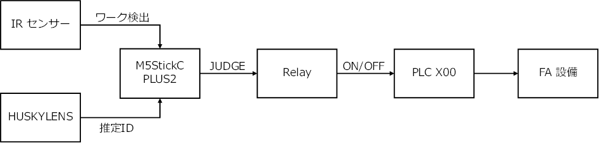

# 第8回 メカトロニクス実習（2nd turn）  
## AI外観検査システム 最終検収・改善・納品

---

## 1. 今日のゴール

今日は、新しい機能を増やす回ではありません。

これまで作ってきた

> **ワーク検出 → 推定ID取得 → M5による良否判定 → Relay → PLC入力**

という検査システムを、実際のFAライン上で最終確認します。

今日のゴールは次の4つです。

1. **完成した検査システムを再現する**
2. **20回の判定実験を行い、現在の性能を数値で確認する**
3. **改善を1つだけ行い、もう一度20回実験して比較する**
4. **仕様書・プレゼン・個人レポートに結果を残す**

---

## 2. 今日使う言葉

今回の最終実験では、

> **「実物は何だったか」**
>
> **「HUSKYLENSには何に見えたか」**
>
> **「M5は良品・不良品をどう判定したか」**

を分けて考えます。

| 用語 | 意味 |
|---|---|
| **正解ID** | 実際に流したワークのID |
| **実物の良否** | 実際のワークが良品か不良品か |
| **推定ID** | HUSKYLENS が返した Class ID |
| **M5の判定結果（JUDGE）** | 推定IDをもとに M5 が出した OK / NG / RETRY |
| **ID一致** | 正解IDと推定IDが同じか |
| **良否判定の一致** | 実物の良否と、M5の良品 / 不良品判定が一致したか |
| **見逃し** | **IRセンサが反応しなかった**、または **HUSKYLENSが ID=0（未認識）となり RETRY になった**もの |

### JUDGE の読み方

```text
JUDGE : OK     → M5は「良品」と判定
JUDGE : NG     → M5は「不良品」と判定
JUDGE : RETRY  → 良品 / 不良品を確定しない
```

### 重要

> **IDが合ったか**
>
> と
>
> **良品・不良品の判定が合ったか**
>
> は別です。

---

## 3. 今回の判定仕様

| ID | ワーク | 実物の良否 | その推定IDを受けたM5の判定 |
|---:|---|---|---|
| ID1 | 青・青・青 | 良品 | OK（良品） |
| ID2 | 黄・黄・黄 | 良品 | OK（良品） |
| ID3 | 青・青・赤 | 不良品 | NG（不良品） |
| ID4 | 黄・黄・赤 | 不良品 | NG（不良品） |
| ID0 / 未認識 | ― | ― | RETRY |

### 例1：IDは違うが、良否判定は合っている

```text
正解ID        : 3
実物の良否    : 不良品
推定ID        : 4
M5の判定結果  : 不良品（JUDGE : NG）

ID一致            : ×
良否判定の一致    : ○
見逃し            : なし
```

ID3とID4は違いますが、どちらも不良品側なので、**良否判定は一致**しています。

### 例2：良否判定も間違っている

```text
正解ID        : 3
実物の良否    : 不良品
推定ID        : 1
M5の判定結果  : 良品（JUDGE : OK）

ID一致            : ×
良否判定の一致    : ×
見逃し            : なし
```

この場合、検査自体は実行されています。  
したがって今回の定義では「見逃し」ではなく、**良否判定の不一致**です。

### 例3：見逃し

IRセンサが反応しなかった場合：

```text
IR反応        : ×
推定ID        : ―
M5の判定結果  : ―
見逃し        : あり
```

HUSKYLENSが未認識になった場合：

```text
IR反応        : ○
推定ID        : 0 / ---
M5の判定結果  : RETRY
見逃し        : あり
```

---

## 4. M5 の表示

今回使用する標準プログラムは、

> `085_m5_main_ir_standard.py`

です。

M5画面には、次の3つを表示します。

```text
SUITEI ID : 3
JUDGE     : NG
KENSA COUNT : 7
```

- **SUITEI ID**：HUSKYLENSの推定ID
- **JUDGE**：M5の判定結果
- **KENSA COUNT**：IRセンサが反応し、検査処理を実行した累積回数

未認識の場合は、

```text
SUITEI ID : ---
JUDGE     : RETRY
```

となります。

---

## 5. システム全体

<div align="center">

</div>

- **IRセンサ**：ワーク通過のタイミングを検出する
- **HUSKYLENS**：ワーク画像から **推定ID** を返す
- **M5StickC PLUS2**：IRセンサと HUSKYLENS の情報を受け取り、**JUDGE** を決める
- **Relay**：M5 の判定結果に応じて PLC 入力を ON / OFF する
- **PLC入力 X00**：Relay からの信号を受ける
- **FA設備**：PLC の入力に応じて設備が動作する

### PLCについて

Relay から PLC の **X00** へ信号を渡します。

ただし現在の X00 は、**既存のワーク検出センサと共有**されています。

そのため、

> 「M5の検査結果だけを使ってFA設備を制御する」

には、PLC側のI/O割付やラダーの再設計が必要です。

今日は **既存ラダーの大きな変更は行いません。**

---

# 6. 今日の進め方（200分）

1st turn の実施結果から、**仕様書・プレゼン作成には想定より時間が必要**だと分かりました。  
今日は実験を終えたあと、グループ成果物と発表の時間を優先します。

| 時間 | 内容 |
|---:|---|
| 0～25分 | FAライン上に検査環境を再現・`main.py` 更新・動作確認 |
| 25～50分 | **第1回 20回判定実験** |
| 50～60分 | 結果集計 |
| 60～75分 | 改善項目を1つ選び、調整 |
| 75～85分 | 休憩 |
| 85～110分 | **第2回 20回判定実験** |
| 110～120分 | 改善前後を比較 |
| 120～165分 | グループ仕様書・プレゼン作成 |
| 165～180分 | グループ発表（1グループ約5分） |
| 180～190分 | 提出確認・授業まとめ |
| 190～200分 | 設備復旧・片付け |

### 個人レポートについて

個人レポートは1人ずつ提出します。  
**授業内で完成しない場合は、授業後に Google Education / Classroom から提出して構いません。**

---

# 7. STEP 1　検査環境を再現する

最初に、これまで作った条件を再現します。

## 7.1 M5 の標準プログラムを更新する

Thonny から M5 内の `main.py` を、

> `085_m5_main_ir_standard.py`

の内容に更新します。

起動後、

```text
SUITEI ID
JUDGE
KENSA COUNT
```

が表示されることを確認してください。

## 7.2 動作確認

- [ ] IRセンサがアルミベースを安定して検出する
- [ ] HUSKYLENS がワークを見やすい位置に固定されている
- [ ] 背景が固定されている
- [ ] HUSKYLENS の Protocol が **I2C**
- [ ] M5 と HUSKYLENS が通信できる
- [ ] M5 に `SUITEI ID / JUDGE / KENSA COUNT` が表示される
- [ ] Relay が ON / OFF する
- [ ] Relay → PLC X00 の接続を確認する
- [ ] PLC / GX Works で X00 の変化を確認できる

### 教員チェック ①

**20回試験を始める前に、教員に一連動作の確認を受けること。**

---

# 8. STEP 2　第1回 20回判定実験

ID1～ID4を、それぞれ5回ずつ流します。

順番は固定でなくても構いません。  
ただし、**実際に流したワークの正解IDを必ず記録**してください。

### 記録ルール

- **1行 = 1個のワーク通過**
- IRセンサが反応しなかった場合は、`IR = ×`、推定ID・JUDGEは `―` とする
- ID=0 / 未認識の場合は、推定IDを `0 / ---`、JUDGEを `RETRY` とする
- 同じワークで複数回検査された場合は、ワーク通過後に**最後に表示された推定IDとJUDGE**を記録する

## 記録表（改善前）

| No. | 正解ID | 実物良否 | IR | 推定ID | JUDGE | ID一致 | 良否一致 | 見逃し |
|---:|---:|:---:|:---:|---:|:---:|:---:|:---:|:---:|
| 1 | | | | | | | | |
| 2 | | | | | | | | |
| 3 | | | | | | | | |
| 4 | | | | | | | | |
| 5 | | | | | | | | |
| 6 | | | | | | | | |
| 7 | | | | | | | | |
| 8 | | | | | | | | |
| 9 | | | | | | | | |
| 10 | | | | | | | | |
| 11 | | | | | | | | |
| 12 | | | | | | | | |
| 13 | | | | | | | | |
| 14 | | | | | | | | |
| 15 | | | | | | | | |
| 16 | | | | | | | | |
| 17 | | | | | | | | |
| 18 | | | | | | | | |
| 19 | | | | | | | | |
| 20 | | | | | | | | |

### KENSA COUNT も確認する

20個のワークを流し終わったら、最後に表示された `KENSA COUNT` を記録してください。

```text
KENSA COUNT：______ 回
```

クリーンに **1ワークにつき1回** 検査できれば、20個のワークで `KENSA COUNT = 20` が目安です。

---

# 9. STEP 3　結果を集計する

次の4つを求めます。

## ① 推定ID 一致率

```text
正解IDと推定IDが一致した回数
÷ 実際に流したワーク数
× 100
```

## ② 良否判定 一致率

```text
実物の良否と M5 の良品 / 不良品判定が一致した回数
÷ 実際に流したワーク数
× 100
```

`RETRY` は良品 / 不良品を確定していないので、**良否判定の一致には数えません。**

## ③ 見逃し回数

今回の「見逃し」は、

```text
IRセンサ反応なし
または
ID=0 / 未認識 → RETRY
```

となったワークの数です。

## ④ 1ワークあたり平均検査回数

```text
KENSA COUNT
÷ 実際に流したワーク数
```

### 改善前の結果

| 項目 | 結果 |
|---|---:|
| 推定ID 一致 | ____ / 20 |
| 推定ID 一致率 | ____ % |
| 良否判定 一致 | ____ / 20 |
| 良否判定 一致率 | ____ % |
| IRセンサ反応なし | ____ 回 |
| ID=0 / RETRY | ____ 回 |
| 見逃し | ____ 回 |
| KENSA COUNT | ____ 回 |
| 1ワークあたり平均検査回数 | ____ 回/ワーク |

### ID別の確認

| 正解ID | 試行数 | 推定ID一致 | 良否判定一致 | 主な誤分類・気づき |
|---:|---:|---:|---:|---|
| ID1 | 5 | | | |
| ID2 | 5 | | | |
| ID3 | 5 | | | |
| ID4 | 5 | | | |

### 数字の見方

例えば、

> **ID一致率は低いが、良否判定一致率は高い**

場合は、ID1とID2、またはID3とID4のように、**同じ良否側のIDを取り違えている**可能性があります。

完全な4クラス分類はできていなくても、良品側 / 不良品側を分ける特徴は比較的捉えている可能性があります。

---

# 10. STEP 4　改善する

## ルール

> **一度に変えるのは1項目だけ。**

複数の条件を同時に変えると、

> 「何を変えたから結果が変わったのか」

が分からなくなります。

まず第1回の20回実験を見て、**どんな間違いが多かったか**を確認してください。

そのあと、下のヒントから改善方法を1つ選びます。

## 改善のヒント

| 実験で見えた症状 | 改善のヒント |
|---|---|
| 特定のIDだけ間違いが多い | そのIDの再学習、カメラ角度、撮像距離を見直す |
| ID一致率は低いが良否判定一致率は高い | 同じ良否側のIDを取り違えていないか確認する |
| 良品側と不良品側をまたぐ誤分類がある | その組合せを重点的に確認し、再学習や撮像位置を見直す |
| 同じワークなのに推定IDがばらつく | カメラ位置・角度・背景・照明を固定する |
| 止めて見せると読めるが、移動中は間違う | IRセンサの検出位置とHUSKYLENSの撮影位置の関係を見直す |
| ID=0 / RETRY が出る | HUSKYLENSの撮像位置・距離・学習状態を確認する |
| KENSA COUNT が20より多い | IRセンサの多重検出がないか、位置・向き・感度を確認する |
| KENSA COUNT が20より少ない | IRセンサの検出漏れがないか、位置・向き・感度を確認する |
| 全体的に成績が低い | まず物理配置を再現し直し、その後に再学習を検討する |

### 教員と相談してから行う改善

次の変更は、時間を使う可能性があるので教員と相談してから行います。

- HUSKYLENS の Threshold 変更
- プログラム変更
- 複数回取得・多数決判定

### 改善計画

**見つかった問題：**

> ________________________________________________

**変更する項目（1つだけ）：**

> ________________________________________________

**良くなると予想する理由：**

> ________________________________________________

### 教員チェック ②

**変更する前に、改善項目を教員へ説明すること。**

---

# 11. STEP 5　第2回 20回判定実験

改善後の試験を始める前に、M5を再起動して、

> **KENSA COUNT = 0**

に戻してください。

その後、第1回と同じ条件でID1～ID4を各5回流します。

比較できるように、試行回数とワーク構成を変えないでください。

## 記録表（改善後）

| No. | 正解ID | 実物良否 | IR | 推定ID | JUDGE | ID一致 | 良否一致 | 見逃し |
|---:|---:|:---:|:---:|---:|:---:|:---:|:---:|:---:|
| 1 | | | | | | | | |
| 2 | | | | | | | | |
| 3 | | | | | | | | |
| 4 | | | | | | | | |
| 5 | | | | | | | | |
| 6 | | | | | | | | |
| 7 | | | | | | | | |
| 8 | | | | | | | | |
| 9 | | | | | | | | |
| 10 | | | | | | | | |
| 11 | | | | | | | | |
| 12 | | | | | | | | |
| 13 | | | | | | | | |
| 14 | | | | | | | | |
| 15 | | | | | | | | |
| 16 | | | | | | | | |
| 17 | | | | | | | | |
| 18 | | | | | | | | |
| 19 | | | | | | | | |
| 20 | | | | | | | | |

```text
KENSA COUNT：______ 回
```

---

# 12. STEP 6　改善前後を比較する

| 項目 | 改善前 | 改善後 | 変化 |
|---|---:|---:|---:|
| 推定ID 一致率 | ____ % | ____ % | ____ |
| 良否判定 一致率 | ____ % | ____ % | ____ |
| IRセンサ反応なし | ____ 回 | ____ 回 | ____ |
| ID=0 / RETRY | ____ 回 | ____ 回 | ____ |
| 見逃し回数 | ____ 回 | ____ 回 | ____ |
| KENSA COUNT | ____ 回 | ____ 回 | ____ |
| 1ワークあたり平均検査回数 | ____ 回/ワーク | ____ 回/ワーク | ____ |

## 比較して分かったこと

<br/>

> ________________________________________________

<br/>

> ________________________________________________

### 注意

改善後に数字が悪くなっても、実験として失敗ではありません。

重要なのは、

> **何を変えたら、結果がどう変わったか**

を説明できることです。

---

# 13. STEP 7　グループ成果物を完成する

## A. 完成仕様書

仕様書には、**最終的に実機で使った条件**を書きます。

最低限、次を完成させてください。

- システム構成
- 使用機器
- GPIO / 配線
- 正解ID・実物の良否・推定ID・JUDGE の関係
- HUSKYLENS / IRセンサの設置条件
- Relay → PLC X00 の接続
- 最終試験結果
- 現在の制約・残課題

### 重要

仕様書は、

> 「こうする予定だった」

ではなく、

> **「最終的に実機ではこうなった」**

を書く文書です。

## B. 納品プレゼン

配布されたPowerPointテンプレートを使います。

### 必須

1. **完成した検査システム**
2. **最終検収結果**

### 時間に余裕があれば追加

3. **工夫・変更したところ**
4. **残課題と納品判断**

発表時間は **1グループ約5分** です。

> **まず1・2枚目を完成させてください。**
>
> 3・4枚目を完成させるために、発表時間を失わないこと。

---

# 14. STEP 8　個人レポート

グループで同じ実験をしていても、**レポートは1人ずつ提出**します。

実験データは共有して構いません。

ただし、

- なぜその改善を選んだか
- ID一致率と良否判定一致率をどう考えたか
- 見逃しがあったか
- 現在の設備の課題
- 自分が担当した作業と、そこで確認したこと

は、**自分の言葉で書いてください。**

授業内で完成しない場合は、授業後に提出して構いません。

---

# 15. 今日の役割分担

2～3人のグループなので、全員が作業を担当します。

| 役割 | 作業 |
|---|---|
| ワーク担当 | ワークを流す、正解IDを確認する |
| 記録担当 | IR反応・推定ID・JUDGE・結果を記録する |
| 監視担当 | M5 / HUSKYLENS / GX Works（X00）の表示を確認する |

5回程度を目安に交代し、**全員が設備に触れる**ようにしてください。

仕様書・プレゼン作成時も分担してください。

---

# 16. 最終確認

## 実験

- [ ] M5 の `main.py` を `085_m5_main_ir_standard.py` に更新した
- [ ] Relay → PLC X00 と GX Works の表示を確認した
- [ ] 改善前の20回試験を完了した
- [ ] 推定ID一致率を求めた
- [ ] 良否判定一致率を求めた
- [ ] 見逃し回数を確認した
- [ ] KENSA COUNT と平均検査回数を確認した
- [ ] 改善項目を1つ決めた
- [ ] 改善後の20回試験を完了した
- [ ] 改善前後を比較した

## グループ成果物

- [ ] 完成仕様書
- [ ] プレゼン1・2枚目
- [ ] グループ発表

## 個人成果物

- [ ] 個人レポート（授業後提出可）

## 片付け

- [ ] M5 / HUSKYLENS / Relay を回収した
- [ ] 仮設ケーブルを外した
- [ ] FA設備を授業開始前の状態へ戻した
- [ ] PC / GX Works / Thonny を終了した
- [ ] 使用した場所を片付けた

---

# 今日の最後に確認したいこと

この実習で重要なのは、

> **HUSKYLENSが「AIだから自動で良品・不良品を理解している」ことではありません。**

実際には、

```text
実物のワーク
↓
IRセンサで検査開始
↓
HUSKYLENS が推定IDを返す
↓
M5 が推定IDを良品 / 不良品 / RETRY に変換
↓
Relay
↓
PLC入力
↓
FA設備
```

というシステムです。

したがって、

> **推定IDの正しさ**
>
> と
>
> **設備としての良否判定の正しさ**

は分けて考える必要があります。

さらに、結果は

- カメラ位置
- ワーク位置
- 背景
- 照明
- センサ位置
- 学習状態
- 配線
- PLC側の構成

にも影響されます。

**画像認識だけでなく、物理条件・制御・FA設備まで含めて1つのシステムとして考えること。**

これが今回の最終確認です。
