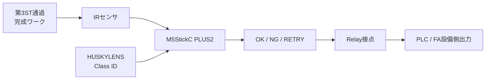

# 第8回 メカトロニクス実習
## 最終検収・As-built・納品プレゼン

### 今日のテーマ

これまでに製作・調整してきた外観検査システムを、**完成した設備として検収し、結果を記録して説明する**ことが今日の目的です。

今回の検査対象は、**第3ステーションを通過し、A・B・Cの3パーツが土台へ取り付けられた完成ワーク**です。

最終的なシステムは、実際に完成した構成に合わせて次の流れで確認します。



今日は新しい技術を増やすことより、

> **直す → 測る → 記録する → 説明する**

ことを重視します。

---

# 1. 今日の到達目標

## 最低到達点

- 実FAライン上で検査システムを一連動作させる
- 10回以上の検収試験を行い、結果を記録する
- Class ID の正誤と、設備としての OK / NG / RETRY 判定の正誤を分けて確認する
- **NG品をOKと判定した回数を別に確認する**
- 実際に完成した構成を As-built として記録する

## 標準到達点

- 4クラスを含む20回程度の検収試験を行う
- 誤判定があった場合、原因をシステムのどこにあるか切り分ける
- 必要な調整を1つ行い、再試験して改善の有無を確認する
- 4枚以内のスライドで、完成した設備・試験結果・工夫・残課題を説明する

---

# 2. 今日のタイムスケジュール

| 時間 | 内容 | 到達条件 |
|---|---|---|
| 0～15分 | 今日の検収条件・提出物確認 | 完成条件と評価方法が分かる |
| 15～40分 | 最終セットアップ・第7回残件の修正 | 一連動作できる状態にする |
| 40～75分 | 最終検収試験（1回目） | 判定結果を記録する |
| 75～95分 | 結果分析・必要なら調整 | 失敗原因の候補を説明できる |
| 95～105分 | 休憩 | |
| 105～130分 | 再試験・最終結果確定 | 最終性能を数値で示せる |
| 130～155分 | As-built 仕様の整理 | 実際に完成した構成を記録する |
| 155～170分 | 発表スライド作成 | 4枚以内にまとめる |
| 170～185分 | グループ発表・質疑 | 5分程度で設備を説明する |
| 185～200分 | Google Educationへ提出・原状確認・片付け | 提出完了、安全な状態へ戻す |

※ 発表は各グループ5分程度。全員が最低1か所は説明を担当してください。  
※ 時間配分は第7回の進捗に応じて最終調整する場合があります。

---

# 3. 最終検収試験

## 試験回数

- 最低：10回
- 標準：20回程度（可能なら ID1～ID4 を各5回）

同じワークだけを繰り返すのではなく、複数のClassを混ぜて試験します。

## 記録すること

各試行について、少なくとも次を記録してください。

| 回 | 投入ワーク | 正解ID | 取得ID | Class ID 正誤 | 設備判定 | 設備判定 正誤 | 気づいたこと |
|---:|---|---:|---:|---|---|---|---|
| 1 | | | | | | | |
| 2 | | | | | | | |
| 3 | | | | | | | |
| … | | | | | | | |

### 重要：2種類の正しさを分ける

**Class ID が正しいこと**と、**設備として OK / NG / RETRY が正しいこと**は同じではありません。

例えば、ID3 と ID4 はどちらも設備上は NG です。

- ID3 を ID4 と読んだ → Class IDとしては誤りだが、設備判定は NG で正しい場合がある
- ID4 を ID2 と読んだ → NG品を OK とするため、設備として重大な誤判定

最終評価では、この2つを分けて考えます。

特に、

> **NG品をOKとして通してしまった回数**

は別に数えてください。

---

# 4. 誤判定が出たときの確認

「AIの精度が悪い」で終わらせず、どこで問題が起きたか確認します。

```text
完成ワーク
  ↓
IRセンサで検出できたか
  ↓
HUSKYLENSでClass IDを取得できたか
  ↓
Class IDは正しかったか
  ↓
M5のOK / NG / RETRY判定は正しかったか
  ↓
Relay接点は正しくON/OFFしたか
  ↓
PLC入力 / FA設備側出力は正しく動いたか
```

原因の候補：

- IRセンサの位置・距離・角度
- HUSKYLENSの位置・距離・背景・照明
- HUSKYLENSの学習状態
- IR検出と撮像のタイミング
- M5の判定ロジック
- Relay / PLC側の入出力
- 配線や固定状態

## 改善するときのルール

一度に多くを変更しないでください。

1. 結果を確認する
2. 原因候補を1つ決める
3. 変更内容を記録する
4. 再試験する
5. 数値が改善したか確認する

「何を変えたら良くなったか」が分からなくならないようにします。

---

# 5. As-built（完成後の実際の仕様）をまとめる

当初の計画ではなく、**最後に実際に完成した状態**を記録します。

## 5.1 システム構成

- 検査位置（第3ステーション通過後のどこに設置したか）
- IRセンサ
- HUSKYLENS
- M5StickC PLUS2
- Relay Unit
- PLC / FA設備側出力（接続した場合）

## 5.2 実際に使用した配線・I/O

| 用途 | 実際の接続 |
|---|---|
| IRセンサ Signal | GPIO33 |
| Relay Unit Signal | GPIO32 |
| HUSKYLENS SDA | GPIO25 |
| HUSKYLENS SCL | GPIO26 |
| Relay接点を接続したPLCステーション | |
| PLC入力 | |
| 使用したPLC出力 | |

PLCのI/Oは、**実際に使用した値だけ**を記入してください。

PLC側を確認するときは、

1. `第1~6ステーション入出力表.pdf`
2. GX Works の既存ラダー・I/O使用状況
3. 実機のPLC端子・配線

の順で確認します。

> **I/O表に記載がないから「空いている」と推測して使わないこと。**

第7回までにPLC接続を行わなかった場合は、空欄をごまかさず「未実施」と記録し、残課題へ記載します。

## 5.3 実際の設置条件

- IRセンサの位置・向き
- HUSKYLENSの位置・向き
- 背景
- ワークとの距離
- ジグの構成

写真を残しておくと、完成状態を説明しやすくなります。

## 5.4 最終性能

- 試行回数：
- Class ID 正答回数：
- Class ID 正答率：
- 設備判定 正答回数：
- 設備判定 正答率：
- RETRY回数：
- **NG品をOKと判定した回数：**

## 5.5 設計変更と残課題

当初予定から変更した点と、その理由を整理します。

例：

```text
現在仕様：IRセンサを真鍮ベース側面へ正対
問題点：斜め配置では反射条件が変化して検出が揺れた
変更：正対する位置へ変更
結果：検出が安定した
```

残った問題は隠さず、**どの条件では安定しないのか**を記録してください。

---

# 6. 納品プレゼン

完成した検査設備を「顧客へ引き渡す」つもりで説明します。

発表時間は **1グループ5分程度**、スライドは **4枚以内**です。

配布する PowerPoint テンプレートを使用してください。

## スライド1：完成した検査システム

- グループ名・発表者
- 第3ステーション通過後のどこで検査しているか
- システムの流れ
- 実機写真
- どのワークをOK / NGとしているか

## スライド2：最終検収結果

- 試行回数
- Class ID 正答率
- 設備判定 正答率
- NG品をOKとした回数
- Classごとの特徴
- 最も問題になった誤判定

## スライド3：工夫・変更したところ

- センサ位置
- カメラ位置
- ジグ
- プログラム
- PLC連携

などから、重要なものを説明します。

PLCを接続した場合は、**実際に使用したステーション・PLC入力・出力**も示してください。

## スライド4：残課題と納品判断

- 現在の設備でできること
- まだ不安定なこと
- 今後改善するとしたら何をするか
- 「この設備を納品できるか」を自分たちで判断する
- 条件付きで納品する場合は、その条件を明示する

### 発表で大切なこと

「うまく動きました」だけではなく、**実験結果の数値を使って説明**してください。

また、良い点だけでなく、残った課題も説明してください。

---

# 7. 最終提出物

授業終了までに、Google Education の指定された課題へ次を提出します。

- 最終検収試験の記録
- As-built のまとめ
- 発表用PowerPoint
- 使用した最終 `main.py`（変更した場合）

提出後、FA設備・ジグ・配線・PC周辺を確認し、安全な状態へ戻して終了します。

---

<!--
# 教員確認ポイント

- 第8回は新規技術要素を増やさず、最終調整・検収・記録・説明を中心にする。
- 検査対象は第3ステーション通過後の完成ワーク。
- PLC I/Oの基準資料は `第1~6ステーション入出力表.pdf`。
- PLC I/Oは資料だけで空きを推測せず、GX Worksと実機端子まで確認した実使用値をAs-builtへ記録させる。
- Fail-safeの観点から、総正答率だけでなく「NG品をOKとした件数」を確認する。
- 20回試験や時間配分は、第7回の進捗を見て最終調整してよい。
- 発表は1グループ5分程度、4枚以内。スライドデザインを主課題にしない。
- 学生への配布・提出はGoogle Education。GitHubは教員側の正本管理に使用する。
-->
